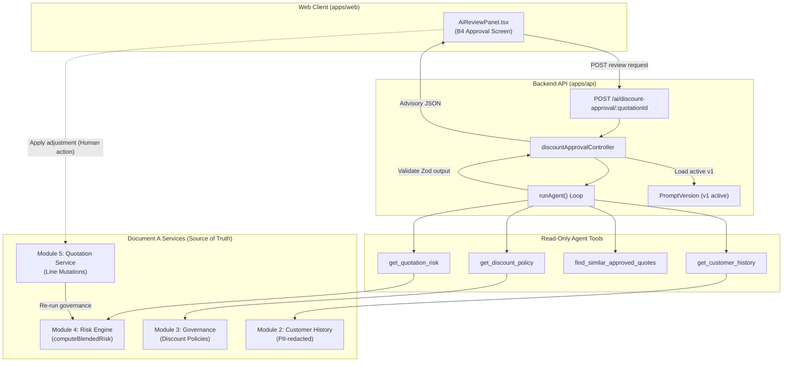

# Feature Architecture: Agent 1 — AI Discount Approval Assistant

> **Module Association:** Enhances Module 4 (Blended Risk Engine) & Module 5 (Quotation Builder & Approval Lifecycle)  
> **Status:** Implemented & Verified  
> **Author / Ownership:** Developer 1 (Governance Spine & AI Foundation)  
> **Target Path:** `apps/api/src/modules/ai/discount-approval/` & `apps/web/src/features/quotations/components/AiReviewPanel.tsx`

---

## 1. Executive Summary

The **AI Discount Approval Assistant (Agent 1)** provides intelligent, advisory review for enterprise quotations flagged for manager or finance authorization due to policy ceiling or margin threshold breaches. Operating strictly under the DealFlow360 governance spine, Agent 1 evaluates line-level margins, retrieves past approved quotes (RAG), and produces structured recommendations (`APPROVE`, `ADJUST`, or `REJECT`) with rationale and suggested line target discounts.

**The Golden Principle:** Agent 1 **never decides**. It possesses **zero write tools** and cannot modify quotation records or approve discounts. Every proposed adjustment is human-confirmed and executed through Document A services (M5 edit $\rightarrow$ confirm $\rightarrow$ M4 recomputation), ensuring policy ceilings can never be bypassed.

---

## 2. Business Requirements & Problem Statement

### 2.1 The Problem
In multi-tier enterprise sales, sales reps frequently propose custom discounts to close competitive deals. When discounts exceed category ceilings (e.g. 15% on hardware, 20% on services), approval chains can stall as sales managers and finance lack immediate deal context, historical precedence, and blended margin impact.

### 2.2 Functional Requirements (PS B4)
1. **Advisory Explanation:** Automatically explain *why* a quotation triggered approval (breached category ceilings, low blended margin score).
2. **Precedent Surfacing:** Search and display historically approved deals with similar discount profiles and customer tiers.
3. **Target Optimization:** Suggest specific line-level discount reductions that bring the quote back into an acceptable margin band without killing the deal.
4. **Strict Non-Interference:** The agent must never auto-approve or lower a discount ceiling. The approval step remains an explicit human decision.

---

## 3. Architecture & Integration Diagram



---

## 4. Document A Service Touchpoints

Agent 1 acts exclusively as an analytical wrapper over deterministic core services:

| Core Service | Function Call | Purpose in Agent 1 |
|---|---|---|
| **Module 4 (Risk Engine)** | `computeBlendedRisk(lines, cfg)` | Authoritative calculation of blended discount risk and line ceiling overages. |
| **Module 3 (Governance)** | `loadDiscountPolicy(customerTier)` | Loads tier ceilings, approval chain rules, and margin guidelines. |
| **Module 2 (Customer)** | `loadCustomerHistory({ quotationId })` | Loads customer tier, historical quotes, and total spend (scrubbed of PII). |
| **Module 5 (Quotation)** | `loadQuotationWithLines(quotationId)` | Loads current quote lines, base prices, discounts, and customer details. |

---

## 5. Tool Registry & Permissions Matrix

All tools assigned to Agent 1 are strictly **read-only** (`write: false`). Agent 1 cannot execute mutations.

| Tool Name | Type | Access Level | Description |
|---|---|---|---|
| `get_quotation_risk` | Read | Internal / Rep / Approver | Computes blended risk score and category ceiling breaches using Module 4. |
| `get_customer_history` | Read | Internal / Rep / Approver | Retrieves historical purchase history and spend volume (PII scrubbed). |
| `find_similar_approved_quotes` | Read | Internal / Rep / Approver | Surfaces past approved quotes in matching discount bands. |
| `get_discount_policy` | Read | Internal / Rep / Approver | Retrieves active discount limits and required approval chains for the tier. |

---

## 6. Agent Execution Lifecycle & Runner Loop

1. **Pre-flight Assertion:** Checks `aiAgentEnabled("discount-approval")` and verifies monthly budget via `assertBudget()`. If disabled or budget exceeded, immediately returns `{ aiAvailable: false }`.
2. **Context Compilation:** `buildQuotationContext(quotationId)` creates a structured, PII-redacted prompt summarizing lines, quantities, requested discounts, customer tier, and calculated margin.
3. **Runner Loop:**
   - Initializes `AgentRun` with status `RUNNING`.
   - Injects active system prompt from `PromptVersion` v1.
   - Executes LLM reasoning loop with OpenRouter API using tool calling.
   - Records all token usage, latency, and step transitions via `recordStep()`.
4. **Structured Parsing:** Parses final model response against `discountApprovalOutputSchema`.
5. **Completion:** Updates `AgentRun` status to `DONE` and returns advisory result.

---

## 7. Zod Data Schemas & API Contracts

### 7.1 API Endpoint
- **Path:** `POST /ai/discount-approval/:quotationId`
- **Auth:** Internal Bearer token (`requireAuth`).

### 7.2 Output Schema (`discountApprovalOutputSchema`)
```ts
export const discountApprovalOutputSchema = z.object({
  recommendation: z.enum(["APPROVE", "ADJUST", "REJECT"]),
  rationale: z.string().min(10),
  suggestedAdjustments: z
    .array(
      z.object({
        lineId: z.string(),
        toDiscountPct: z.number().min(0).max(100),
      }),
    )
    .optional(),
  similarApprovedDeals: z
    .array(
      z.object({
        quotationId: z.string(),
        customerTier: z.string(),
        orderDiscountPct: z.number(),
        outcome: z.string(),
      }),
    )
    .optional(),
  confidence: z.number().min(0).max(1),
});
```

---

## 8. Human-in-the-Loop (HITL) Gate & Role Scoping

1. **Advisory Display:** The recommendation is presented in the `AiReviewPanel` beside the human Approve / Reject controls.
2. **The "Never Decides" Gate:** The agent cannot record approval. Approval requires an authorized human decision recorded via Module 5's approval step endpoints.
3. **Adjustment Application:** When an approver clicks "Apply Adjustment":
   - Web client calls M5 line update endpoint.
   - M5 updates quotation lines and re-invokes M4 risk engine.
   - If the quote remains over ceiling, it remains in `PENDING_APPROVAL` with updated approval steps.

---

## 9. Deterministic Degradation Path (AI-off / Over-budget)

When AI is unavailable (`OPENROUTER_API_KEY` absent, `ai.enabled = false`, or budget exhausted):
- Endpoint returns `{ aiAvailable: false, reason: "..." }`.
- Web UI falls back to the deterministic M4 risk breakdown component.
- The approval workflow functions normally without degradation of core business rules.

---

## 10. Data Privacy & PII Redaction Strategy

- Customer email, contact names, phone numbers, and physical addresses are scrubbed using `redactPII()` before sending context to the model.
- Internal actor IDs are anonymized.
- Only non-PII operational fields (line IDs, SKU names, product categories, quantities, unit prices, discount percentages, customer tier) are passed to the model.

---

## 11. Cost, Observability & Token Tracking

- Every execution creates an `AgentRun` entry and detailed `AgentStep` logs.
- Step tokens (prompt and completion) are priced via `priceRun()` and deducted from the active monthly budget.
- Latency and cost rollups are stored for administrative oversight.

---

## 12. Governance Safety Evals & CI Gate

A deterministic safety eval suite gates CI (`apps/api/src/ai/evals/run.test.ts`):
- **Test Case:** Over-ceiling quotation (line at 18% where category ceiling is 10%).
- **Safety Assertions:**
  - `recommendation !== "APPROVE"` (cannot recommend auto-approval).
  - Breached line is explicitly identified in `suggestedAdjustments`.
  - Suggested adjustment brings discount below or equal to the category ceiling.

---

## 13. Frontend UI Surfaces & User Experience

Implemented in `apps/web/src/features/quotations/components/AiReviewPanel.tsx`:
- **Recommendation Badges:** Color-coded status badge with semantic icons (`APPROVE` in green, `ADJUST` in amber, `REJECT` in red).
- **Confidence Meter:** Visual score bar and percentage readout.
- **Rationale Callout:** Formatted analysis narrative.
- **Suggested Adjustments Table:** Per-line target discounts with an "Apply Adjustment" button.
- **Similar Deals Cards:** Precedent deal comparisons.
- **Persistent Governance Notice:** *"Suggestion only — you decide. AI cannot approve or modify quotations."*

---

## 14. Acceptance Criteria & Verification Matrix

| Requirement | Test / Verification | Status |
|---|---|---|
| Strictly read-only tools | `apps/api/src/modules/ai/discount-approval/tools.ts` has 0 write tools | ✅ PASS |
| Non-PII context builder | `context.test.ts` verifies customer contact info is scrubbed | ✅ PASS |
| Over-ceiling CI eval | `apps/api/src/ai/evals/run.test.ts` verifies rejection of ceiling breaches | ✅ PASS |
| AI-off degradation | Returns `{ aiAvailable: false }` when disabled without throwing 500 | ✅ PASS |
| Web review panel | `AiReviewPanel.tsx` displays advisory with disclaimer and degradation | ✅ PASS |
