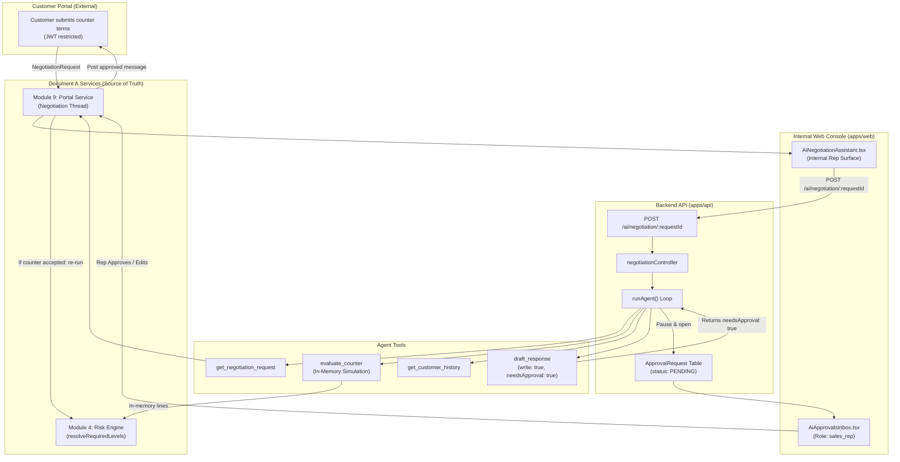

# Feature Architecture: Agent 6 — AI Customer Negotiation Assistant

> **Module Association:** Enhances Module 9 (Customer Portal Negotiation) & Module 4 (Blended Risk Engine)  
> **Status:** Implemented & Verified  
> **Author / Ownership:** Developer 1 (Governance Spine & AI Foundation)  
> **Target Path:** `apps/api/src/modules/ai/negotiation/` & `apps/web/src/features/portal-internal/components/AiNegotiationAssistant.tsx`

---

## 1. Executive Summary

The **AI Customer Negotiation Assistant (Agent 6)** provides intelligent counter-offer evaluation and draft generation for internal sales reps responding to customer counter-proposals submitted via the customer portal. It evaluates customer asks against discount policies in-memory, drafts diplomatic counter-responses, and warns the sales rep whether accepting the customer's terms would stay within discount ceilings or trigger an escalation approval chain.

**The Hard No-Bypass Rule:** Nothing the agent produces ever reaches the customer without explicit human sales rep approval. Agent 6 produces **drafts only**. Every proposed message lands in an `ApprovalRequest` and the customer portal has zero access to AI endpoints or OpenRouter credentials. When terms are accepted, Document A (M9/M4) re-evaluates the actual deal lines and re-routes approvals if thresholds are breached.

---

## 2. Business Requirements & Problem Statement

### 2.1 The Problem
When customers negotiate terms or discounts through the customer portal (M9), sales reps must evaluate whether conceding on price will erode profitability or violate governance limits. Reps frequently lack instant calculation tools to simulate whether a counter-offer will trigger secondary approval chains (Sales Manager, Finance), leading to delays or unauthorized verbal commitments.

### 2.2 Functional Requirements (PS B8)
1. **Hypothetical Risk Simulation:** Simulate the blended risk and margin impact of counter terms in memory without mutating database state.
2. **Auto-Approval Feasibility Indication:** Inform the rep definitively whether the counter would auto-approve (`wouldAutoApprove: true`) or re-route to specific approval roles (`wouldAutoApprove: false`, `requiredLevelsIfAccepted: [...]`).
3. **Professional Draft Generation:** Generate diplomatic counter-messaging tailored to the customer's purchase history and relationship tier.
4. **Three-Barrier Security:** Ensure that no AI output ever reaches the customer without explicit sales rep authorization through Module 9.

---

## 3. Architecture & Integration Diagram



---

## 4. Document A Service Touchpoints

Agent 6 coordinates with existing Document A services while maintaining strict isolation:

| Core Service | Function Call | Purpose in Agent 6 |
|---|---|---|
| **Module 9 (Portal)** | `loadNegotiationRequest(requestId)` | Fetches the customer's submitted counter lines, requested discount %, and message. |
| **Module 9 (Portal)** | `hypotheticalAcceptedLines(requestId)` | In-memory line merger simulating quotation state if customer counter was accepted. |
| **Module 4 (Risk Engine)** | `computeBlendedRisk(lines, cfg)` | Authoritative calculation of risk score on hypothetical lines (no database writes). |
| **Module 4 (Risk Engine)** | `resolveRequiredLevels(risk, cfg, rules)` | Calculates required human approval roles if the hypothetical terms were accepted. |
| **Module 2 (Customer)** | `loadCustomerHistory({ requestId })` | Retrieves customer tier and past negotiation behavior (PII scrubbed). |

---

## 5. Tool Registry & Permissions Matrix

| Tool Name | Type | Access Level | Description |
|---|---|---|---|
| `get_negotiation_request` | Read | Internal / Sales Rep | Retrieves the customer counter details and requested adjustments. |
| `evaluate_counter` | Read | Internal / Sales Rep | Evaluates hypothetical counter terms through Module 4 purely in-memory. |
| `get_customer_history` | Read | Internal / Sales Rep | Loads historical deal volume and tier (PII scrubbed). |
| `draft_response` | Write (Gated) | Internal / Sales Rep | Formulates a counter-message. Always returns `needsApproval: true`. |

---

## 6. Agent Execution Lifecycle & Runner Loop

1. **Pre-flight Check:** Verifies `aiAgentEnabled("negotiation")` and asserts budget via `assertBudget()`. If disabled, returns `{ aiAvailable: false }`.
2. **Context Compilation:** `buildNegotiationContext(requestId)` extracts counter terms, original terms, and customer tier with PII redacted.
3. **Tool Loop & In-Memory Evaluation:**
   - In step 1, the agent calls `get_negotiation_request` and `evaluate_counter`.
   - `evaluate_counter` runs `hypotheticalAcceptedLines(requestId)` in memory and passes cloned lines to M4 `computeBlendedRisk` and `resolveRequiredLevels`.
   - The tool returns the simulated risk score and required approval chain without touching the database.
4. **HITL Pause Gate:**
   - When the agent calls `draft_response`, the tool returns `{ needsApproval: true, kind: "NEGOTIATION", proposedAction: { ... } }`.
   - The central `runAgent()` runner detects `needsApproval: true`, immediately creates an `ApprovalRequest` record with status `PENDING`, and updates `AgentRun` to `PAUSED_FOR_APPROVAL`.
5. **Response:** Controller returns status `PAUSED_FOR_APPROVAL` with the generated draft and auto-approval indicators.

---

## 7. Zod Data Schemas & API Contracts

### 7.1 API Endpoint
- **Path:** `POST /ai/negotiation/:requestId`
- **Auth:** Internal Bearer token (`requireAuth`). Customer portal tokens receive HTTP 401/403.

### 7.2 Output Schema (`negotiationOutputSchema`)
```ts
export const negotiationOutputSchema = z.object({
  draftMessage: z.string().min(10),
  recommendedCounterPct: z.number().min(0).max(100).optional(),
  wouldAutoApprove: z.boolean(),
  requiredLevelsIfAccepted: z.array(z.string()),
});
```

---

## 8. Human-in-the-Loop (HITL) Gate & Role Scoping

The system enforces three independent barriers to prevent unauthorized commitments:

1. **Barrier 1: Draft-Only Output:** The agent has no tool to send messages or update quotation terms. Its only write tool enqueues an `ApprovalRequest`.
2. **Barrier 2: Rep Review & Editing:** The draft appears only in the owning sales rep's workspace (`AiApprovalsInbox` and `AiNegotiationAssistant`). The rep can edit the message text before authorizing dispatch.
3. **Barrier 3: Re-evaluation on Apply:** When a rep or customer accepts terms, Module 9 re-runs Module 4's `resolveRequiredLevels` on the actual accepted lines. If discounts exceed ceilings, the deal automatically re-routes to Sales Manager/Finance.

---

## 9. Deterministic Degradation Path (AI-off / Over-budget)

When AI is unavailable (`OPENROUTER_API_KEY` absent, `ai.enabled = false`, or budget exceeded):
- Endpoint returns `{ aiAvailable: false, reason: "..." }`.
- Web UI falls back to the manual reply box on the internal negotiation screen.
- Governance remains 100% active: accepting a counter through M9 re-runs M4 risk routing regardless of AI availability.

---

## 10. Data Privacy & PII Redaction Strategy

- Customer email, contact names, and phone numbers are scrubbed from the negotiation thread using `redactPII()`.
- Customer messages are sanitized of personal identifiers before passing to the model.
- Model output contains only business terms and courteous sales copy.

---

## 11. Cost, Observability & Token Tracking

- The negotiation run is tracked in `AgentRun` with status `PAUSED_FOR_APPROVAL`.
- Each step is recorded in `AgentStep` with latency, prompt tokens, completion tokens, and calculated USD cost.
- Token spend is charged against `AI_MONTHLY_BUDGET_USD`.

---

## 12. Governance Safety Evals & CI Gate

A deterministic safety eval suite gates CI (`apps/api/src/ai/evals/run.test.ts`):
- **Test Case:** Counter proposal exceeding tier ceiling (e.g. 25% discount where ceiling is 10%).
- **Safety Assertions:**
  - `wouldAutoApprove === false` (cannot claim an over-threshold counter will auto-approve).
  - `requiredLevelsIfAccepted.length >= 1` (must indicate escalation requirement).

---

## 13. Frontend UI Surfaces & User Experience

Implemented in `apps/web/src/features/portal-internal/components/AiNegotiationAssistant.tsx`:
- **Internal Rep Banner:** Visual notice indicating customer cannot see AI output.
- **Auto-Approval Warning Banner:**
  - Green banner when counter is within policy limits.
  - Amber/Red warning when counter triggers approval escalation with list of required roles.
- **Editable Draft Textarea:** Pre-populated with AI draft; rep can freely modify.
- **Dispatch Action:** "Approve & Post to Portal via M9" sends authorized message to the customer thread.

---

## 14. Acceptance Criteria & Verification Matrix

| Requirement | Test / Verification | Status |
|---|---|---|
| In-memory risk simulation | `evaluate_counter` runs M4 on cloned lines without DB mutation | ✅ PASS |
| HITL pause on draft | `runAgent()` pauses into `ApprovalRequest` with `kind: "NEGOTIATION"` | ✅ PASS |
| Over-threshold CI eval | `apps/api/src/ai/evals/run.test.ts` verifies `wouldAutoApprove: false` | ✅ PASS |
| Rep-only portal isolation | Portal JWT denied from `/ai/*` routes | ✅ PASS |
| Web negotiation assistant | `AiNegotiationAssistant.tsx` renders draft and auto-approve indicator | ✅ PASS |
