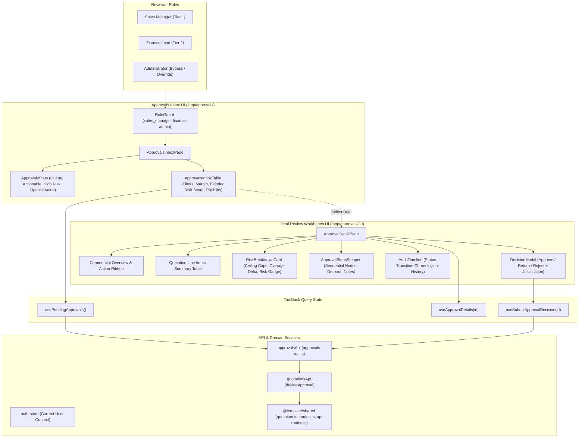
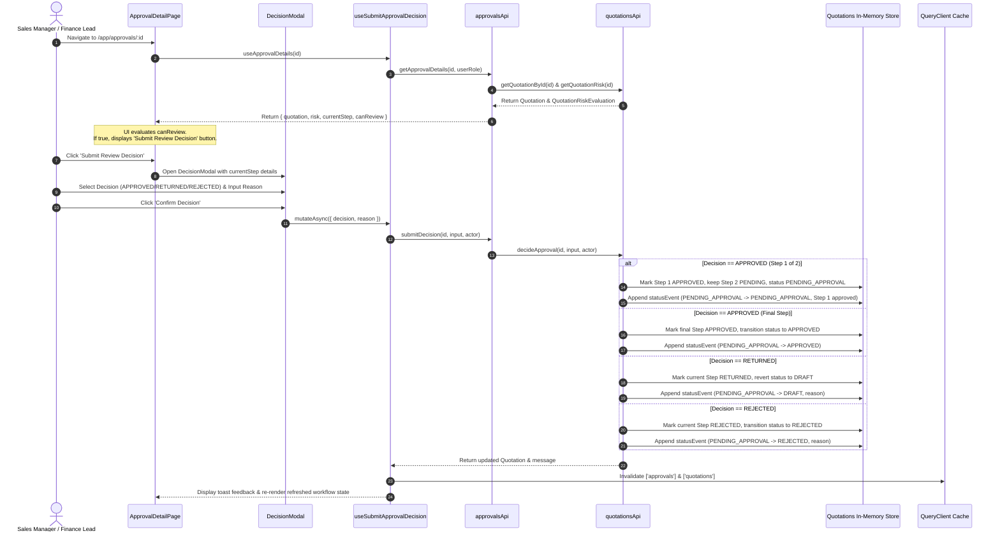

# Architecture Documentation — Approval Routing & Review Workbench (M2)

## 1. Summary
The **Approval Routing & Review Workbench** module provides governance review orchestration for DealFlow360. Operating directly downstream of the Quotation Builder & Risk Engine, this feature empowers Sales Managers, Finance Leads, and Platform Administrators to review, audit, and decide upon escalated deal quotations. The module implements a sequential, multi-tier approval state machine (`SALES_MANAGER` -> `FINANCE`), where managerial authorization unlocks finance margin concession checks. It features an Approvals Inbox with risk filtering, high-risk escalation ribbons, line-by-line policy comparison tables, sequential approval steppers, a decision modal requiring mandatory justification rationale, and an immutable status event audit trail.

---

## 2. Architecture Overview



---

## 3. Data Flow



---

## 4. File Structure

```
DealFlow360/
├── packages/shared/src/
│   ├── schemas/quotation.ts            # ApprovalDecisionInput, ApprovalStep, RiskEvaluation
│   ├── config/api-routes.ts            # apiRoutes.approvals.inbox, decision, steps
│   └── config/routes.ts                # appRoutes.approvals, appRoutes.approvalDetail(id)
├── apps/web/
│   ├── app/
│   │   ├── routes.ts                   # Route tree registration
│   │   └── routes/
│   │       ├── approvals.tsx           # Route wrapper for ApprovalsInboxPage
│   │       └── approval-detail.tsx     # Route wrapper for ApprovalDetailPage
│   └── src/features/approvals/
│       ├── api/
│       │   └── approvals-api.ts        # Client API service with checkCanReview logic
│       ├── hooks/
│       │   └── use-approvals.ts        # usePendingApprovals, useApprovalDetails, useSubmitApprovalDecision
│       ├── components/
│       │   ├── approvals-stats.tsx     # 4 KPI cards: In Queue, Actionable, High Risk, Pipeline Value
│       │   ├── approvals-inbox-table.tsx # Filterable inbox table with risk pills & action links
│       │   ├── risk-breakdown-card.tsx # Line policy compliance table & blended risk gauge
│       │   ├── approval-steps-stepper.tsx # Sequential workflow stepper with decision rationale
│       │   ├── decision-modal.tsx      # Modal with Approve / Return / Reject & rationale
│       │   └── audit-timeline.tsx      # Chronological status transitions with actor logging
│       └── pages/
│           ├── approvals-inbox-page.tsx # Inbox page wrapped with RoleGuard
│           └── approval-detail-page.tsx # Detailed review workbench with RoleGuard
```

---

## 5. Contracts & Schema Definitions

### 5.1 Approval Decision Input Schema (`@template/shared`)
```typescript
export const approvalDecisionInputSchema = z.object({
  decision: z.enum(["APPROVED", "REJECTED", "RETURNED"]),
  reason: z
    .string()
    .min(3, "A justification reason of at least 3 characters is required"),
});
export type ApprovalDecisionInput = z.infer<typeof approvalDecisionInputSchema>;
```

### 5.2 Quotation Approval Step Schema (`@template/shared`)
```typescript
export const quotationApprovalStepSchema = z.object({
  id: z.string(),
  quotationId: z.string(),
  level: approvalLevelSchema, // "SALES_MANAGER" | "FINANCE"
  sequence: z.number().int().positive(),
  decision: approvalDecisionSchema.default("PENDING"),
  approverId: z.string().nullable().optional(),
  reason: z.string().nullable().optional(),
  decidedAt: z.string().nullable().optional(),
  createdAt: z.string().optional(),
});
export type QuotationApprovalStep = z.infer<typeof quotationApprovalStepSchema>;
```

### 5.3 Approval Queue Item (`approvals-api.ts`)
```typescript
export interface ApprovalQueueItem {
  quotation: Quotation;
  currentStep: QuotationApprovalStep | null;
  canReview: boolean;
  requiredRoleLabel: string;
}
```

---

## 6. State Management

The module leverages **TanStack Query (v5)** with coordinated multi-domain cache invalidation:
- **`usePendingApprovals`**: Queries pending quotations for the user's role with 15s staleTime.
- **`useApprovalDetails`**: Fetches the target quotation, line risk evaluation, active approval step, and eligibility flags.
- **`useSubmitApprovalDecision`**: Performs optimistic invalidation upon decision submission:
  - Invalidates `['approvals']` so that queue counters and inbox tables update immediately.
  - Invalidates `['quotations']` so that pipeline views, quotes tables, and detail builder pages synchronize seamlessly.
  - Displays distinctive toast notifications: Success for `APPROVED`, Amber icon for `RETURNED`, and Red banner for `REJECTED`.

---

## 7. UI Components

1. **`ApprovalsStats`**: Top metrics ribbon rendering 4 cards: Total Pending in Queue, Actionable by Current User, High-Risk Deals (`blendedRiskScore >= 70`), and Total Escalated Pipeline Value ($).
2. **`ApprovalsInboxTable`**: Provides filter tabs (`All Pending`, `Actionable`, `High Risk`), real-time search, customer tier badges, formatted financial totals, margin badges, risk pills, pending review tier indicators, and review navigation buttons.
3. **`RiskBreakdownCard`**: Detailed governance panel showing overall blended risk score, progression bar, triggered governance rule, and a per-line table comparing requested discount vs effective ceiling and highlighting excess overages.
4. **`ApprovalStepsStepper`**: Chronological multi-tier stepper indicating step completion status, reviewer IDs, decision timestamps, and reviewer notes.
5. **`DecisionModal`**: Interactive decision dialog featuring 3 distinct action tabs (`Approve`, `Return`, `Reject`), explanatory consequence descriptions based on whether the step is intermediate or final, and a required textarea for reviewer rationale.
6. **`AuditTimeline`**: Vertical timeline presenting all status transition events with transition badges, actor tags, and timestamps.

---

## 8. API Routes

| Resource | Path | Method | Purpose |
|---|---|---|---|
| `apiRoutes.approvals.inbox` | `/api/v1/approvals/inbox` | GET | Fetch pending review queue |
| `apiRoutes.approvals.decision` | `/api/v1/approvals/:id/decision` | POST | Submit tier decision |
| `apiRoutes.approvals.steps` | `/api/v1/approvals/:id/steps` | GET | Fetch active quotation steps |

---

## 9. Error Handling
- **Missing or Invalid Justification**: The `DecisionModal` enforces client-side validation requiring at least 3 characters before mutation submission.
- **Quotation Not Found**: `ApprovalDetailPage` renders a polite empty-state banner with an action link returning to the inbox.
- **Unauthorized Review Attempt**: If a user role does not match the active step level (e.g. Sales Manager attempting to approve Tier 2 Finance), the action callout displays "Awaiting Review: Finance Lead Tier 2" without the decision button.
- **Mutation Rejection**: The mutation `onError` handler catches server-side validation messages and renders a descriptive toast alert.

---

## 10. Security & Role Guarding
- **Page Guards**: Both `/app/approvals` and `/app/approvals/:id` are wrapped with `<RoleGuard allowedRoles={["sales_manager", "finance", "admin"]}>`.
- **Navigation Guard**: The sidebar item for "Deal Approvals" in `navigation.ts` is restricted to managerial and finance roles.
- **Domain Eligibility**: `checkCanReview()` strictly verifies:
  - `admin` -> authorized for all tiers.
  - `sales_manager` -> authorized only when `currentStep.level === "SALES_MANAGER"`.
  - `finance` -> authorized only when `currentStep.level === "FINANCE"`.
  - All other roles -> read-only inspection.

---

## 11. Performance & Caching
- **Query Cache Invalidation**: Coordinated invalidation ensures no stale status transitions between quotation and approval stores.
- **Zero Render Impurity**: Compliant with React Compiler and React 19 standards (no synchronous setState inside effects, no `Date.now()` during component renders).
- **Code Splitting**: Dynamic chunking in Vite ensures review workbench components (`approval-detail.tsx`, `approvals.tsx`) are only loaded when navigated.

---

## 12. Testing & Verification
- **Static Verification**:
  - `pnpm --filter @template/web typecheck` -> 0 TypeScript errors.
  - `pnpm --filter @template/web exec eslint src/features/approvals --fix` -> 0 errors, 0 warnings.
  - `pnpm --filter @template/web build` -> Production client and SSR builds successfully compiled.
- **Sequential Approval State Verification**:
  - Step 1 Approval advances sequence without altering `PENDING_APPROVAL` status prematurely.
  - Final Step Approval shifts quotation to `APPROVED`.
  - Return decision restores quote to `DRAFT` with reviewer notes preserved.
  - Rejection locks quote as `REJECTED`.

---

## 13. Future Considerations
- **Email / Webhook Dispatch**: Trigger transactional email or Slack notifications to designated approver groups when an escalation occurs.
- **Delegated Approvers**: Support temporary approval delegation when managers or finance directors are out of office.
- **Bulk Batch Approvals**: Enable reviewers to batch-approve low-risk quotations meeting predefined criteria.

---

## 14. References & Linked Documentation
- [Document A Platform Specifications](../../architecture/INDEX.md)
- [Quotation Builder & Risk Engine Architecture](./quotation-builder-and-risk-engine.md)
- [Discount Governance Architecture](./discount-governance.md)
- [Foundation and Multi-Role Auth Architecture](./foundation-and-multi-role-auth.md)
