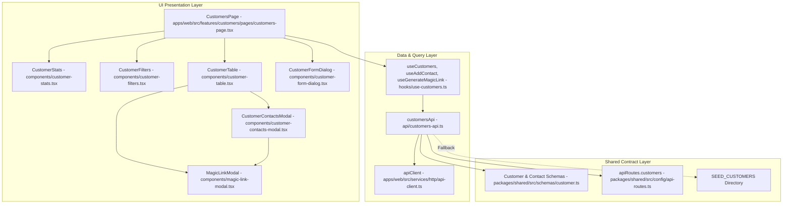

# Architecture: Customer Management (M1)

## 1. Feature Overview
The Customer Management module (M1) provides DealFlow360 with enterprise account management, tier assignment governance (`BRONZE`, `SILVER`, `GOLD`), credit limit allocation, payment terms controls, and customer procurement contact administration. It acts as the authority for customer tiering that drives downstream dynamic pricing (Module 1) and margin-risk discount ceilings (Module 3). Furthermore, it features a built-in negotiation portal magic-link generator, enabling sales reps to provide procurement stakeholders with immediate, tokenized access to digital quotation negotiations without password barriers.

## 2. Architecture Diagram



## 3. Files Changed / Created

| File Path | Action | Role / Purpose |
|---|---|---|
| `packages/shared/src/schemas/customer.ts` | Created | Declares `CustomerContact`, `Customer`, `CreateCustomerInput`, `CreateContactInput`, `PortalMagicLink`, and `SEED_CUSTOMERS`. |
| `packages/shared/src/config/api-routes.ts` | Modified | Registers `/customers` endpoints (`list`, `create`, `getById`, `update`, `remove`, `contacts`, `addContact`, `magicLink`). |
| `packages/shared/src/index.ts` | Modified | Re-exports all customer schemas and types. |
| `apps/web/src/features/customers/api/customers-api.ts` | Created | Client service for customer CRUD, contact registration, and tokenized portal magic-link generation with offline fallback. |
| `apps/web/src/features/customers/hooks/use-customers.ts` | Created | TanStack Query hooks (`useCustomers`, `useCustomer`, `useCreateCustomer`, `useUpdateCustomer`, `useDeleteCustomer`, `useAddContact`, `useGenerateMagicLink`). |
| `apps/web/src/features/customers/components/customer-stats.tsx` | Created | 5-metric KPI ribbon (Total Accounts, Gold Strategic, Silver Enterprise, Bronze Growth, Total Credit Lines). |
| `apps/web/src/features/customers/components/customer-filters.tsx` | Created | Instant search bar with clear button and account tier tab selector (`ALL`, `GOLD`, `SILVER`, `BRONZE`). |
| `apps/web/src/features/customers/components/customer-table.tsx` | Created | High-density operational directory table with tier badges, credit limits, payment terms, contact chips, and magic-link triggers. |
| `apps/web/src/features/customers/components/customer-contacts-modal.tsx` | Created | Modal presenting customer contact stakeholders, inline contact addition, and individual magic-link generation. |
| `apps/web/src/features/customers/components/magic-link-modal.tsx` | Created | Modal showing generated tokenized negotiation link with 1-click clipboard copy and simulation preview link. |
| `apps/web/src/features/customers/components/customer-form-dialog.tsx` | Created | Create/edit dialog configuring company name, industry, tier assignment, credit limits, and billing terms. |
| `apps/web/src/features/customers/pages/customers-page.tsx` | Created | Orchestration view page managing filter states, query data, and modal triggers. |
| `apps/web/app/routes/customers.tsx` | Created | React Router v7 route entrypoint mounting `CustomersPage`. |
| `apps/web/app/routes.ts` | Modified | Registers `/app/customers` route inside the protected app layout. |

## 4. Key Functions & Interfaces

### `Customer` (`packages/shared/src/schemas/customer.ts`)
```typescript
export interface Customer {
  id: string;
  name: string;
  tier: "BRONZE" | "SILVER" | "GOLD";
  currency: string;
  industry: string;
  creditLimit: number; // Minor units (cents)
  paymentTerms: string;
  contacts: CustomerContact[];
  createdAt: string;
  updatedAt: string;
}
```

### `CustomerContact` (`packages/shared/src/schemas/customer.ts`)
```typescript
export interface CustomerContact {
  id: string;
  customerId: string;
  name: string;
  email: string;
  phone?: string;
  roleTitle?: string;
  createdAt: string;
  updatedAt: string;
}
```

### `PortalMagicLink` (`packages/shared/src/schemas/customer.ts`)
```typescript
export interface PortalMagicLink {
  token: string;
  url: string;
  expiresAt: string;
  contactEmail: string;
  customerName: string;
}
```

### `customersApi.generateMagicLink(customerId: string, contactId: string)` (`apps/web/src/features/customers/api/customers-api.ts`)
Generates a tokenized negotiation session URL (`/portal/negotiate?token=...&cid=...&email=...`) valid for 7 days, providing single-session authenticated access for customer procurement leads.

## 5. Data Flow
1. **Directory Fetching**:
   - `CustomersPage` mounts and executes `useCustomers({ query, tier })`.
   - `customersApi.getCustomers` dispatches GET `/customers` using `apiClient`.
   - On response (or local fallback), data is cached under `['customers', filters]`.
2. **Tier & Name Filtering**:
   - User inputs search keywords or clicks `GOLD`, `SILVER`, or `BRONZE` filter tabs.
   - Filter state triggers query re-evaluation with responsive loading skeleton state.
3. **Contact Directory Management**:
   - User clicks the contacts badge on any row to open `CustomerContactsModal`.
   - User can view all assigned procurement leads or fill the inline form to add a new contact via `useAddContact`.
4. **Portal Magic Link Generation**:
   - User clicks "Create Magic Link" either from the table row or from an individual contact card.
   - `useGenerateMagicLink` generates a signed token link and displays `MagicLinkModal`.
   - User copies the link with 1-click clipboard integration.
5. **Account Provisioning**:
   - Admin or Sales Manager opens `CustomerFormDialog` to add or modify an account.
   - Credit limits are entered in dollars and converted to integer minor units (cents) before mutation.
   - On success, `['customers']` cache is invalidated and toast confirmation fires.

## 6. State Management
- **Server Cache**: Managed by `@tanstack/react-query` under key `['customers']` with a 30-second stale time.
- **Search & Filter State**: Stored in `CustomersPage` (`searchQuery`, `selectedTier`).
- **Modal Context**: `activeContactsCustomer`, `activeMagicLink`, `isCustomerDialogOpen`, and `editingCustomer`.
- **Role Authority**: Read from `useAuthStore`; restricts "Add Account", "Edit", and "Delete" actions to `admin` and `sales_manager`.

## 7. API & Network Interactions
- **GET `/customers`**: Returns filtered array of `Customer` records.
- **GET `/customers/:id`**: Returns single customer profile.
- **POST `/customers`**: Request payload conforms to `CreateCustomerInput`; returns created customer.
- **PATCH `/customers/:id`**: Updates customer details (tier, credit limit, payment terms).
- **DELETE `/customers/:id`**: Removes customer from directory.
- **POST `/customers/:id/contacts`**: Request payload conforms to `CreateContactInput`; adds contact.
- **POST `/customers/:id/magic-link`**: Generates signed portal token URL for negotiation.

## 8. Design System & Theming Compliance
- **Design Tokens**: 100% compliant with centralized CSS variables:
  - `bg-card`, `bg-muted`, `bg-background`, `border-border`, `text-foreground`, `text-muted-foreground`, `text-primary`.
- **Customer Tier Accents**:
  - `GOLD`: Amber badge (`bg-amber-500/10 text-amber-500 border-amber-500/20`).
  - `SILVER`: Blue badge (`bg-blue-500/10 text-blue-500 border-blue-500/20`).
  - `BRONZE`: Orange badge (`bg-orange-500/10 text-orange-500 border-orange-500/20`).
- **Zero Arbitrary Classes**: Free of hardcoded hex codes and arbitrary Tailwind bracket classes.

## 9. Dependencies & External Libraries
- `@tanstack/react-query`: Asynchronous query synchronization and mutation handling.
- `lucide-react`: UI iconography (`Building2`, `Award`, `ShieldCheck`, `ShieldAlert`, `CreditCard`, `Users`, `Send`, `Copy`, `Check`, `ExternalLink`, `Clock`, `Plus`, `Edit2`, `Trash2`).
- `react-hot-toast`: Notification banners for clipboard copies, contact additions, and account updates.
- `zod`: Type safety and validation schemas.

## 10. Error Handling & Edge Cases
- **Empty Filter Results**: Displays `<EmptyState />` with reset instructions.
- **Contactless Accounts**: If "Create Magic Link" is clicked on a customer without contacts, the contacts modal automatically opens with prompt to add a representative first.
- **Offline / Mock Fallback**: All endpoints seamlessly fall back to `localCustomers` initialized with `SEED_CUSTOMERS`.

## 11. Security & Authentication Considerations
- Generated portal magic links contain unique session tokens with expiration timestamps.
- Customer management mutations are gated behind `admin` and `sales_manager` roles.

## 12. Performance Considerations
- Minor unit arithmetic eliminates IEEE 754 floating point imprecision for credit lines and monetary ceilings.
- Search queries are matched case-insensitively across multiple fields in a single pass.

## 13. Testing Surface
- **Tier Filtering**: Verify selecting `GOLD` displays only Gold accounts.
- **Contact Addition**: Add contact with phone/title and verify immediate rendering in modal list.
- **Magic Link Clipboard**: Click copy and verify toast feedback and URL structure.
- **Credit Limit Storage**: Enter $500,000 and verify stored as 50,000,000 cents.

## 14. What Was NOT Done / Future Enhancements
- Integration with external Dun & Bradstreet (D&B) credit rating APIs.
- Customer portal authentication handshake (completed in Module 5 & 9).
