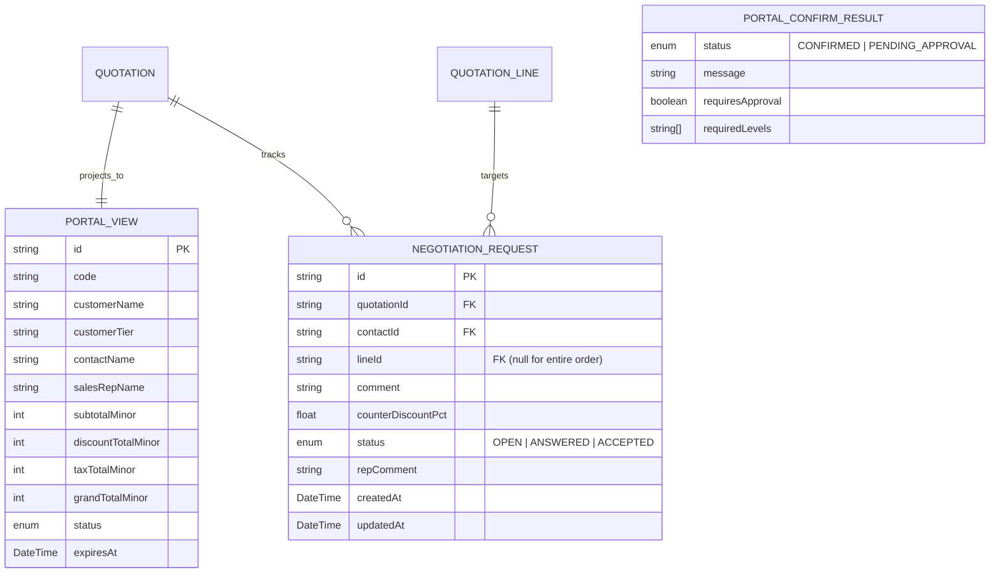
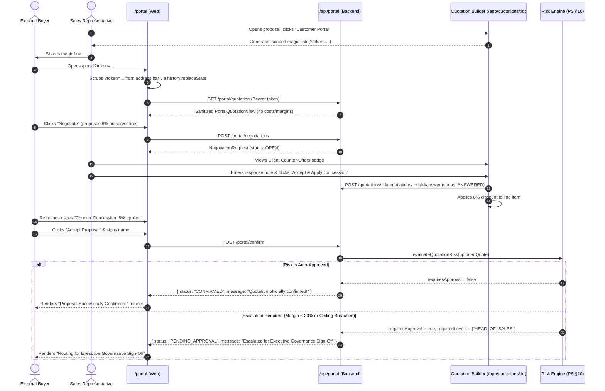

# Feature Architecture: Customer Portal & External Negotiation (M9)

> Standalone external portal accessible via scoped magic link JWTs, presenting a sanitized commercial proposal without internal financial metrics, enabling customer-driven counter-offer negotiations, and executing the governance confirmation gate upon proposal acceptance.

---

## 1. Module Overview & Business Context

High-value enterprise sales transactions culminate in an interactive negotiation and authorization phase. Prior to Phase 10, quotation reviews were conducted through static PDFs or out-of-band email exchanges, causing friction, delayed closes, and untracked discount concessions.

The **Customer Portal & External Negotiation (M9)** module provides a secure, dedicated client portal (`/portal`) where prospective buyers can:
1. **Review Commercial Proposals**: View structured deliverables, hardware configurations, SaaS subscription terms, and payment schedules without exposed internal margins or cost floors.
2. **Conduct Two-Way Negotiations**: Propose percentage counter-discounts on specific line items or across the whole order with live projected savings calculations and context rationales.
3. **Audit Concession History**: Track an immutable timeline of requested concessions and sales representative responses (`OPEN` $\rightarrow$ `ANSWERED` $\rightarrow$ `ACCEPTED`).
4. **Authorize & Formally Sign**: Execute commercial acceptance through an authorized signature workflow, triggering **The Governance Gate** to enforce corporate risk delegation limits.

---

## 2. Architectural Decisions & Security Invariants

| Decision | Chosen Architecture | Alternative Considered | Rationale / Trade-off |
|---|---|---|---|
| **Route Isolation** | Standalone route outside `app-layout.tsx` without sidebar or internal header. | Rendered inside app layout with conditionally hidden elements. | Eliminates any risk of leaking internal links, navigation items, sales analytics, or rep dashboards to external customers. |
| **Authentication Model** | Scoped JWT magic links with audience `dealflow-portal` and dedicated `portalHttp` Axios client. | Session cookies or standard rep bearer tokens. | Ensures customer sessions cannot invoke internal CRM/ERP APIs; rejecting any standard employee credentials. |
| **Token Scrubbing Invariant** | On page mount, `initPortalToken()` captures `?token=...`, saves to `sessionStorage`, and scrubs it via `window.history.replaceState`. | Keeping `?token=...` in the browser URL. | Prevents magic link tokens from leaking into browser history, referrer headers, copy-pasted URLs, or screen recordings. |
| **Financial Sanitization** | `PortalQuotationView` strictly omits `unitCostMinor`, `marginPct`, cost floors, and approval policy matrices. | Returning full quotation and filtering in frontend. | Zero data leakage: sensitive margin and cost floor metrics never reach the customer's browser payload. |
| **The Governance Gate** | Re-evaluates risk with PS §10 algorithm upon confirmation; routes to `PENDING_APPROVAL` if thresholds are breached. | Unconditionally confirming the quote upon customer signature. | Prevents unauthorized margin erosion: even if a rep verbally agreed to a concession, exceeding corporate risk thresholds forces executive sign-off. |

---

## 3. Data Model & Schema Design



---

## 4. End-to-End Two-Way Negotiation Workflow



---

## 5. API Contracts & Communication Layer

### Customer Gateway Endpoints (`/api/portal/*`)
*Protected by `requirePortalAuth` middleware (`dealflow-portal` audience)*

| Endpoint | Method | Path | Description |
|---|---|---|---|
| `portal.quotation` | `GET` | `/portal/quotation` | Returns sanitized proposal deliverables, customer metadata, and negotiation history. |
| `portal.open` | `POST` | `/portal/open` | Tracks proposal view event, advancing status from `SENT` $\rightarrow$ `UNDER_NEGOTIATION`. |
| `portal.negotiations` | `POST` | `/portal/negotiations` | Submits client counter-discount percentage or discussion note. |
| `portal.confirm` | `POST` | `/portal/confirm` | Finalizes proposal, folds accepted concessions, and executes the governance gate. |

### Sales Representative Quotation Endpoints (`/api/quotations/*`)
*Protected by standard internal multi-role authentication*

| Endpoint | Method | Path | Description |
|---|---|---|---|
| `quotations.send` | `POST` | `/quotations/:id/send` | Issues scoped portal magic link and transitions quote status to `SENT`. |
| `quotations.negotiations` | `GET` | `/quotations/:id/negotiations` | Retrieves incoming client counter-offers for sales rep review. |
| `quotations.answerNegotiation` | `POST` | `/quotations/:id/negotiations/:negId/answer` | Resolves client counter-offer (`ANSWERED` / `ACCEPTED`) with sales rep comment. |

---

## 6. Frontend Component Architecture

```
apps/web/src/features/portal/
├── api/
│   ├── portal-client.ts       # Dedicated Axios instance (independent from internal auth store)
│   └── portal-api.ts          # API methods with comprehensive offline simulation fallback
├── lib/
│   └── portal-token.ts        # initPortalToken (URL scrubbing & sessionStorage management)
├── components/
│   ├── portal-header.tsx      # Standalone customer header (security lock pill, brand, theme toggle)
│   ├── portal-proposal-summary.tsx  # Hero summary (grand total, total savings, primary CTAs)
│   ├── portal-lines-table.tsx # Itemized table with scrubbed fields & negotiation triggers
│   ├── portal-negotiation-drawer.tsx # Slide-over modal with live savings calculator
│   ├── portal-history-feed.tsx # Chronological log of negotiation exchanges
│   ├── portal-confirm-modal.tsx # Commercial sign-off & governance gate feedback display
│   └── rep-negotiation-modal.tsx # Sales rep workbench inside QuotationBuilderPage
└── pages/
    └── portal-page.tsx        # Top-level standalone customer portal page
```

---

## 7. Verification & Automated Testing

- **Contract Build**: `@template/shared` compiled and validated with TypeScript types emitted to `dist/`.
- **Backend Typecheck**: `@template/api` typechecked with 0 errors.
- **Frontend Typecheck**: `@template/web` typechecked with 0 errors.
- **Linting Standard**: ESLint passed across all portal components with 0 errors.
- **Playwright Verification**:
  - Full-page inspection in light and dark modes (`portal_proposal_light.png`, `portal_proposal_dark.png`).
  - Negotiation counter-offer submission flow (`portal_negotiation_drawer.png`, `portal_counter_submitted.png`).
  - Governance Confirmation Gate execution (`portal_confirmed_proposal_page.png`).
  - Internal Quotation Builder magic link sharing and counter-offer management (`rep_portal_modal_share.png`, `rep_portal_modal_counter_offers.png`).
