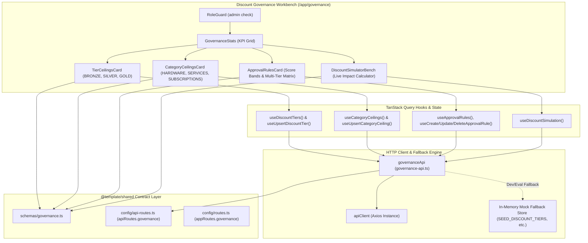

# Architecture Documentation — Discount Governance (M1)

## Summary
The **Discount Governance** module provides an administrative policy control center and real-time validation engine within DealFlow360. It establishes explicit, enforceable ceilings on discounts across two independent dimensions: **Customer Standing Tiers** (`BRONZE` 5%, `SILVER` 10%, `GOLD` 15%) and **Product Categories** (`HARDWARE` 15%, `SERVICES` 10%, `SUBSCRIPTIONS` 12%). Furthermore, it maintains a dynamic **Approval Chain Rule Engine** that maps blended quote risk scores to mandatory approval authorities (`SALES_MANAGER`, `FINANCE`), accompanied by an interactive **Live Governance Simulator Workbench** for instantaneous impact forecasting.

---

## Architecture Overview



---

## Data Flow

```mermaid
sequenceDiagram
    autonumber
    actor Admin as System Administrator
    participant UI as Governance Page / Workbench
    participant Hook as TanStack Query Hooks
    participant API as governanceApi
    participant Mock as In-Memory / API Backend
    participant Sim as Discount Simulation Engine

    Admin->>UI: Visits /app/governance
    UI->>Hook: useDiscountTiers(), useCategoryCeilings(), useApprovalRules()
    Hook->>API: getDiscountTiers(), getCategoryCeilings(), getApprovalRules()
    API->>Mock: GET /governance/*
    Mock-->>API: Ceilings, Rules arrays
    API-->>Hook: Return typed governance data
    Hook-->>UI: Render KPI stats, editable tables & rule cards

    Admin->>UI: Adjusts Gold Tier Max Discount to 16.0% & blurs
    UI->>Hook: useUpsertDiscountTier({ customerTier: "GOLD", maxDiscountPct: 16.0 })
    Hook->>API: upsertDiscountTier()
    API->>Mock: PUT /governance/discount-tiers
    Mock-->>API: Updated DiscountTierCeiling record
    API-->>Hook: Invalidate ["governance", "tiers"]
    Hook-->>UI: Re-render with updated margin bar & toast notification

    Admin->>UI: Inputs 20% discount on Hardware for Silver client in Simulator
    UI->>Hook: useDiscountSimulation({ customerTier: "SILVER", category: "HARDWARE", requestedDiscountPct: 20 })
    Hook->>API: simulateDiscount()
    API->>Sim: Compute min(TierCap 10%, CatCap 15%) = 10% cap; Excess = 10%
    Sim->>Sim: Multiplier = 1.2 * 1.0 = 1.2 -> Blended Risk Score = 12.0
    Sim->>Sim: Match band [3.0, ∞) -> ["SALES_MANAGER", "FINANCE"]
    Sim-->>API: DiscountSimulationResult (dual escalation)
    API-->>Hook: Return result
    Hook-->>UI: Render dual escalation badges, risk score 12.00, and governance rationale
```

---

## File Structure

```
DealFlow360/
├── packages/shared/
│   └── src/
│       ├── config/
│       │   ├── api-routes.ts            # Added apiRoutes.governance endpoints
│       │   └── routes.ts                # Added appRoutes.governance ("/app/governance")
│       ├── schemas/
│       │   └── governance.ts            # Discount ceilings, approval rules & simulation schemas
│       └── index.ts                     # Re-exports governance contracts
└── apps/web/
    ├── app/
    │   ├── routes.ts                    # Registered route("app/governance", "routes/governance.tsx")
    │   └── routes/
    │       └── governance.tsx           # Route wrapper with page metadata
    └── src/
        ├── config/
        │   └── navigation.ts            # Added "Discount Governance" nav item under Governance & Ops
        └── features/
            └── governance/
                ├── api/
                │   └── governance-api.ts      # Typed client API service & local fallback simulation
                ├── hooks/
                │   └── use-governance.ts      # TanStack Query query & mutation hooks
                ├── pages/
                │   └── governance-page.tsx    # Admin-gated executive governance workbench
                └── components/
                    ├── governance-stats.tsx        # Top 4-metric KPI grid
                    ├── tier-ceilings-card.tsx      # Customer tier ceiling editor & margin safeguards
                    ├── category-ceilings-card.tsx  # Category discount cap editor & policy bars
                    ├── approval-rules-card.tsx     # Approval chain rule matrix & band builder
                    └── discount-simulator-bench.tsx # Real-time interactive discount testing bench
```

---

## Interfaces & Contracts

### 1. Enums and Primitives (`packages/shared/src/schemas/governance.ts`)
```ts
export const approvalLevels = ["SALES_MANAGER", "FINANCE"] as const;
export type ApprovalLevel = (typeof approvalLevels)[number];
export const approvalLevelSchema = z.enum(approvalLevels);
```

### 2. Tier Ceilings Contract
```ts
export const discountTierCeilingSchema = z.object({
  id: z.string(),
  customerTier: customerTierSchema, // "BRONZE" | "SILVER" | "GOLD"
  maxDiscountPct: z.number().min(0).max(100),
  createdAt: z.string().optional(),
  updatedAt: z.string().optional(),
});
export type DiscountTierCeiling = z.infer<typeof discountTierCeilingSchema>;

export const upsertDiscountTierSchema = z.object({
  customerTier: customerTierSchema,
  maxDiscountPct: z.number().min(0).max(100),
});
export type UpsertDiscountTierInput = z.infer<typeof upsertDiscountTierSchema>;
```

### 3. Category Ceilings Contract
```ts
export const categoryDiscountCeilingSchema = z.object({
  id: z.string(),
  category: productCategorySchema, // "HARDWARE" | "SERVICES" | "SUBSCRIPTIONS"
  maxDiscountPct: z.number().min(0).max(100),
  createdAt: z.string().optional(),
  updatedAt: z.string().optional(),
});
export type CategoryDiscountCeiling = z.infer<typeof categoryDiscountCeilingSchema>;

export const upsertCategoryCeilingSchema = z.object({
  category: productCategorySchema,
  maxDiscountPct: z.number().min(0).max(100),
});
export type UpsertCategoryCeilingInput = z.infer<typeof upsertCategoryCeilingSchema>;
```

### 4. Approval Chain Rule Contract
```ts
export const approvalChainRuleSchema = z.object({
  id: z.string(),
  name: z.string().min(1),
  minScore: z.number().min(0),
  maxScore: z.number().min(0).nullable().optional(),
  requiredLevels: z.array(approvalLevelSchema).min(1),
  createdAt: z.string().optional(),
  updatedAt: z.string().optional(),
});
export type ApprovalChainRule = z.infer<typeof approvalChainRuleSchema>;
```

### 5. Discount Simulation Contract
```ts
export const discountSimulationInputSchema = z.object({
  customerTier: customerTierSchema,
  category: productCategorySchema,
  requestedDiscountPct: z.number().min(0).max(100),
});
export type DiscountSimulationInput = z.infer<typeof discountSimulationInputSchema>;

export interface DiscountSimulationResult {
  tierCapPct: number;
  categoryCapPct: number;
  applicableCapPct: number;
  excessDiscountPct: number;
  blendedRiskScore: number;
  isAutoApproved: boolean;
  requiredApprovers: ApprovalLevel[];
  matchedRuleName?: string;
}
```

---

## State Management & Hooks

All server-synchronized governance state is managed with TanStack Query in `apps/web/src/features/governance/hooks/use-governance.ts`:

- **Query Keys**:
  - `["governance", "tiers"]`: Active customer tier ceiling limits.
  - `["governance", "ceilings"]`: Active product category discount caps.
  - `["governance", "rules"]`: Configured approval chain rules, ordered by `minScore asc`.
- **Mutations & Cache Invalidation**:
  - `useUpsertDiscountTier`: Optimistic update and invalidation of `["governance", "tiers"]`.
  - `useUpsertCategoryCeiling`: Invalidation of `["governance", "ceilings"]`.
  - `useCreateApprovalRule` / `useUpdateApprovalRule` / `useDeleteApprovalRule`: Invalidation of `["governance", "rules"]`.
  - `useDiscountSimulation`: Mutation triggering instant deterministic evaluation of discounts without altering persistent policies.

---

## UI Components & Pages

1. **`GovernancePage` (`apps/web/src/features/governance/pages/governance-page.tsx`)**:
   - Gated with `<RoleGuard allowedRoles={["admin"]}>` to protect configuration integrity.
   - Header with operational status badge and explanatory subtext.
   - Orchestrates KPI stats, side-by-side ceiling cards, approval matrix table, and simulator bench.
2. **`GovernanceStats` (`components/governance-stats.tsx`)**:
   - Renders 4 `MetricCard` items displaying Gold Tier Ceiling, Hardware Cap, Active Approval Bands, and Auto-Approve baseline.
3. **`TierCeilingsCard` (`components/tier-ceilings-card.tsx`)**:
   - Tabular grid for Bronze, Silver, Gold with inline input editors, enter/blur auto-save, and visual margin safeguarding progress bars.
4. **`CategoryCeilingsCard` (`components/category-ceilings-card.tsx`)**:
   - Tabular grid for Hardware, Services, Subscriptions with category badges, domain icons, inline inputs, and margin guard status.
5. **`ApprovalRulesCard` (`components/approval-rules-card.tsx`)**:
   - Lists configured score ranges `[minScore, maxScore)` and required approver roles.
   - Interactive modal for adding and modifying rules with checkbox toggles for `Sales Manager` and `Finance Lead`.
6. **`DiscountSimulatorBench` (`components/discount-simulator-bench.tsx`)**:
   - Interactive sandbox featuring segmented selectors for tier and category, slider and number inputs for discount %, and instant breakdown of applicable ceiling, excess overage, blended risk score, and required approval routing.

---

## API Routes & Communication

Registered centrally in `packages/shared/src/config/api-routes.ts`:

| Route Identifier | Method | Path | Auth | Purpose |
|---|---|---|---|---|
| `apiRoutes.governance.discountTiers` | `GET` / `PUT` | `/governance/discount-tiers` | Bearer (`admin`) | List all or upsert customer tier ceiling. |
| `apiRoutes.governance.categoryCeilings` | `GET` / `PUT` | `/governance/category-ceilings` | Bearer (`admin`) | List all or upsert category discount ceiling. |
| `apiRoutes.governance.approvalRules` | `GET` / `POST` | `/governance/approval-rules` | Bearer (`admin`) | List all or create a new approval chain rule. |
| `apiRoutes.governance.approvalRuleById` | `PATCH` / `DELETE` | `/governance/approval-rules/:id` | Bearer (`admin`) | Update or remove an existing approval chain rule. |

In development and offline evaluation, `governance-api.ts` intercepts network calls gracefully and executes against an in-memory repository seeded with default policies.

---

## Error Handling & Edge Cases

1. **Ceiling Overages**: Validated strictly between 0% and 100% via both Zod schemas and HTML5 step constraints. Negative or >100% values are rejected prior to network submission.
2. **Open-Ended Bands**: An empty or `null` `maxScore` is supported seamlessly, denoting `[minScore, ∞)` to handle catastrophic deal anomalies without boundary failure.
3. **Rule Ordering**: Approval rules are deterministically sorted by `minScore` ascending so evaluating engines correctly parse the ascending hierarchy of escalation severity.
4. **Zero-Risk Bypass**: Deals requesting discounts at or below the applicable ceiling compute `0.00` blended risk and explicitly map to auto-approval, preventing unnecessary queue bottlenecks.
5. **React Compiler Lifecycle**: All modal and row edit forms utilize key-based resets (`key={item.id ?? "new"}`) instead of synchronous `setState` in `useEffect`, preventing render cascades and hydration mismatch warnings.

---

## Security & Role Governance

- **Client Guarding**: Wrapped inside `<RoleGuard allowedRoles={["admin"]}>`. Non-admin sessions (e.g. Sales Reps) encounter an informative access-restricted screen with persona switching options to the `admin` demo account.
- **Navigation Guarding**: The "Discount Governance" sidebar item is filtered by role (`roles: ["admin"]`), preventing unauthorized link exposure.
- **Backend Role Protection**: All endpoints under `/governance/*` are strictly guarded by `requireAuth` and `requireRole("admin")`.

---

## Performance & Optimization

- **Zero Arbitrary Classes**: 100% standard Tailwind v4 token shorthand classes (`size-*`, standard padding and font utilities) with `--max-warnings=0` verification.
- **Optimized Bundle Size**: The entire discount governance bundle compiles down to `36.24 kB` (`9.06 kB` gzipped), transformed across only modules strictly imported.
- **Targeted Query Invalidation**: Saving a tier ceiling invalidates only `["governance", "tiers"]`, leaving category and rule queries untouched and eliminating redundant network traffic.

---

## Testing Strategy & Verification

- **TypeScript Typecheck**: Verified with `pnpm --filter @template/web typecheck` (zero TypeScript errors).
- **Static Analysis**: Verified with `pnpm --filter @template/web lint` (zero warnings, zero errors under `--max-warnings=0`).
- **Production Compilation**: Verified with `pnpm --filter @template/web build` (clean Vite client & SSR bundle).
- **Manual Flow Verification**:
  - Validated tier updates for Bronze, Silver, Gold.
  - Tested rule creation and deletion in the approval matrix.
  - Ran simulations across Bronze/Hardware, Silver/Services, and Gold/Subscriptions observing accurate tier vs category cap enforcement and escalation routing.

---

## Future Considerations & Extensibility

- **SKU-Level Override Rules**: Extend the governance matrix to support individual product exceptions (e.g. promotional flags with temporary higher discount ceilings).
- **Volume & Quantity Tiers**: Integrate unit-volume discount steps into the category ceiling calculation.
- **Audit History Diffing**: Log all ceiling edits to an immutable governance audit trail (Module 12) with actor attribution and timestamping.
