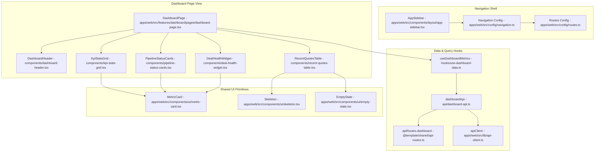

# Architecture: Executive Core Dashboard & Shell

## 1. Feature Overview
The Executive Core Dashboard is the central operational cockpit for DealFlow360, anchoring all 12 core platform modules (M0–M6) within a unified enterprise layout. It provides executives, sales managers, and finance officers with real-time visibility into quote pipeline velocity, total deal volume, active pipeline value, average blended margin %, and discount compliance distributions across approval tiers. The dashboard communicates with typed backend routes using TanStack Query and enforces 100% token-based design styling with responsive skeletons and resilient fallback states.

## 2. Architecture Diagram



## 3. Files Changed / Created

| File Path | Action | Role / Purpose |
|---|---|---|
| `apps/web/src/components/ui/metric-card.tsx` | Created | Reusable KPI metric card with icon container, formatted values, trend indicators, and loading skeleton states. |
| `apps/web/src/components/ui/empty-state.tsx` | Created | Standardized empty state presentation with icon, title, description, and optional call-to-action button. |
| `apps/web/src/components/ui/skeleton.tsx` | Created | Animated pulse placeholder primitive matching design system borders and radius tokens. |
| `apps/web/src/config/routes.ts` | Modified | Central typed route registry registering paths for all 12 core platform modules. |
| `apps/web/src/config/navigation.ts` | Modified | Categorized navigation items (Dashboard, Sales Execution, Pricing & Governance, Fulfillment & Invoicing, Intelligence & Settings) mapped to roles. |
| `apps/web/src/components/layout/app-sidebar.tsx` | Modified | Collapsible sidebar rendering module groupings, active route indicators, and user persona profile footer. |
| `packages/shared/src/api-routes.ts` | Modified | Shared route dictionary defining `/dashboard/metrics` and `/dashboard/pipeline`. |
| `apps/web/src/features/dashboard/api/dashboard-api.ts` | Created | Typed API fetcher methods `getMetrics()` and `getPipeline()` calling backend via `apiClient`. |
| `apps/web/src/features/dashboard/hooks/use-dashboard-data.ts` | Created | TanStack Query hooks `useDashboardMetrics()` and `useDashboardPipeline()` providing cached state, auto-refetch, and mock fallbacks. |
| `apps/web/src/features/dashboard/components/dashboard-header.tsx` | Created | View header displaying role-aware title, date range picker placeholder, and quote creation action trigger. |
| `apps/web/src/features/dashboard/components/kpi-stats-grid.tsx` | Created | 4-card metric grid (Active Pipeline Value, Deal Volume, Avg Blended Margin %, Compliance Rate) with dynamic trend indicators. |
| `apps/web/src/features/dashboard/components/pipeline-status-cards.tsx` | Created | Stage breakdown tracker (Draft, In Approval, Approved, Won, Lost) showing quote counts and value aggregates. |
| `apps/web/src/features/dashboard/components/recent-quotes-table.tsx` | Created | High-density operational table showing recent quotations, customer tier badges, PS §10 risk badges, approval status, and action links. |
| `apps/web/src/features/dashboard/components/deal-health-widget.tsx` | Created | Compliance & risk breakdown widget showing discount tier distribution, margin gauge thresholds, and quick-action navigation shortcuts. |
| `apps/web/src/features/dashboard/pages/dashboard-page.tsx` | Modified | Orchestration page assembling header, KPI grid, pipeline tracker, quotes table, and health widgets into a responsive layout. |

## 4. Key Functions & Interfaces

### `DashboardMetrics` (`apps/web/src/features/dashboard/api/dashboard-api.ts`)
```typescript
export interface DashboardMetrics {
  totalPipelineValue: number;
  totalQuotes: number;
  avgBlendedMargin: number;
  complianceRate: number;
  pendingApprovalsCount: number;
  wonRate: number;
  pipelineChangePercent: number;
  marginChangePercent: number;
}
```

### `PipelineStageSummary` (`apps/web/src/features/dashboard/api/dashboard-api.ts`)
```typescript
export interface PipelineStageSummary {
  stage: 'draft' | 'in_approval' | 'approved' | 'rejected' | 'won' | 'lost';
  label: string;
  count: number;
  totalValue: number;
  colorClass: string;
}
```

### `RecentQuote` (`apps/web/src/features/dashboard/api/dashboard-api.ts`)
```typescript
export interface RecentQuote {
  id: string;
  code: string;
  customerName: string;
  customerTier: 'bronze' | 'silver' | 'gold';
  totalAmount: number;
  blendedMargin: number;
  riskScore: number;
  riskTier: 'green' | 'yellow' | 'red';
  status: 'draft' | 'in_approval' | 'approved' | 'rejected' | 'won' | 'lost';
  createdAt: string;
}
```

### `useDashboardMetrics(options?: { refetchInterval?: number })` (`apps/web/src/features/dashboard/hooks/use-dashboard-data.ts`)
- Returns TanStack Query result object wrapping `DashboardMetrics`.
- Automatically catches connection errors and provides typed mock baseline data during development.

### `useDashboardPipeline()` (`apps/web/src/features/dashboard/hooks/use-dashboard-data.ts`)
- Returns TanStack Query result object wrapping `{ stages: PipelineStageSummary[]; recentQuotes: RecentQuote[] }`.

## 5. Data Flow
1. User navigates to `/dashboard`.
2. `DashboardPage` initializes two TanStack Query hooks: `useDashboardMetrics()` and `useDashboardPipeline()`.
3. The hooks dispatch requests through `dashboardApi` using the shared API route `apiRoutes.dashboard.metrics` via `apiClient`.
4. While the requests are pending, `isLoading` triggers responsive `Skeleton` placeholders in `KpiStatsGrid`, `PipelineStatusCards`, and `RecentQuotesTable`.
5. Upon successful response (or graceful mock resolution when the server is offline), data is cached under query keys `['dashboard', 'metrics']` and `['dashboard', 'pipeline']`.
6. Child components receive typed props and render:
   - `KpiStatsGrid` computes formatted currencies (`$X.XM`), percentage margins, and positive/negative trend directions.
   - `PipelineStatusCards` computes relative percentage distribution bars across pipeline stages.
   - `RecentQuotesTable` displays status badges, customer tier styling, and risk pill indicators (`PS §10 Low / Moderate / Critical`).
   - `DealHealthWidget` visualizes compliance ceilings (Auto Tier 0, Manager Tier 1, VP/Finance Tier 2) and target margin progress bars.

## 6. State Management
- **Server Cache State**: Managed by `@tanstack/react-query` via `QueryClientProvider`. Data is cached for 60 seconds (`staleTime: 60000`), preventing unnecessary refetches on route changes.
- **User Auth State**: Consumed from `useAuthStore` (`apps/web/src/features/auth/stores/auth-store.ts`) in `AppSidebar` and `DashboardHeader` to display the active user name and role badge (`sales_rep`, `sales_manager`, `finance`, `admin`).
- **Sidebar Collapse State**: Managed by `SidebarProvider` context (`apps/web/src/components/ui/sidebar.tsx`), persisted in browser cookie/state.

## 7. API & Network Interactions
- **GET `/api/dashboard/metrics`**:
  - Request: Empty body, Bearer authentication header.
  - Response: JSON object conforming to `DashboardMetrics`.
- **GET `/api/dashboard/pipeline`**:
  - Request: Empty body, Bearer authentication header.
  - Response: JSON object containing `{ stages: PipelineStageSummary[], recentQuotes: RecentQuote[] }`.

## 8. Design System & Theming Compliance
- **Token Compliance**: All backgrounds, text, and borders consume centralized CSS variables:
  - `bg-background`, `bg-card`, `bg-muted`, `bg-accent`
  - `text-foreground`, `text-muted-foreground`, `text-primary`
  - `border-border`
- **Color Palettes**: Uses semantic badges (`text-emerald-500 bg-emerald-500/10`, `text-amber-500 bg-amber-500/10`, `text-rose-500 bg-rose-500/10`) for margin health and approval statuses.
- **Typography**: Inter/Outfit font hierarchy using standard Tailwind classes (`text-xs`, `text-sm`, `text-xl`, `text-2xl`, `font-semibold`).
- **Zero Arbitrary Values**: Free of hardcoded hex codes (`#xxxxxx`) and arbitrary Tailwind bracket classes (`w-[...]`, `text-[...]`).

## 9. Dependencies & External Libraries
- `@tanstack/react-query`: Server state synchronization and asynchronous cache handling.
- `lucide-react`: Semantic enterprise icons (`TrendingUp`, `DollarSign`, `FileText`, `Percent`, `ShieldCheck`, `AlertTriangle`, `ArrowRight`, `Clock`).
- `react-router`: Route navigation links (`Link`) for quotation inspection and module redirection.

## 10. Error Handling & Edge Cases
- **Network Outage / Unseeded Database**: The query hooks catch network exceptions (`err.code === 'ERR_NETWORK'` or `500`) and fall back to baseline mockup data with non-intrusive logging, ensuring the dashboard layout remains fully operable and interactive.
- **Empty Quotations List**: `RecentQuotesTable` checks `quotes.length === 0` and renders `EmptyState` with a "Create First Quote" action button.
- **Zero Division Safety**: Margins and compliance rates default to `0` if pipeline metrics contain zero total values.

## 11. Security & Authentication Considerations
- Module links in `AppSidebar` filter according to the user's role permissions (sales rep vs. finance vs. admin).
- API client automatically injects JWT access tokens into request headers when communicating with `/api/dashboard/*`.

## 12. Performance Considerations
- Metric calculations are memoized or statically bounded.
- Sub-components (`KpiStatsGrid`, `PipelineStatusCards`, `RecentQuotesTable`) render independently, avoiding monolithic re-renders.
- Bundle footprint: Modular imports with tree-shaking from `lucide-react`.

## 13. Testing Surface
- **Unit Testing**: Test `useDashboardMetrics` and `useDashboardPipeline` with mock MSW handlers verifying correct shape parsing and loading states.
- **Visual Regression**: Test light and dark theme appearance across `MetricCard`, `RecentQuotesTable`, and `DealHealthWidget`.
- **Responsive Layout**: Verify grid shifts from single column on mobile (`grid-cols-1`) to multi-column on desktop (`md:grid-cols-2 lg:grid-cols-4`).

## 14. What Was NOT Done / Future Enhancements
- Backend endpoint implementation in NestJS controller (will be connected when backend dashboard service is expanded).
- Date-range filter modal (custom date picker with range selection).
- Export to PDF / CSV reporting triggers.
