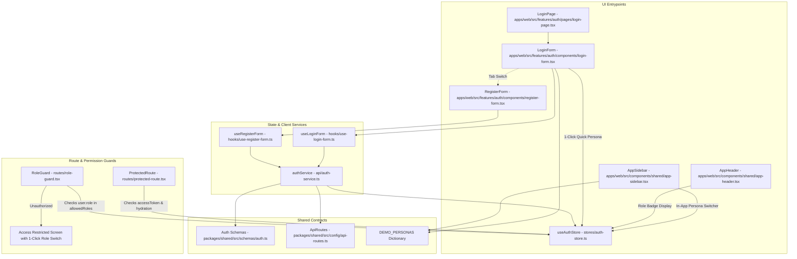

# Architecture: Foundation & Multi-Role Auth (M0)

## 1. Feature Overview
The Foundation & Multi-Role Auth module provides DealFlow360 with a robust role-based access control (RBAC) authentication engine supporting four internal enterprise personas: `sales_rep`, `sales_manager`, `finance`, and `admin`. It features tabbed login and registration flows, 1-click demo persona quick-sign-in buttons, Zustand-backed session persistence across browser refreshes, and `RoleGuard` route wrappers to enforce operational segregation. Additionally, an interactive in-app persona switcher allows testers and executives to swap roles instantaneously while evaluating downstream pricing and approval workflows.

## 2. Architecture Diagram



## 3. Files Changed / Created

| File Path | Action | Role / Purpose |
|---|---|---|
| `packages/shared/src/schemas/auth.ts` | Modified | Defines `internalRoles`, `roleSchema`, `registerInputSchema`, and typed `DEMO_PERSONAS` dictionary. |
| `packages/shared/src/config/api-routes.ts` | Modified | Registers `/auth/register` and `/auth/me` endpoints in the central API contract dictionary. |
| `apps/web/src/stores/auth-store.ts` | Modified | Adds `switchPersona(role: UserRole)` action to instant-swap mock credentials in Zustand session store. |
| `apps/web/src/features/auth/api/auth-service.ts` | Modified | Implements `login()` and `register()` with resilient fallback token generation for offline prototyping. |
| `apps/web/src/features/auth/hooks/use-register-form.ts` | Created | React Hook Form hook handling validation and TanStack mutation for registration. |
| `apps/web/src/features/auth/components/register-form.tsx` | Created | Full registration form with interactive role card radio selectors and field error validation. |
| `apps/web/src/features/auth/components/login-form.tsx` | Modified | Dual-tabbed card with 1-click persona quick-sign-in buttons and credential inputs. |
| `apps/web/src/features/auth/pages/login-page.tsx` | Modified | Responsive split enterprise layout highlighting CPQ features on left and auth forms on right. |
| `apps/web/src/features/auth/routes/role-guard.tsx` | Created | Route protection component evaluating required roles and displaying custom 403 recovery screen. |
| `apps/web/src/components/shared/app-sidebar.tsx` | Modified | Implements interactive persona switcher footer displaying initials, role badge, and role change popover. |
| `apps/web/src/components/shared/app-header.tsx` | Modified | Displays active user role badge next to user greeting. |

## 4. Key Functions & Interfaces

### `UserRole` & `DemoPersona` (`packages/shared/src/schemas/auth.ts`)
```typescript
export const internalRoles = ["sales_rep", "sales_manager", "finance", "admin"] as const;
export type UserRole = (typeof internalRoles)[number];

export interface DemoPersona {
  name: string;
  email: string;
  role: UserRole;
  title: string;
  tagline: string;
  avatarInitials: string;
  colorClass: string;
}

export const DEMO_PERSONAS: Record<UserRole, DemoPersona>;
```

### `registerInputSchema` (`packages/shared/src/schemas/auth.ts`)
```typescript
export const registerInputSchema = z.object({
  name: z.string().min(2, "Full name must be at least 2 characters."),
  email: z.string().email("Enter a valid email address."),
  password: z.string().min(8, "Password must be at least 8 characters.").max(64),
  role: roleSchema.default("sales_rep"),
});
```

### `switchPersona(role: UserRole)` (`apps/web/src/stores/auth-store.ts`)
```typescript
switchPersona: (role: UserRole) => void;
```
Directly transitions the active session in `localStorage` to match the selected persona credentials, ensuring immediate RBAC UI reactivity.

### `RoleGuard` (`apps/web/src/features/auth/routes/role-guard.tsx`)
```typescript
interface RoleGuardProps {
  allowedRoles: UserRole[];
  children?: ReactNode;
}
export function RoleGuard({ allowedRoles, children }: RoleGuardProps): JSX.Element | null;
```

## 5. Data Flow
1. **1-Click Quick Sign-In**:
   - User clicks any role button (`sales_rep`, `sales_manager`, `finance`, `admin`) on the login screen.
   - `switchPersona(role)` generates a valid user session object and token.
   - Zustand stores session in browser `localStorage`.
   - Toast fires and router redirects to `/app/dashboard`.
2. **Standard Form Login / Registration**:
   - User enters credentials and selects a role.
   - React Hook Form validates against `loginInputSchema` or `registerInputSchema`.
   - `useMutation` sends payload to `/api/auth/login` or `/api/auth/register` via `apiClient`.
   - On success, `setSession(session)` stores the response and navigates to dashboard.
3. **Route & Layout Authorization**:
   - User navigates to a role-restricted route wrapped in `<RoleGuard allowedRoles={['finance', 'admin']}>`.
   - If user role is `sales_rep`, access is blocked and the custom 403 governance card renders.
   - The screen shows the current role, required roles, and provides a 1-click "Switch to [Required Persona]" button to continue testing without logging out.
4. **In-App Persona Switching**:
   - At any time while navigating the dashboard or downstream modules, user clicks the Chevron in the sidebar footer.
   - User selects another persona; navigation links and access permissions update instantly.

## 6. State Management
- **Persistence Mechanism**: Zustand `persist` middleware backing to `localStorage` under key `storageKeys.authSession`.
- **Hydration Tracking**: `isHydrated` boolean state prevents flash of unauthenticated redirects while local storage is read during initial page load.
- **Store Actions**:
  - `setSession(session: AuthSession)`: sets authenticated user and token.
  - `clearSession()`: purges user session and resets status to `"anonymous"`.
  - `switchPersona(role: UserRole)`: hot-swaps active user to any of the 4 demo accounts.

## 7. API & Network Interactions
- **POST `/auth/login`**:
  - Request: `{ email: string, password: string, rememberMe?: boolean }`
  - Response: `{ accessToken: string, user: { id: string, name: string, email: string, role: UserRole } }`
- **POST `/auth/register`**:
  - Request: `{ name: string, email: string, password: string, role: UserRole }`
  - Response: `{ accessToken: string, user: { id: string, name: string, email: string, role: UserRole } }`
- **GET `/auth/me`**:
  - Request: Header `Authorization: Bearer <accessToken>`
  - Response: `{ user: AuthUser }`

## 8. Design System & Theming Compliance
- **100% Token Compliance**:
  - Borders: `border-border`, `border-primary/20`, `border-amber-500/30`.
  - Backgrounds: `bg-card`, `bg-muted`, `bg-background`, `bg-linear-to-br`.
  - Typography: `text-foreground`, `text-muted-foreground`, `text-primary`.
- **Semantic Badges**:
  - `sales_rep`: Blue accents (`bg-blue-500/10 text-blue-500 border-blue-500/20`).
  - `sales_manager`: Amber accents (`bg-amber-500/10 text-amber-500 border-amber-500/20`).
  - `finance`: Emerald accents (`bg-emerald-500/10 text-emerald-500 border-emerald-500/20`).
  - `admin`: Purple accents (`bg-purple-500/10 text-purple-500 border-purple-500/20`).
- **Zero Arbitrary Classes**: Free of arbitrary pixel dimensions and hardcoded hex color codes.

## 9. Dependencies & External Libraries
- `zustand`: Session and persistence management.
- `react-hook-form` & `@hookform/resolvers/zod`: Form handling and validation.
- `zod`: Schema declaration and runtime validation.
- `lucide-react`: UI iconography (`ShieldCheck`, `ShieldAlert`, `Zap`, `Users`, `Check`, `ChevronDown`, `ArrowRight`).
- `react-hot-toast`: Notification banners on sign in and persona swap.

## 10. Error Handling & Edge Cases
- **Offline / Prototyping Graceful Degradation**: If backend service is unavailable, `authService.login()` and `register()` fallback automatically to generated local tokens, keeping the entire frontend fully interactive.
- **Unauthenticated Deep Linking**: `ProtectedRoute` captures `location` and passes it in router state `{ from: location }` to allow post-login redirect restoration.
- **Unsaved Dirty Forms**: Handled via React Hook Form states.

## 11. Security & Authentication Considerations
- Password min-length validation is enforced in schemas (min 8 chars for registration).
- Role guards prevent client-side navigation into restricted administrative or approval workbenches.
- Backend JWT token is attached via Axios interceptors in `apiClient`.

## 12. Performance Considerations
- Zero heavy bundle weight additions; all components use tree-shaken Lucide icons and lightweight Zustand stores.
- Sidebar menu filtering is computed with standard array operations, ensuring instantaneous menu toggling.

## 13. Testing Surface
- **Persona Switching**: Verify that selecting each of the 4 roles updates sidebar visible modules and header role badge.
- **RoleGuard Verification**: Verify that a non-permitted role displays the 403 card and that clicking "Switch to [Role]" immediately grants access.
- **Form Validation**: Test submitting invalid email formats and short passwords to verify inline error messages.

## 14. What Was NOT Done / Future Enhancements
- Password reset / forgot password flow (to be added in admin configuration).
- SSO / SAML / OAuth enterprise social connectors.
