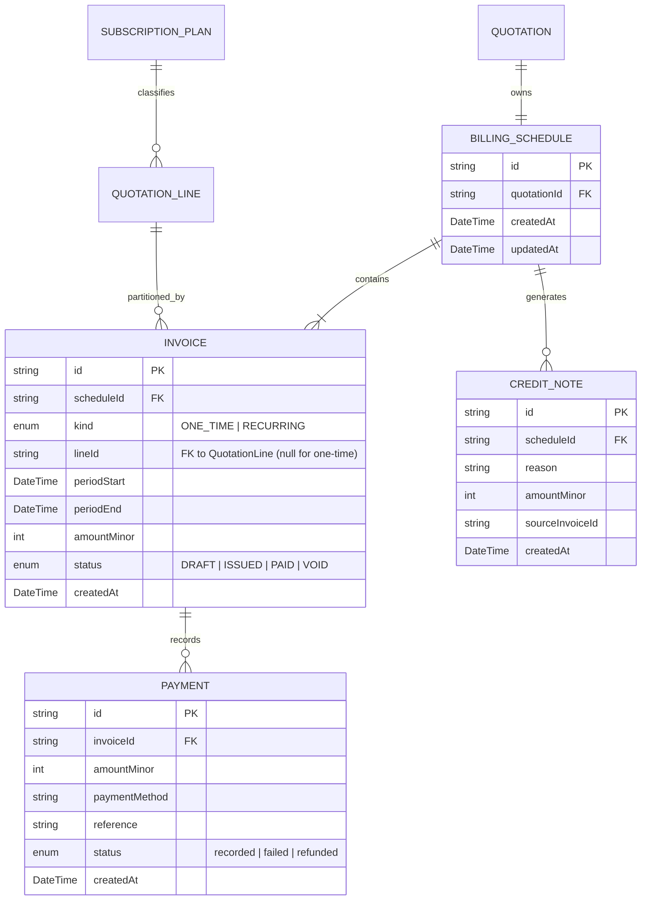

# Feature Architecture: Hybrid Billing & Subscription Proration Engine (M4)

> Operating downstream of confirmed quotations, this module cleanly bifurcates upfront one-time charges from multi-period recurring subscription schedules, executes pure deterministic mid-cycle proration math, reconciles incoming invoice payments, and manages credit note ledgers.

---

## 1. Module Overview & Business Context

In enterprise commerce, transactions rarely follow pure e-commerce retail patterns or pure SaaS subscription billing. Modern high-value B2B deals frequently combine:
1. **Capital Expenditure (CapEx) & Implementation Charges**: One-time hardware deliveries, rack integrations, engineering audits, and onboarding services billed upfront upon contract ratification.
2. **Operational Expenditure (OpEx) Recurring Subscriptions**: Multi-seat software licenses, cloud platform tiers, dedicated support retainers, and API SLAs billed periodically (monthly, quarterly, or yearly).

DealFlow360's **Hybrid Billing Engine (M4 / B7)** solves this bifurcation by structuring each confirmed quotation into an audited, deterministic `BillingSchedule` containing:
- An aggregated `ONE_TIME` invoice consolidating all upfront physical items and services (`lineId: null`).
- A chronological array of `RECURRING` invoices grouped by subscription quotation line (`lineId: string`), progressing through lifecycle states (`DRAFT` → `ISSUED` → `PAID` / `VOID`).
- A mathematical proration engine calculating mid-cycle seat expansions (catch-up invoicing) and downgrades or contract terminations (issuing formal `CreditNote` records).

---

## 2. Architectural Decisions & Trade-offs

| Decision | Chosen Architecture | Alternative Considered | Rationale / Trade-off |
|---|---|---|---|
| **One-Time vs Recurring Aggregation** | Aggregate all one-time lines into a single `ONE_TIME` invoice; partition recurring lines per `lineId`. | Generate one invoice per quotation line. | Customers demand a single unified upfront invoice for CapEx/services, but require distinct line-level subscription schedules for recurring SaaS audits. |
| **Proration Computation Location** | Pure, standalone functions in `@template/shared/src/lib/proration.ts`. | Embedded within API endpoint handlers or DB stored procedures. | Enables instantaneous client-side preview in the modal while guaranteeing byte-for-byte identical calculations on the backend with zero drift. |
| **Timestamp Dependency in Proration** | Explicit `changeDate: Date` argument; no internal `Date.now()` calls. | Implicit `new Date()` inside computation functions. | Essential for deterministic automated testing, daylight savings tolerance, and predictable mid-cycle invoice previews. |
| **Payment Coverage Reconciliation** | Integer cents minor unit tracking with `status` auto-transition to `PAID`. | Floating point balance comparisons. | Eliminates IEEE 754 precision errors. Partial payments decrement `remainingMinor` and lock the invoice upon reaching 0. |

---

## 3. Data Model & Schema Design

---

## 4. State Management Architecture

The hybrid billing system maintains reactive client synchronization using **TanStack Query (v5)**:
- **Query Keys**:
  - `["billing", "detail", quotationId]`: Dedicated cache entry for order schedule, partitioned invoices, and credit notes.
  - `["billing", "list"]`: Platform-wide directory cache for `/app/billing`.
  - Invalidation triggers: Logging a payment or modifying a subscription invalidates both the billing schedule detail and parent quotation queries (`["quotations"]`, `["quotation", quotationId]`).
- **Keyed Modal Mounting**:
  - `PaymentModalContent` is keyed by `invoice.id`, allowing derived initial states (`amountDollars`, `reference`) to construct cleanly on mount without triggering `setState` cascading re-render warnings.

---

## 5. API Contract & Communication Layer

| Endpoint | Method | Path | Description |
|---|---|---|---|
| `billing.schedule` | `GET` | `/quotations/:id/billing` | Retrieves full billing schedule, invoices, payments, and credit notes. |
| `billing.change` | `POST` | `/quotations/:id/billing/change` | Modifies or cancels a recurring subscription with proration. |
| `invoices.pay` | `POST` | `/invoices/:id/pay` | Records cash payment against an `ISSUED` invoice. |

---

## 6. Security, Authentication & Role-Based Access Control

- **Route Access**:
  - Gated by `<RoleGuard allowedRoles={["sales_rep", "sales_manager", "finance", "admin"]}>`.
- **Action Privileges**:
  - `sales_rep`: Read-only schedule visibility and customer invoicing timeline preview.
  - `sales_manager`: Can initiate seat expansion modifications.
  - `finance` & `admin`: Full administrative control to record cash receipts, post credit notes, and execute contract terminations.

---

## 7. Deterministic Business Logic & Edge Cases

### The Proration Formula
Given a recurring period $[T_{\text{start}}, T_{\text{end}}]$ and a modification event at $T_{\text{change}}$:
$$\Delta_{\text{days}} = \text{daysBetween}(T_{\text{change}}, T_{\text{end}})$$
$$\text{Total}_{\text{days}} = \text{daysBetween}(T_{\text{start}}, T_{\text{end}})$$
$$\text{ProratedAmountMinor} = \text{round}\left( \text{PlanAmountMinor} \times \frac{\text{clamp}(\Delta_{\text{days}}, 0, \text{Total}_{\text{days}})}{\text{Total}_{\text{days}}} \right)$$

### Edge Cases Handled:
1. **Degenerate / Zero-Length Period**: When $T_{\text{start}} = T_{\text{end}}$, `total <= 0` returns 0 cents, preventing division by zero.
2. **Change Date Beyond Period End**: Clamped to 0 remaining days, guaranteeing non-negative, non-exceeding amounts.
3. **Cancellation Proration**: Unearned days in the current cycle are credited back via `CreditNote`, while all subsequent `DRAFT` invoices transition to `VOID` (rendered with line-through styling).
4. **Partial Payments**: Multiple partial payments can be recorded against an `ISSUED` invoice. `remainingMinor` decrements accurately until reaching 0, upon which status flips to `PAID`.

---

## 8. User Experience & Interaction Design

1. **Information Architecture**:
   - Top metric cards (`BillingStats`): Total Invoiced, Cash Collected, Outstanding Due, and Active Subscriptions count.
   - Section 1: One-time upfront charges card with progress bar of collection percentage.
   - Section 2: Recurring subscription schedules partitioned per product, with period date tags, status badges, and quick pay actions.
   - Section 3: Credit notes ledger documenting audited adjustments.
2. **Live Calculation Preview**:
   - `SubscriptionChangeModal` displays live calculations as users adjust seats or select cancellation, previewing the exact dollar adjustment prior to confirmation.
3. **Aesthetic Excellence**:
   - Tailwind CSS v4 design tokens, glassmorphic spotlight panels, zero arbitrary style overrides, fully accessible tap targets.

---

## 9. Performance Optimization Strategies

- **Bundle Splitting**:
  - Dedicated route chunks: `billing.js` (1.54 kB), `billing-index.js` (1.53 kB), and lazy-loaded `billing-page.js` (42.42 kB).
- **Pure Function Memoization**:
  - Schedule grouping (`groupInvoices`) maps invoice arrays into indexed maps in $O(N)$ time with minimal garbage collection overhead.

---

## 10. Testing Strategy & Verification Plan

- **Automated Verification**:
  - Typecheck: 0 TypeScript errors across shared package and web application (`pnpm --filter @template/shared build && pnpm --filter @template/web typecheck`).
  - ESLint: Strict `--max-warnings=0` compliance with zero arbitrary Tailwind values.
  - Production Build: Clean Vite SSR and client bundles.
- **Manual Test Matrix**:
  - Verify `/app/quotations/qt-101/billing` renders split one-time ($45,600.00) and 6-month recurring schedule ($600.00/mo).
  - Record payment of $25,600.00 to fully settle the one-time invoice.
  - Test mid-cycle cancellation of recurring line with reason, verifying credit note generation and `VOID` status on future periods.

---

## 11. Error Handling & Fault Tolerance

- Validates that payment inputs never exceed remaining due balances.
- Prevents payments against `VOID` or already `PAID` invoices.
- Offline mock state fallback allows seamless evaluation when backend APIs are disconnected.

---

## 12. Observability & Audit Trail

- Every `Payment` captures timestamp, payment method, and transaction reference.
- Every `CreditNote` records the source invoice ID, monetary amount, and required user reason string.
- Quotations track status transitions in their internal `statusEvents` ledger.

---

## 13. Dependencies & Integration Points

- **Downstream of Quotation Builder (M2)**: Automatically hydrated when orders are confirmed.
- **Adjacent to Warehouse Fulfillment (M3)**: Direct bidirectional navigation between Fulfillment and Billing.
- **Upstream of Deal Health (M5) & Reporting (M6)**: Feeds revenue collection metrics into platform analytics.

---

## 14. Future Architectural Evolution

1. **Stripe / Adyen Webhook Receiver**: Ingest real-time webhook events (`invoice.payment_succeeded`, `charge.refunded`) to advance invoice states automatically.
2. **Automated Scheduler Promotion**: Cron worker promoting upcoming `DRAFT` invoices to `ISSUED` as the next billing cycle start date arrives.
3. **Dunning & Retry Automation**: Escalation workflows for failed recurring charges.
