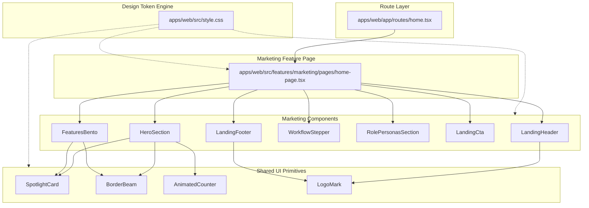
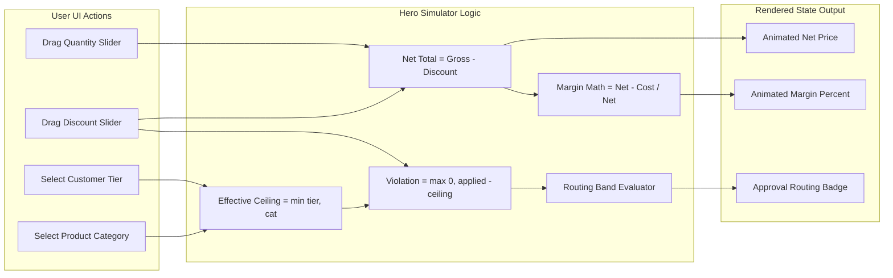

# Landing Page & Centralized Theme Engine

## 1. Feature Overview
The **Landing Page & Centralized Theme Engine** feature provides the public entry point for DealFlow360 and establishes the global visual design system. It introduces a tokenized Executive Cobalt & Mint Emerald color scheme (`apps/web/src/style.css`) and renders an interactive, marketing experience (`apps/web/src/features/marketing/pages/home-page.tsx`) without static hardcoded business data. It includes an interactive client-side **Risk & Margin Simulator** implementing DealFlow360's core PS §10 blended-risk governance logic, an interactive **6-Step Quote-to-Cash Workflow Stepper**, a **Bento Grid** with mouse-following spotlight glow cards, and an interactive **Role Personas Switcher**.

* **Triggering User Action**: Navigating to root route `/` in the web application.
* **Expected Outcome**: Instant rendering of the DealFlow360 landing interface with sticky navigation, live simulator sliders, step-by-step lifecycle explorer, and direct links to `/auth/login` and `/app`.

---

## 2. User Flow
1. Visitor loads `/` in the browser.
2. `HomeRoute` (`apps/web/app/routes/home.tsx`) renders `HomePage` (`apps/web/src/features/marketing/pages/home-page.tsx`).
3. User views top sticky `LandingHeader` with DealFlow360 logo, section anchors, and dark/light mode toggle.
4. User interacts with the **Risk & Margin Simulator** in `HeroSection`:
   * Switches customer tier (`BRONZE`, `SILVER`, `GOLD`).
   * Switches product line category (`HARDWARE`, `SERVICES`, `SUBSCRIPTION`).
   * Drags discount slider (0% to 35%) and quantity slider (1 to 20 units).
   * Observes live calculation of effective ceiling, discount amount, net total, estimated margin %, and automated routing level (`AUTO_APPROVED`, `SALES_MANAGER`, or `FINANCE_AND_MANAGER`) with animated counter transitions.
5. User navigates to `FeaturesBento` to inspect platform capabilities inside interactive `SpotlightCard` and `BorderBeam` containers.
6. User clicks tabs in `WorkflowStepper` to preview the 6 stages of the Quotation-to-Cash lifecycle.
7. User clicks stakeholder pills in `RolePersonasSection` to view role-specific responsibilities (`sales_rep`, `sales_manager`, `finance`, `customer`, `admin`).
8. User clicks "Launch Workspace" or "Sign In", navigating to `/app` or `/auth/login`.

---

## 3. Related File Structure
```
DealFlow360/
├── apps/web/
│   ├── app/
│   │   └── routes/
│   │       └── home.tsx                                    # Route entry & metadata
│   └── src/
│       ├── style.css                                       # Centralized design tokens & animations
│       ├── components/
│       │   ├── shared/
│       │   │   └── logo-mark.tsx                           # DealFlow360 logo branding
│       │   └── ui/
│       │       ├── animated-counter.tsx                    # React Bits cubic-easing numeric ticker
│       │       ├── border-beam.tsx                         # 21st.dev animated traveling light border
│       │       └── spotlight-card.tsx                      # 21st.dev mouse-tracking radial spotlight card
│       └── features/
│           └── marketing/
│               ├── components/
│               │   ├── features-bento.tsx                  # 5-card Bento grid architecture overview
│               │   ├── hero-section.tsx                    # Hero banner & interactive risk simulator
│               │   ├── landing-cta.tsx                     # Call-to-action conversion card
│               │   ├── landing-footer.tsx                  # Platform footer & status indicator
│               │   ├── landing-header.tsx                  # Sticky navbar & mobile dropdown menu
│               │   ├── role-personas-section.tsx           # Interactive 5-role stakeholder switcher
│               │   └── workflow-stepper.tsx                # 6-step quote-to-cash lifecycle visualizer
│               └── pages/
│                   └── home-page.tsx                       # Main page assembler
```

---

## 4. File Responsibilities
### Frontend Files
* **`apps/web/src/style.css`**:
  * *Responsibility*: Single source of truth for design tokens, CSS variables (`--primary`, `--secondary`, `--surface`, `--border`, etc.), Tailwind v4 `@theme inline` mappings, and keyframes (`border-beam`, `fade-in`, `slide-up`, `pulse-subtle`).
  * *Why it's involved*: Enforces the requirement that no component hardcodes color codes.
  * *Key rules*: `.surface-card`, `.border-beam-container`, `.border-beam-runner`.
* **`apps/web/app/routes/home.tsx`**:
  * *Responsibility*: Route entry point for URL `/`. Exports `meta` and default route component.
  * *Why it's involved*: React Router v7 framework-mode route binding.
* **`apps/web/src/features/marketing/pages/home-page.tsx`**:
  * *Responsibility*: Page layout composing all marketing components in semantic order.
* **`apps/web/src/features/marketing/components/landing-header.tsx`**:
  * *Responsibility*: Top navigation bar with logo, hash anchors, theme toggle, and responsive mobile menu toggle.
* **`apps/web/src/features/marketing/components/hero-section.tsx`**:
  * *Responsibility*: Displays primary value proposition and executes the interactive client-side margin & blended-risk calculation logic.
* **`apps/web/src/features/marketing/components/workflow-stepper.tsx`**:
  * *Responsibility*: Manages state for the 6 quote-to-cash lifecycle steps and displays relevant governing rules.
* **`apps/web/src/features/marketing/components/features-bento.tsx`**:
  * *Responsibility*: Renders Bento grid showcasing core pillars with `SpotlightCard` and `BorderBeam`.
* **`apps/web/src/features/marketing/components/role-personas-section.tsx`**:
  * *Responsibility*: Manages active tab state for 5 stakeholder roles and displays their responsibilities.
* **`apps/web/src/features/marketing/components/landing-cta.tsx`**:
  * *Responsibility*: Renders call-to-action banner with navigation buttons.
* **`apps/web/src/features/marketing/components/landing-footer.tsx`**:
  * *Responsibility*: Bottom page footer with site map and system operational badge.
* **`apps/web/src/components/shared/logo-mark.tsx`**:
  * *Responsibility*: Renders DealFlow360 icon and brand badge.
* **`apps/web/src/components/ui/spotlight-card.tsx`**:
  * *Responsibility*: Renders a container that calculates mouse offset on `mousemove` and projects a radial spotlight gradient.
* **`apps/web/src/components/ui/border-beam.tsx`**:
  * *Responsibility*: Renders a CSS-masked border element that loops an animated gradient beam along container borders.
* **`apps/web/src/components/ui/animated-counter.tsx`**:
  * *Responsibility*: Animates numeric changes via `requestAnimationFrame` and cubic ease-out calculation.

---

## 5. File Relationships
```
apps/web/app/routes/home.tsx
  └── imports HomePage (apps/web/src/features/marketing/pages/home-page.tsx)
        ├── imports LandingHeader (components/landing-header.tsx)
        │     ├── imports LogoMark (components/shared/logo-mark.tsx)
        │     ├── imports ThemeToggle (components/shared/theme-toggle.tsx)
        │     └── imports Button (components/ui/button.tsx)
        ├── imports HeroSection (components/hero-section.tsx)
        │     ├── imports SpotlightCard (components/ui/spotlight-card.tsx)
        │     ├── imports BorderBeam (components/ui/border-beam.tsx)
        │     ├── imports AnimatedCounter (components/ui/animated-counter.tsx)
        │     └── imports Button (components/ui/button.tsx)
        ├── imports FeaturesBento (components/features-bento.tsx)
        │     ├── imports SpotlightCard (components/ui/spotlight-card.tsx)
        │     └── imports BorderBeam (components/ui/border-beam.tsx)
        ├── imports WorkflowStepper (components/workflow-stepper.tsx)
        ├── imports RolePersonasSection (components/role-personas-section.tsx)
        ├── imports LandingCta (components/landing-cta.tsx)
        │     └── imports Button (components/ui/button.tsx)
        └── imports LandingFooter (components/landing-footer.tsx)
              └── imports LogoMark (components/shared/logo-mark.tsx)

Global Style Relationship:
apps/web/src/style.css ──> Applied to all components via Tailwind v4 CSS variables
```

---

## 6. End-to-End Execution Flow
1. **Request Trigger**: Browser requests `/`.
2. **Route Resolution**: React Router v7 routes to `apps/web/app/routes/home.tsx`.
3. **Component Mounting**: `HomePage` mounts and renders all 7 section components sequentially.
4. **Theme Resolution**: `apps/web/src/style.css` resolves `:root` (light) or `.dark` class tokens to paint background, surfaces, and cobalt/emerald text.
5. **Interactive Event Loop in Hero**:
   * User clicks a tier button (e.g., `GOLD`) -> `setCustomerTier("GOLD")` triggers re-render.
   * `effectiveCeiling` is recomputed: `Math.min(tierCeilings[customerTier], categoryCeilings[category])`.
   * User moves slider -> `setDiscountPct(Number(e.target.value))` triggers state update.
   * `violationPoints` computed: `Math.max(0, discountPct - effectiveCeiling)`.
   * `marginPct` re-evaluates through `useMemo`.
   * `routingStatus` re-evaluates routing band (`AUTO_APPROVED` | `SALES_MANAGER` | `FINANCE_AND_MANAGER`).
   * `<AnimatedCounter />` receives new numeric targets and runs `requestAnimationFrame` steps to interpolate values.
6. **Spotlight Tracking**: User hovers on `SpotlightCard` -> `handleMouseMove` tracks `clientX/clientY` relative to `getBoundingClientRect()` and updates CSS radial gradient origin.

---

## 7. Mermaid Architecture Diagram


---

## 8. Mermaid Data Flow Diagram


---

## 9. Important Functions and Classes

| Function / Component | File | Purpose | Called by | Calls / Uses | Input | Output | Side Effects |
|---|---|---|---|---|---|---|---|
| `HomePage` | `home-page.tsx` | Main marketing layout container | `home.tsx` | `LandingHeader`, `HeroSection`, `FeaturesBento`, `WorkflowStepper`, `RolePersonasSection`, `LandingCta`, `LandingFooter` | None | `JSX.Element` | None |
| `HeroSection` | `hero-section.tsx` | Renders hero and executes PS §10 risk calculation logic | `home-page.tsx` | `SpotlightCard`, `BorderBeam`, `AnimatedCounter`, `Button` | None | `JSX.Element` | Internal state updates |
| `SpotlightCard` | `spotlight-card.tsx` | Renders card with cursor-following radial spotlight | `hero-section.tsx`, `features-bento.tsx` | `useRef`, `useState` | `children`, `spotlightColor`, `className` | `JSX.Element` | Updates radial-gradient inline style |
| `BorderBeam` | `border-beam.tsx` | Renders traveling border light animation | `hero-section.tsx`, `features-bento.tsx` | None | `size`, `duration`, `borderWidth`, `colorFrom`, `colorTo` | `JSX.Element` | Sets CSS variables for animation |
| `AnimatedCounter` | `animated-counter.tsx` | Smoothly rolls number from previous to next value | `hero-section.tsx` | `requestAnimationFrame`, `useRef`, `useState`, `useEffect` | `value`, `prefix`, `suffix`, `duration` | `JSX.Element` | Drives `requestAnimationFrame` loop |
| `LogoMark` | `logo-mark.tsx` | Displays DealFlow360 icon and brand label | `landing-header.tsx`, `landing-footer.tsx` | None | `className?` | `JSX.Element` | None |

---

## 10. API Flow
* **API Calls**: None directly invoked during landing page rendering.
* **Explanation**: The landing page is a static/interactive presentation tier that executes pure client-side simulation logic; backend endpoints are consumed by the protected `/app` workspace.

---

## 11. Error Flow
* **Runtime Failures**: If an uncaught error occurs during route rendering, it is captured by the parent React Router `ErrorBoundary` (`apps/web/src/components/shared/error-boundary.tsx`).
* **Animation Cleanup**: In `animated-counter.tsx`, the `requestAnimationFrame` identifier is cleanly cancelled on unmount via `window.cancelAnimationFrame(animId)`, preventing memory leaks or detached callback execution.

---

## 12. Architectural Decisions
1. **Centralized CSS Variables vs. Inline Values**: All colors are bound to CSS variables (`--primary`, `--secondary`, `--surface`, `--border`) in `apps/web/src/style.css` rather than Tailwind arbitrary values. This satisfies the requirement that future theme changes require editing only `style.css`.
2. **Pure Client-Side Risk Simulator**: Rather than calling an external API for the simulator demo, the business math (`min(tierCeiling, categoryCeiling)` and value-weighted violation routing) is executed client-side in `HeroSection`. This ensures instant responsiveness with zero server latency or network failures during landing visits.
3. **CSS Masking for BorderBeam**: `BorderBeam` delegates animation to a CSS keyframe runner (`border-beam-container` and `border-beam-runner` in `style.css`), avoiding expensive JavaScript canvas renders while passing strict linter rules (`tailwindcss/no-arbitrary-value`).

---

## 13. Dependencies and Impact
* **Upstream Dependencies**:
  * React Router v7 (`@react-router/node`, `@react-router/serve`, `react-router`)
  * Lucide React (`lucide-react`)
  * Tailwind CSS v4 (`@tailwindcss/vite`, `tailwindcss`)
* **Downstream Consumers**:
  * The root route `/` in `apps/web/app/routes.ts`.
  * Navigation links route to `/auth/login` and `/app`.
* **Blast Radius**:
  * Modifications to `apps/web/src/style.css` impact the entire application's color tokens and dark/light themes.
  * Modifications to `spotlight-card.tsx` or `border-beam.tsx` affect any future dashboard or CPQ view reusing these primitives.

---

## 14. Interview-Level Explanation
* **Where it starts**: The landing page lifecycle starts at `apps/web/app/routes/home.tsx`, which serves as the React Router v7 entry for `/`.
* **Main execution path**: `home.tsx` mounts `HomePage`, which renders seven semantic sub-components. Among them, `HeroSection` manages state for the live CPQ simulator, while `FeaturesBento` and `WorkflowStepper` render interactive platform walkthroughs.
* **Most important files**:
  * `apps/web/src/style.css`: Governs every color token and keyframe animation.
  * `apps/web/src/features/marketing/components/hero-section.tsx`: Houses the PS §10 risk calculation and simulator controls.
  * `apps/web/src/features/marketing/pages/home-page.tsx`: Assembles the page structure.
* **Where business logic lives**: The discount governance calculation logic lives in `hero-section.tsx` (mirroring the backend blended-risk engine logic).
* **Which files to know cold**: `style.css` (design token structure) and `hero-section.tsx` (the effective ceiling and routing band calculation).
