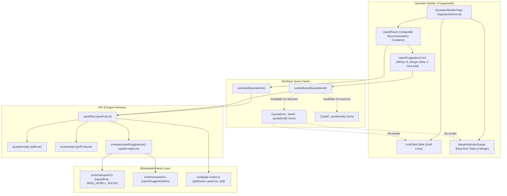
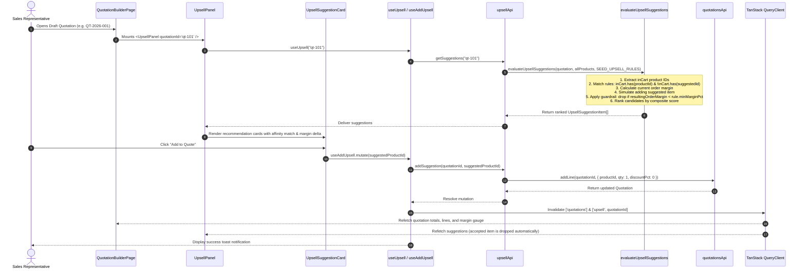

# Architecture Documentation — Live Upsell & Cross-Sell (M3)

## 1. Summary
The **Live Upsell & Cross-Sell** module (`06-upsell-crosssell`) delivers intelligent, real-time product recommendations directly inside the DealFlow360 Quotation Builder. By analyzing the current composition of items in a draft quotation, the engine identifies high-affinity complementary add-ons and services derived from historical co-purchase patterns. The module computes hypothetical margin-delta impact in real time, applies a strict margin-floor guardrail (`minMarginPct`) to prevent profitability erosion, and empowers sales representatives with 1-click addition that immediately re-evaluates server-authoritative line items, gross margin gauges, and approval routing risks.

---

## 2. Architecture Overview



---

## 3. Data Flow



---

## 4. File Structure

```
DealFlow360/
├── packages/shared/src/
│   ├── schemas/upsell.ts            # UpsellRule, UpsellSuggestionItem, SEED_UPSELL_RULES
│   ├── lib/upsell-engine.ts         # Pure deterministic recommendation & margin-floor engine
│   ├── config/api-routes.ts         # apiRoutes.upsell.list and apiRoutes.upsell.add
│   └── index.ts                     # Public exports for shared consumers
├── apps/web/src/
│   └── features/
│       ├── quotations/pages/
│       │   └── quotation-builder-page.tsx # Mounted <UpsellPanel quotationId={quote.id} />
│       └── upsell/
│           ├── api/
│           │   └── upsell-api.ts    # Client service with local engine fallback
│           ├── hooks/
│           │   └── use-upsell.ts    # useUpsell, useAddUpsell hooks with dual invalidation
│           └── components/
│               ├── upsell-suggestion-card.tsx # Individual recommendation card
│               └── upsell-panel.tsx # Collapsible container with filter tabs
```

---

## 5. Contracts & Schema Definitions

### 5.1 Upsell Rule Schema (`@template/shared`)
```typescript
export const upsellRuleSchema = z.object({
  id: z.string(),
  productId: z.string(),
  suggestedId: z.string(),
  coPurchaseScore: z.number().min(0).max(1).default(0),
  minMarginPct: z.number().min(0).max(100).default(0),
  createdAt: z.string().optional(),
  updatedAt: z.string().optional(),
});
export type UpsellRule = z.infer<typeof upsellRuleSchema>;
```

### 5.2 Upsell Suggestion Item Schema (`@template/shared`)
```typescript
export const upsellSuggestionItemSchema = z.object({
  product: productSchema,
  marginDeltaPct: z.number(),
  resultingOrderMarginPct: z.number(),
  promoted: z.boolean().default(false),
  coPurchaseScore: z.number().default(0),
  suggestionMarginPct: z.number().default(0),
  score: z.number().default(0),
});
export type UpsellSuggestionItem = z.infer<typeof upsellSuggestionItemSchema>;
```

---

## 6. State Management

The module coordinates with TanStack Query (v5):
- **`useUpsell(quotationId)`**:
  - Automatically queries suggestions whenever cart lines or quote ID change.
  - Features a 10s `staleTime` to prevent excessive re-computation while ensuring live updates upon line modifications.
- **`useAddUpsell(quotationId)`**:
  - Adds recommended line item with quantity 1 and 0% initial discount.
  - Coordinated Cache Invalidation:
    - `queryClient.invalidateQueries({ queryKey: QUOTATIONS_QUERY_KEY })` -> forces the builder to re-render line rows, grand totals, margin percentage, and blended risk gauge.
    - `queryClient.invalidateQueries({ queryKey: [...UPSELL_QUERY_KEY, quotationId] })` -> removes the accepted product from the suggested items pool.
- **Component Session State (`UpsellPanel`)**:
  - Maintains `dismissedIds` (`Set<string>`) to allow sales reps to hide irrelevant recommendations without mutating database records.
  - Tracks `filter` tabs (`ALL`, `MARGIN_POSITIVE`, `PROMOTED`).
  - Tracks `isCollapsed` for user layout preference.

---

## 7. UI Components

1. **`UpsellSuggestionCard`**:
   - Product title, category badge, and list price.
   - Promoted indicator badge for highlighted strategic products.
   - Co-purchase affinity score pill (`88% Co-Purchase Match`).
   - Margin-delta badge (`+1.4% Margin Delta` in emerald green or `-0.8% Margin Delta` in amber).
   - Deal-level margin estimation tag (`(Deal ~38.5%)`).
   - 1-Click "Add to Quote" action button with loading spinner.
   - "Dismiss" action button to hide from current editing session.
2. **`UpsellPanel`**:
   - Sticky or inline container mounted beneath the Line Items card.
   - Filter bar: All Recommendations, Margin Boosters, and Promoted.
   - Live available suggestions counter badge.
   - Collapse/expand toggle button for minimal distraction.
   - Polite empty state when all rules are satisfied or filtered out.

---

## 8. API Routes

| Resource | Path | Method | Purpose |
|---|---|---|---|
| `apiRoutes.upsell.list` | `/api/v1/quotations/:id/upsell` | GET | Fetch ranked suggestions with margin deltas |
| `apiRoutes.upsell.add` | `/api/v1/quotations/:id/upsell/:suggestedId` | POST | Insert suggested add-on as line item |

---

## 9. Error Handling
- **Missing Quotation**: Gracefully returns an empty suggestions array when quotation is not found or has no lines.
- **Product Missing from Catalog**: Filtered out during candidate evaluation without interrupting user workflow.
- **Add Mutation Failure**: Catches network/validation errors and triggers an explanatory error toast notification (`"Could not add recommended add-on."`).

---

## 10. Security & Role Guarding
- **Draft Status Only**: The `UpsellPanel` is exclusively rendered when quotation status is `DRAFT`. Non-draft quotations (such as `PENDING_APPROVAL`, `APPROVED`, or `CONFIRMED`) omit the panel to prevent unauthorized post-freeze changes.
- **Authoritative Server Pricing**: Price resolution defaults to catalog and tier base prices; discounts cannot be altered during 1-click addition, ensuring compliance with governance ceilings.

---

## 11. Performance & Caching
- **Pure Functional Scoring**: `evaluateUpsellSuggestions` runs in `O(N)` where `N` is the number of catalog products and rules, executing in < 2 milliseconds.
- **Deduplication**: Automatically suppresses duplicate suggestions when multiple cart items trigger the same complementary add-on.
- **Client-Side Memoization**: Suggestions are cached per quotation ID and refreshed only upon quotation line mutations.

---

## 12. Testing & Verification
- **Static Verification**:
  - `pnpm --filter @template/shared build` -> Clean declaration and ESM output.
  - `pnpm --filter @template/web typecheck` -> 0 TypeScript errors.
  - `pnpm --filter @template/web exec eslint src/features/upsell src/features/quotations --fix` -> 0 errors, 0 warnings.
  - `pnpm --filter @template/web build` -> Production client and SSR builds successfully compiled.
- **Functional Verification**:
  - Cart with `prd-hw-01` (Edge Server) generates recommendations for `prd-sub-02` (AI Copilot) and `prd-hw-02` (QuantumSwitch).
  - Clicking "Add to Quote" adds the item to the lines table, recalculates margin gauge, and removes it from the panel.

---

## 13. Future Considerations
- **Machine Learning Co-Purchase Matrix**: Periodically compute affinity weights from historical ERP invoice data.
- **Multi-Quantity Recommendations**: Suggest multi-unit bundles (e.g., 2 switches per server rack).
- **Customer Historical Preference**: Weight recommendations based on the customer account's past purchases.

---

## 14. References & Linked Documentation
- [Document A Platform Specifications](../../architecture/INDEX.md)
- [Quotation Builder & Risk Engine Architecture](./quotation-builder-and-risk-engine.md)
- [Approval Routing & Review Workbench Architecture](./approval-routing-and-workbench.md)
- [Product & Price Lists Architecture](./product-and-price-lists.md)
