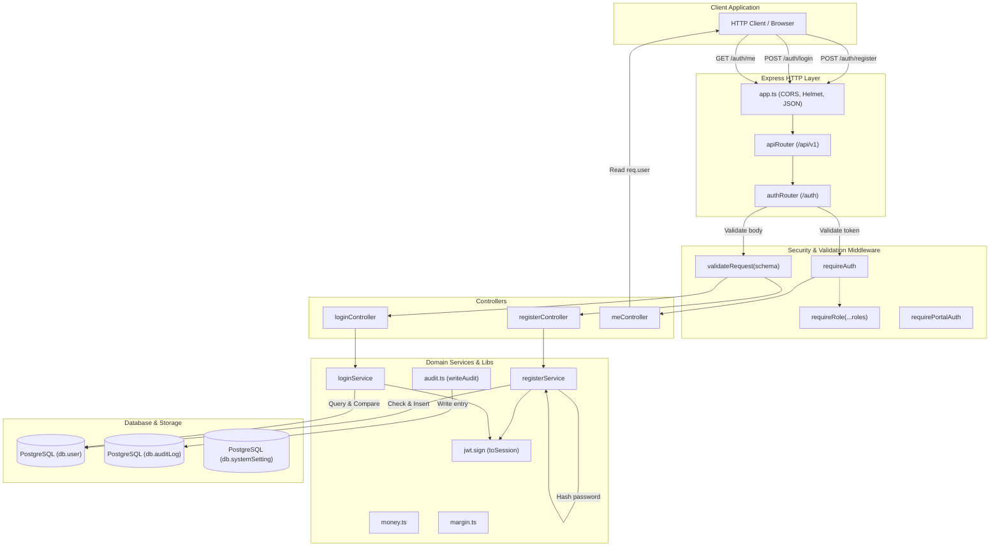
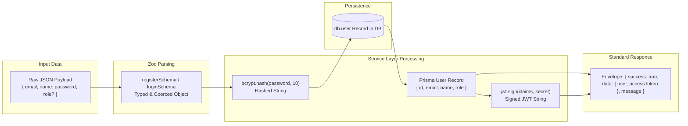

# M0 — Foundation & Auth

## 1. Feature Overview

- **Feature Name**: M0 — Foundation & Auth
- **Purpose**: Establishes the foundational runtime, security, domain utilities, and authentication infrastructure for DealFlow360. This includes password hashing with bcrypt, JWT authentication and role-based authorization (RBAC) supporting 4 internal roles (`sales_rep`, `sales_manager`, `finance`, `admin`), customer portal magic-link authorization, currency/margin math helpers using integer minor units, centralized immutable audit logging, standardized API response/error envelopes, environment configuration with mandatory database URL validation, and idempotent database seeding.
- **Triggering User Action**:
  - User registration via `POST /api/v1/auth/register`
  - User login via `POST /api/v1/auth/login`
  - Authenticated session query via `GET /api/v1/auth/me`
  - Internal or customer portal route access protected by RBAC / portal token middleware
  - Developer/Deployment seed execution via `pnpm db:seed`
- **Expected Outcome**: Secure creation of user records in PostgreSQL, issuance of signed JWT tokens containing user identity and role claims, validated request bodies with standardized error envelopes, enforcement of role permissions, and database initialization with default accounts and system governance settings.

---

## 2. User Flow

1. **User Registration**:
   - Client sends `POST /api/v1/auth/register` with `email`, `name`, `password`, and optional `role`.
   - `validateRequest(registerSchema)` validates input types and constraints (minimum 8-character password, valid email).
   - `registerService` checks if email already exists in `db.user`. If duplicate, throws `EMAIL_TAKEN` (HTTP 409).
   - Password is salted and hashed with bcrypt (cost factor 10).
   - User is created in the database with role default `sales_rep`.
   - JWT access token is signed using `env.JWT_SECRET` and returned alongside user metadata with HTTP 201.
2. **User Login**:
   - Client sends `POST /api/v1/auth/login` with `email` and `password`.
   - `validateRequest(loginSchema)` validates payload structure.
   - `loginService` fetches user by email. If not found or `bcrypt.compare` fails, throws `BAD_CREDENTIALS` (HTTP 401).
   - JWT access token is signed and returned with HTTP 200.
3. **Session Verification**:
   - Client sends `GET /api/v1/auth/me` with header `Authorization: Bearer <token>`.
   - `requireAuth` verifies JWT signature and extracts claims (`sub`, `email`, `name`, `role`) into `req.user`.
   - `meController` returns `{ user: req.user }`.
4. **Role Gating**:
   - Downstream routes invoke `requireAuth` followed by `requireRole("admin", "finance", ...)`.
   - If `req.user.role` is not permitted, request is rejected immediately with HTTP 403 Forbidden.
5. **Customer Portal Token Verification**:
   - External customer clicks quote link containing token (passed in `Authorization` header or `?t=` query parameter).
   - `requirePortalAuth` verifies token with payload constraint `kind: "portal"`.
   - Populates `req.portal = { quotationId, contactId }` for downstream portal handlers or returns HTTP 401.

---

## 3. Related File Structure

### Shared Contracts

- `packages/shared/src/schemas/auth.ts` — Source of truth Zod schemas for auth inputs, outputs, roles, and derived TypeScript types.
- `packages/shared/src/config/api-routes.ts` — Central registry defining API endpoint paths, methods, auth requirements, and descriptions.

### Backend Infrastructure & Configuration

- `apps/api/src/config/env.ts` — Runtime environment variable schema and validation via Zod.
- `apps/api/src/constants/http.ts` — Enumeration of standard HTTP status codes.
- `apps/api/src/types/express.d.ts` — TypeScript type augmentation for `Express.Request` (`req.user` and `req.portal`).
- `apps/api/src/app.ts` — Express application setup, global middleware, router mounting, and error handling.
- `apps/api/src/routes/index.ts` — Root API router mounting `/auth`, `/health`, and `/dashboard`.

### Backend Libraries & Utilities

- `apps/api/src/lib/db.ts` — Prisma client singleton instance.
- `apps/api/src/lib/response.ts` — Standardized response formatting helpers (`sendOk`, `sendCreated`, `sendError`, `sendNotFound`).
- `apps/api/src/lib/validate-request.ts` — Generic Zod request body validation middleware.
- `apps/api/src/lib/money.ts` — Minor unit conversion and percentage discount utilities.
- `apps/api/src/lib/margin.ts` — Line-level and weighted order-level margin calculation functions.
- `apps/api/src/lib/audit.ts` — Immutable audit log recording helper (`writeAudit`).

### Backend Middlewares

- `apps/api/src/middleware/require-auth.ts` — Bearer JWT authentication middleware for internal users.
- `apps/api/src/middleware/require-role.ts` — RBAC authorization middleware for internal roles.
- `apps/api/src/middleware/require-portal-auth.ts` — Portal-scoped JWT authentication middleware for customer magic links.

### Auth Module

- `apps/api/src/modules/auth/auth.schema.ts` — Re-exports schemas from `@template/shared`.
- `apps/api/src/modules/auth/auth.service.ts` — Business logic for registration, credential validation, and JWT minting.
- `apps/api/src/modules/auth/auth.controller.ts` — HTTP controllers for register, login, and profile retrieval.
- `apps/api/src/modules/auth/auth.routes.ts` — Express route definitions for `/auth/register`, `/auth/login`, and `/auth/me`.

### Database

- `apps/api/prisma/seed.ts` — Database seed script populating default users for each role and system settings.

---

## 4. File Responsibilities

| File                                             | Responsibility                       | Why It's Involved                                                            | Key Functions / Exports                                                                               | Dependencies                                                           |
| ------------------------------------------------ | ------------------------------------ | ---------------------------------------------------------------------------- | ----------------------------------------------------------------------------------------------------- | ---------------------------------------------------------------------- |
| `packages/shared/src/schemas/auth.ts`            | Shared type & schema definitions     | Single source of truth for validation rules between frontend and backend     | `internalRoles`, `roleSchema`, `registerSchema`, `loginSchema`, `authUserSchema`, `authSessionSchema` | `zod`                                                                  |
| `packages/shared/src/config/api-routes.ts`       | API endpoint catalog                 | Enforces unified route paths and methods                                     | `apiRoutes`, `ApiRoutes`, `HttpMethod`                                                                | None                                                                   |
| `apps/api/src/config/env.ts`                     | Environment validation               | Enforces presence of `DATABASE_URL`, `JWT_SECRET`, and defaults at boot time | `env`                                                                                                 | `dotenv`, `zod`                                                        |
| `apps/api/src/constants/http.ts`                 | HTTP status constants                | Avoids magic numbers in controllers and middlewares                          | `httpStatus`                                                                                          | None                                                                   |
| `apps/api/src/types/express.d.ts`                | Express request type augmentation    | Provides type safety for `req.user` and `req.portal`                         | `Express.Request` interface augmentation                                                              | `express`                                                              |
| `apps/api/src/lib/db.ts`                         | Prisma Client wrapper                | Prevents multiple client instances in development                            | `db`                                                                                                  | `@prisma/client`                                                       |
| `apps/api/src/lib/response.ts`                   | Standard response formatters         | Ensures consistent API envelope structure                                    | `sendOk`, `sendCreated`, `sendError`, `sendNotFound`                                                  | `express`                                                              |
| `apps/api/src/lib/validate-request.ts`           | Request payload validator middleware | Validates and types `req.body` against Zod schemas                           | `validateRequest`                                                                                     | `express`, `zod`, `httpStatus`                                         |
| `apps/api/src/lib/money.ts`                      | Minor-unit currency utilities        | Avoids floating-point math bugs across billing and quoting                   | `toMinor`, `toMajor`, `applyDiscount`                                                                 | None                                                                   |
| `apps/api/src/lib/margin.ts`                     | Margin computation utilities         | Calculates profit margins consistently across all modules                    | `lineMarginPct`, `orderMarginPct`                                                                     | None                                                                   |
| `apps/api/src/lib/audit.ts`                      | Audit logging wrapper                | Guarantees consistent schema for all database audit trail records            | `writeAudit`                                                                                          | `db`                                                                   |
| `apps/api/src/middleware/require-auth.ts`        | Internal JWT authentication          | Verifies bearer token and attaches user context                              | `requireAuth`, `JwtPayload`                                                                           | `jsonwebtoken`, `env`, `httpStatus`                                    |
| `apps/api/src/middleware/require-role.ts`        | Internal RBAC authorization          | Restricts route access to specified internal roles                           | `requireRole`                                                                                         | `httpStatus`                                                           |
| `apps/api/src/middleware/require-portal-auth.ts` | Customer portal token authentication | Verifies portal magic-link JWT tokens                                        | `requirePortalAuth`                                                                                   | `jsonwebtoken`, `env`, `httpStatus`                                    |
| `apps/api/src/modules/auth/auth.schema.ts`       | Auth module validation contract      | Re-exports shared schemas for API consumers                                  | `loginSchema`, `registerSchema`, `roleSchema`                                                         | `@template/shared`                                                     |
| `apps/api/src/modules/auth/auth.service.ts`      | Auth business logic                  | Executes user registration, credential verification, and token signing       | `registerService`, `loginService`                                                                     | `bcryptjs`, `jsonwebtoken`, `db`, `env`                                |
| `apps/api/src/modules/auth/auth.controller.ts`   | Auth HTTP request handlers           | Translates HTTP requests to service calls and formats responses              | `registerController`, `loginController`, `meController`                                               | `response.ts`, `httpStatus`, `auth.service.ts`                         |
| `apps/api/src/modules/auth/auth.routes.ts`       | Auth route definitions               | Mounts endpoints with schema validation and auth middleware                  | `authRouter`                                                                                          | `createRouter`, `validateRequest`, `requireAuth`, `auth.controller.ts` |
| `apps/api/src/routes/index.ts`                   | Central API router                   | Aggregates module routers under `/api/v1`                                    | `apiRouter`                                                                                           | `express`, `authRouter`, `dashboardRouter`, `healthRouter`             |
| `apps/api/src/app.ts`                            | Express application factory          | Configures middleware stack and root routes                                  | `createApp`                                                                                           | `express`, `cors`, `helmet`, `apiRouter`, `errorHandler`               |
| `apps/api/prisma/seed.ts`                        | Database seeding script              | Upserts baseline test users and governance system settings                   | `main`                                                                                                | `@prisma/client`, `bcryptjs`                                           |

---

## 5. File Relationships

```
packages/shared/src/schemas/auth.ts
   │
   ├── imported by ──> apps/api/src/modules/auth/auth.schema.ts
   │                      │
   │                      └── imported by ──> apps/api/src/modules/auth/auth.routes.ts
   │
   └── imported by ──> apps/api/src/modules/auth/auth.service.ts

apps/api/src/config/env.ts
   ├── imported by ──> apps/api/src/modules/auth/auth.service.ts
   ├── imported by ──> apps/api/src/middleware/require-auth.ts
   ├── imported by ──> apps/api/src/middleware/require-portal-auth.ts
   └── imported by ──> apps/api/src/app.ts

apps/api/src/lib/validate-request.ts
   └── imported by ──> apps/api/src/modules/auth/auth.routes.ts

apps/api/src/middleware/require-auth.ts
   └── imported by ──> apps/api/src/modules/auth/auth.routes.ts (for GET /me)

apps/api/src/modules/auth/auth.controller.ts
   ├── calls ───────> apps/api/src/modules/auth/auth.service.ts
   ├── uses ────────> apps/api/src/lib/response.ts
   ├── uses ────────> apps/api/src/constants/http.ts
   └── imported by ──> apps/api/src/modules/auth/auth.routes.ts

apps/api/src/modules/auth/auth.routes.ts
   └── imported by ──> apps/api/src/routes/index.ts
                          └── imported by ──> apps/api/src/app.ts
                                                 └── imported by ──> apps/api/src/server.ts
```

---

## 6. End-to-End Execution Flow

### Registration Flow (`POST /api/v1/auth/register`)

1. **Client Request**: Client sends JSON `{ email, name, password, role? }`.
2. **App Stack**: `app.ts` parses JSON body via `express.json()` and forwards to `apiRouter` at `/api/v1`.
3. **Route & Validation**: `auth.routes.ts` passes request through `validateRequest(registerSchema)`.
   - If invalid: Returns HTTP 400 with flattened validation issues.
4. **Controller**: `registerController` invokes `registerService(req.body)`.
5. **Service & Database**:
   - `auth.service.ts` queries `db.user.findUnique({ where: { email } })`.
   - If user exists: Throws `EMAIL_TAKEN`; controller catches and returns HTTP 409 (`Email already registered.`).
   - If user is new: Computes `bcrypt.hash(password, 10)` and calls `db.user.create()`.
6. **Token Generation**: `toSession()` creates signed JWT with claims `{ sub, email, name, role }` using `env.JWT_SECRET` and expiration `env.JWT_EXPIRES_IN`.
7. **Response**: `sendCreated()` sends HTTP 201 with `{ success: true, data: { user, accessToken }, message: "Registered successfully." }`.

### Login Flow (`POST /api/v1/auth/login`)

1. **Client Request**: Client sends JSON `{ email, password }`.
2. **Validation**: `validateRequest(loginSchema)` verifies non-empty fields.
3. **Controller & Service**: `loginController` calls `loginService(req.body)`.
4. **Credential Verification**:
   - `auth.service.ts` finds user by email in `db.user`.
   - If not found or `bcrypt.compare(password, user.password)` evaluates to false: Throws `BAD_CREDENTIALS`.
   - Controller catches `BAD_CREDENTIALS` and returns HTTP 401 (`Invalid email or password.`).
5. **Response**: On success, `sendOk()` sends HTTP 200 with `{ success: true, data: { user, accessToken }, message: "Logged in." }`.

### Profile Retrieval Flow (`GET /api/v1/auth/me`)

1. **Client Request**: Client sends `GET` with header `Authorization: Bearer <token>`.
2. **Auth Middleware**: `requireAuth` extracts token, verifies it with `jwt.verify(token, env.JWT_SECRET)`.
   - If missing or invalid: Returns HTTP 401 (`Missing bearer token.` or `Token is invalid or expired.`).
   - If valid: Sets `req.user = payload` and calls `next()`.
3. **Controller**: `meController` runs and returns `sendOk(res, { user: req.user })`.

---

## 7. Mermaid Architecture Diagram



---

## 8. Mermaid Data Flow Diagram



---

## 9. Important Functions and Classes

| Function / Class    | File                                             | Purpose                                                               | Called By                                  | Calls                                                              | Input                                                                                       | Output                                                | Side Effects                           |
| ------------------- | ------------------------------------------------ | --------------------------------------------------------------------- | ------------------------------------------ | ------------------------------------------------------------------ | ------------------------------------------------------------------------------------------- | ----------------------------------------------------- | -------------------------------------- |
| `registerService`   | `apps/api/src/modules/auth/auth.service.ts`      | Registers a new user with hashed password and generates session token | `registerController`                       | `db.user.findUnique`, `bcrypt.hash`, `db.user.create`, `toSession` | `{ email, name, password, role? }`                                                          | `Promise<{ user, accessToken }>`                      | Creates row in `User` table            |
| `loginService`      | `apps/api/src/modules/auth/auth.service.ts`      | Authenticates email/password credentials and generates session token  | `loginController`                          | `db.user.findUnique`, `bcrypt.compare`, `toSession`                | `{ email, password }`                                                                       | `Promise<{ user, accessToken }>`                      | None                                   |
| `toSession`         | `apps/api/src/modules/auth/auth.service.ts`      | Private helper to construct user profile object and sign JWT          | `registerService`, `loginService`          | `jwt.sign`                                                         | `user` object (`id`, `email`, `name`, `role`)                                               | `{ user, accessToken }`                               | None                                   |
| `requireAuth`       | `apps/api/src/middleware/require-auth.ts`        | Validates Bearer JWT and sets `req.user`                              | Protected route handlers (e.g. `/auth/me`) | `jwt.verify`                                                       | `Request`, `Response`, `NextFunction`                                                       | Calls `next()` or returns 401                         | Populates `req.user`                   |
| `requireRole`       | `apps/api/src/middleware/require-role.ts`        | RBAC route guard checking `req.user.role`                             | Protected internal routes                  | None                                                               | Permitted `...roles` (`InternalRole[]`)                                                     | Middleware function calling `next()` or returning 403 | None                                   |
| `requirePortalAuth` | `apps/api/src/middleware/require-portal-auth.ts` | Validates customer portal magic link tokens                           | Customer portal routes                     | `jwt.verify`                                                       | `Request`, `Response`, `NextFunction`                                                       | Calls `next()` or returns 401                         | Populates `req.portal`                 |
| `validateRequest`   | `apps/api/src/lib/validate-request.ts`           | Validates and types request body using Zod                            | Route definitions                          | `schema.safeParse`                                                 | `ZodType<T>`                                                                                | Middleware function calling `next()` or returning 400 | Overwrites `req.body` with parsed data |
| `toMinor`           | `apps/api/src/lib/money.ts`                      | Converts major currency units to minor units (e.g. dollars to cents)  | Financial / quoting calculations           | `Math.round`                                                       | `major: number`                                                                             | `minor: number` (integer)                             | None                                   |
| `toMajor`           | `apps/api/src/lib/money.ts`                      | Converts minor currency units to major units for display              | API serialization                          | None                                                               | `minor: number`                                                                             | `major: number` (float)                               | None                                   |
| `applyDiscount`     | `apps/api/src/lib/money.ts`                      | Applies percentage discount to minor unit amount                      | Quoting calculations                       | `Math.round`                                                       | `minor: number`, `pct: number`                                                              | `discountedMinor: number`                             | None                                   |
| `lineMarginPct`     | `apps/api/src/lib/margin.ts`                     | Computes profit margin percentage for a single line                   | Quotation line calculations                | None                                                               | `netUnitMinor: number`, `unitCostMinor: number`                                             | `marginPct: number`                                   | None                                   |
| `orderMarginPct`    | `apps/api/src/lib/margin.ts`                     | Computes revenue-weighted basket margin percentage                    | Quotation basket calculations              | None                                                               | `lines: { netMinor, costMinor }[]`                                                          | `orderMarginPct: number`                              | None                                   |
| `writeAudit`        | `apps/api/src/lib/audit.ts`                      | Inserts an immutable audit log record                                 | Mutating service handlers                  | `db.auditLog.create`                                               | `entry` object (`actorId`, `actorKind`, `action`, `entity`, `entityId`, `reason?`, `diff?`) | `Promise<void>`                                       | Inserts row into `AuditLog` table      |

---

## 10. API Flow

### `POST /api/v1/auth/register`

- **Caller**: Frontend registration form / API client
- **Controller**: `registerController` (`apps/api/src/modules/auth/auth.controller.ts`)
- **Service**: `registerService` (`apps/api/src/modules/auth/auth.service.ts`)
- **Request Body**:
  ```json
  {
    "email": "user@example.com",
    "name": "Jane Doe",
    "password": "securePassword123",
    "role": "sales_rep"
  }
  ```
- **Response Shape (201 Created)**:
  ```json
  {
    "success": true,
    "data": {
      "user": {
        "id": "uuid-or-cuid",
        "email": "user@example.com",
        "name": "Jane Doe",
        "role": "sales_rep"
      },
      "accessToken": "eyJhbGciOiJIUzI1NiIsIn..."
    },
    "message": "Registered successfully."
  }
  ```
- **Error Handling**:
  - Validation failure: `400 Bad Request` with `{ success: false, message: "Request validation failed.", issues: { ... } }`
  - Duplicate email: `409 Conflict` with `{ success: false, message: "Email already registered." }`
  - Internal error: `500 Internal Server Error`

### `POST /api/v1/auth/login`

- **Caller**: Frontend login form / API client
- **Controller**: `loginController` (`apps/api/src/modules/auth/auth.controller.ts`)
- **Service**: `loginService` (`apps/api/src/modules/auth/auth.service.ts`)
- **Request Body**:
  ```json
  {
    "email": "user@example.com",
    "password": "securePassword123",
    "rememberMe": true
  }
  ```
- **Response Shape (200 OK)**:
  ```json
  {
    "success": true,
    "data": {
      "user": {
        "id": "uuid-or-cuid",
        "email": "user@example.com",
        "name": "Jane Doe",
        "role": "sales_rep"
      },
      "accessToken": "eyJhbGciOiJIUzI1NiIsIn..."
    },
    "message": "Logged in."
  }
  ```
- **Error Handling**:
  - Validation failure: `400 Bad Request` with `{ success: false, message: "Request validation failed.", issues: { ... } }`
  - Bad credentials: `401 Unauthorized` with `{ success: false, message: "Invalid email or password." }`

### `GET /api/v1/auth/me`

- **Caller**: Authenticated frontend client
- **Header**: `Authorization: Bearer <accessToken>`
- **Controller**: `meController` (`apps/api/src/modules/auth/auth.controller.ts`)
- **Response Shape (200 OK)**:
  ```json
  {
    "success": true,
    "data": {
      "user": {
        "sub": "user-id",
        "email": "user@example.com",
        "name": "Jane Doe",
        "role": "sales_rep"
      }
    }
  }
  ```
- **Error Handling**:
  - Missing token: `401 Unauthorized` (`Missing bearer token.`)
  - Invalid/expired token: `401 Unauthorized` (`Token is invalid or expired.`)

---

## 11. Error Flow

```
1. Request Input Failure:
   Client -> validateRequest(schema) -> schema.safeParse(req.body) fails
   -> Returns HTTP 400 { success: false, message: "Request validation failed.", issues }
   -> Execution stops before controller.

2. Auth Validation Failure (Email Conflict):
   registerController -> registerService -> db.user.findUnique finds existing record
   -> throws Error("EMAIL_TAKEN")
   -> registerController catch block matches "EMAIL_TAKEN"
   -> calls sendError(res, 409, "Email already registered.")
   -> Returns HTTP 409 { success: false, message: "Email already registered." }.

3. Auth Validation Failure (Bad Credentials):
   loginController -> loginService -> user not found OR bcrypt.compare returns false
   -> throws Error("BAD_CREDENTIALS")
   -> loginController catch block matches "BAD_CREDENTIALS"
   -> calls sendError(res, 401, "Invalid email or password.")
   -> Returns HTTP 401 { success: false, message: "Invalid email or password." }.

4. Token Authentication Failure:
   Client -> requireAuth -> missing token OR jwt.verify throws error
   -> Returns HTTP 401 { success: false, message: "Missing bearer token." | "Token is invalid or expired." }.

5. Role Authorization Failure:
   Client -> requireRole("admin") -> req.user.role !== "admin"
   -> Returns HTTP 403 { success: false, message: "Forbidden." }.

6. Unexpected Errors:
   Any unhandled error in controller/service -> rethrown -> caught by errorHandler middleware in app.ts
   -> logs error with pino logger
   -> Returns HTTP 500 { message: "Internal server error." }.
```

---

## 12. Architectural Decisions

1. **Single Source of Truth in `@template/shared`**: Roles (`internalRoles`), role enums (`roleSchema`), and auth request schemas are maintained in the shared package. This prevents schema drift between frontend and backend.
2. **Stateless JWT with Standard Claims**: Session tokens contain `sub`, `email`, `name`, and `role`. This enables role checks (`requireRole`) and profile checks (`/auth/me`) without continuous database lookups on every request.
3. **Dedicated Customer Portal Token Strategy**: A separate middleware `requirePortalAuth` verifies tokens containing `{ kind: "portal", quotationId, contactId }`. Portal tokens cannot authenticate internal routes, preventing privilege escalation.
4. **Minor-Unit Currency Convention**: All monetary math is handled in integer minor units (cents/paise) via `money.ts` (`toMinor`, `toMajor`, `applyDiscount`) to prevent IEEE 754 floating-point rounding inaccuracies.
5. **Weighted Basket Margin Calculation**: Overall order margin is calculated by aggregating total net revenue vs total cost (`orderMarginPct`), rather than taking an unweighted arithmetic average of line margins.
6. **Centralized Audit Logging**: Mutating domain operations invoke `writeAudit()` from `audit.ts` to ensure consistent schema tagging (`actorId`, `actorKind`, `action`, `entity`, `entityId`, `diff`) into `AuditLog`.
7. **Strict Environment Enforcement**: `DATABASE_URL` is parsed with `.url()` requirement in `env.ts` during startup, ensuring the API process fails fast if database connectivity is missing.

---

## 13. Dependencies and Impact

- **Dependencies**:
  - `bcryptjs` (password hashing)
  - `jsonwebtoken` (JWT token generation and verification)
  - `zod` (schema validation)
  - `@prisma/client` (database persistence)
  - `dotenv` (environment variables)
- **Downstream Modules Depending on M0**:
  - **M1 (Catalog)**: Uses `requireAuth`, `requireRole`, `money.ts`, `writeAudit`.
  - **M2 (Customer Management)**: Uses `requireAuth`, `requireRole`, `writeAudit`.
  - **M3 (Discount Governance)**: Uses `requireAuth`, `requireRole("admin")`, `SystemSetting` records, `writeAudit`.
  - **M4 (Approval Workflow)**: Uses `requireAuth`, `requireRole("sales_manager" | "finance")`, `writeAudit`.
  - **M5 (Quotation Engine)**: Uses `requireAuth`, `money.ts`, `margin.ts`, `writeAudit`.
  - **M6 (Upsell & Cross-sell)**: Uses `margin.ts`, `money.ts`.
  - **M7 (Inventory & Stock)**: Uses `requireAuth`, `writeAudit`.
  - **M8 (Subscription & Billing)**: Uses `money.ts`, `margin.ts`, `writeAudit`.
  - **M9 (Customer Portal)**: Uses `requirePortalAuth`, `PORTAL_LINK_TTL`.
- **Blast Radius**:
  - Modifying `requireAuth` or `requireRole` impacts all protected API endpoints across the entire application.
  - Modifying `money.ts` or `margin.ts` changes calculation results across quotations, upsells, and billing.
  - Modifying `roleSchema` or `internalRoles` requires synchronization across shared contracts, Prisma schema, and frontend UI role guards.

---

## 14. Interview-Level Explanation

- **Where execution starts**: The HTTP server starts at `apps/api/src/server.ts`, instantiating the Express app in `apps/api/src/app.ts`, which mounts the API router at `/api/v1` and routes auth requests to `apps/api/src/modules/auth/auth.routes.ts`.
- **Main execution path**: Incoming requests pass through `validateRequest` (Zod validation), enter `auth.controller.ts`, invoke `auth.service.ts` to perform database operations (Prisma) and crypto operations (`bcryptjs`, `jsonwebtoken`), and return standardized JSON responses via `response.ts`.
- **Most important files**:
  1. `packages/shared/src/schemas/auth.ts` — Central data contracts and roles.
  2. `apps/api/src/modules/auth/auth.service.ts` — Authentication logic, hashing, and token minting.
  3. `apps/api/src/middleware/require-auth.ts` & `require-role.ts` — Gateway security and RBAC enforcement.
  4. `apps/api/src/lib/money.ts` & `margin.ts` & `audit.ts` — Universal domain primitives.
- **Where business logic lives**:
  - Password hashing and user registration logic lives in `apps/api/src/modules/auth/auth.service.ts`.
  - Role gating logic lives in `apps/api/src/middleware/require-role.ts`.
  - Financial/margin math lives in `apps/api/src/lib/money.ts` and `apps/api/src/lib/margin.ts`.
  - Audit record formation lives in `apps/api/src/lib/audit.ts`.
- **Where data enters, transforms, and persists**:
  - **Enters**: HTTP request body or headers parsed by Express.
  - **Transforms**: Validated by Zod schemas, passwords hashed with bcrypt, tokens signed with JWT claims, monetary values converted to integer minor units.
  - **Persists**: Saved to PostgreSQL via Prisma Client (`db.user`, `db.auditLog`, `db.systemSetting`).
- **How results return**: Through standardized helpers in `apps/api/src/lib/response.ts` (`sendOk` with HTTP 200, `sendCreated` with HTTP 201) wrapping data in `{ success: true, data, message }`.
- **Files to know cold**:
  - `apps/api/src/modules/auth/auth.service.ts`
  - `apps/api/src/middleware/require-auth.ts`
  - `apps/api/src/middleware/require-role.ts`
  - `apps/api/src/lib/money.ts`
