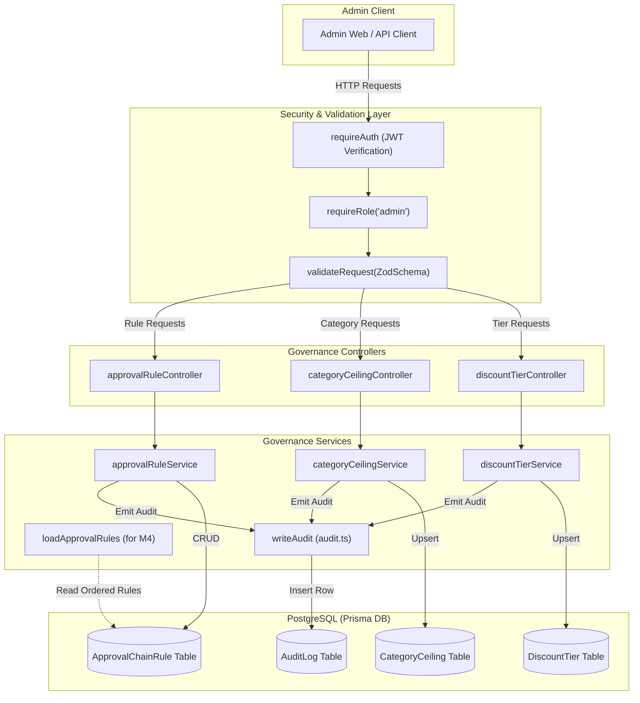
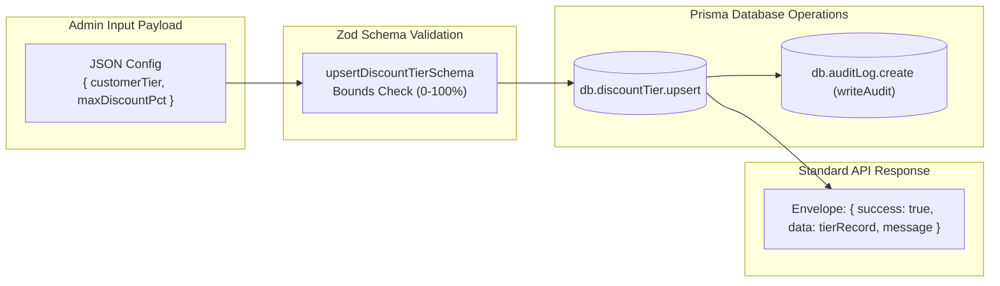

# M3 — Discount Governance Config

## 1. Feature Overview

- **Feature Name**: M3 — Discount Governance Config
- **Purpose**: Provides administrative configuration and governance rules for sales discounting. This includes setting maximum discount percentages per customer tier (`BRONZE`, `SILVER`, `GOLD`), setting maximum category discount ceilings (`HARDWARE`, `SERVICES`, `SUBSCRIPTIONS`), defining risk-score-based approval chain rules with required approval levels (`SALES_MANAGER`, `FINANCE`), emitting immutable audit records via `writeAudit` for every configuration mutation, and enforcing strict admin-only RBAC protection.
- **Triggering User Action**:
  - Admin queries discount tier ceilings via `GET /api/v1/governance/discount-tiers`
  - Admin upserts customer tier discount limits via `PUT /api/v1/governance/discount-tiers`
  - Admin queries category discount ceilings via `GET /api/v1/governance/category-ceilings`
  - Admin upserts category discount limits via `PUT /api/v1/governance/category-ceilings`
  - Admin queries approval chain rules via `GET /api/v1/governance/approval-rules`
  - Admin creates, updates, or deletes approval chain rules via `POST|PATCH|DELETE /api/v1/governance/approval-rules`
  - Database seeding via `pnpm db:seed`
- **Expected Outcome**: Real-time persistence of discount thresholds in PostgreSQL, creation of audit trail entries in `db.auditLog`, and provision of ordered governance rules for downstream evaluation by M4 (Blended Risk Engine) and M5 (Quotation Builder).

---

## 2. User Flow

1. **Discount Tier Management**:
   - Admin client calls `PUT /api/v1/governance/discount-tiers` with `{ customerTier: "GOLD", maxDiscountPct: 15 }`.
   - `requireAuth` and `requireRole("admin")` verify that the caller is authenticated as an administrator.
   - `validateRequest(upsertDiscountTierSchema)` verifies that `customerTier` is a valid enum and `maxDiscountPct` is between 0 and 100.
   - `discountTierService.upsert` performs an idempotent upsert on `db.discountTier` using the unique `customerTier` key.
   - `writeAudit` creates an audit entry recording the actor ID, entity (`DiscountTier`), and modified parameters.
   - Response returns HTTP 200 with the saved tier record.
2. **Category Ceiling Management**:
   - Admin client calls `PUT /api/v1/governance/category-ceilings` with `{ category: "HARDWARE", maxDiscountPct: 15 }`.
   - `validateRequest(upsertCategoryCeilingSchema)` validates category and percentage bounds.
   - `categoryCeilingService.upsert` updates or creates the `CategoryCeiling` record in PostgreSQL.
   - `writeAudit` records the mutation in `db.auditLog`.
   - Returns HTTP 200 with the saved ceiling record.
3. **Approval Chain Rule Management**:
   - Admin client sends `POST /api/v1/governance/approval-rules` with `{ name: "small overage", minScore: 0.01, maxScore: 3, requiredLevels: ["SALES_MANAGER"] }`.
   - `validateRequest(createApprovalRuleSchema)` validates rule boundaries and required approvers.
   - `approvalRuleService.create` inserts the rule in `db.approvalChainRule` and logs the audit event.
   - Returns HTTP 201 with the created rule record.
4. **In-Process Consumption by Risk Engine (M4)**:
   - When M4 evaluates quotation risk, it calls `loadApprovalRules()` to fetch all rules ordered by `minScore` ascending to map calculated risk scores to required approval tiers.

---

## 3. Related File Structure

### Shared Contracts

- `packages/shared/src/schemas/governance.ts` — Zod schemas (`upsertDiscountTierSchema`, `upsertCategoryCeilingSchema`, `createApprovalRuleSchema`, `updateApprovalRuleSchema`), enums (`approvalLevels`, `customerTiers`, `productCategories`), and TypeScript types.
- `packages/shared/src/config/api-routes.ts` — Route definitions for `/governance/discount-tiers`, `/governance/category-ceilings`, and `/governance/approval-rules`.
- `packages/shared/src/index.ts` — Re-exports governance schemas and contracts.

### Backend Module

- `apps/api/src/modules/governance/governance.schema.ts` — Re-exports validation schemas from `@template/shared`.
- `apps/api/src/modules/governance/governance.service.ts` — Business logic for discount tier upsert, category ceiling upsert, approval rule CRUD, and `loadApprovalRules` helper with `writeAudit` logging.
- `apps/api/src/modules/governance/governance.controller.ts` — Express controllers for list, upsert, create, update, and delete actions.
- `apps/api/src/modules/governance/governance.routes.ts` — Express router with `requireAuth` + `requireRole("admin")` and schema validators.

### Routing & Database

- `apps/api/src/routes/index.ts` — Mounts `governanceRouter` under `/governance`.
- `apps/api/prisma/seed.ts` — Seed logic for initial discount tiers, category caps, and approval score bands.

---

## 4. File Responsibilities

| File                                                       | Responsibility               | Why It's Involved                                              | Key Functions / Exports                                                                                                                                                                                                                                           | Dependencies                                                    |
| ---------------------------------------------------------- | ---------------------------- | -------------------------------------------------------------- | ----------------------------------------------------------------------------------------------------------------------------------------------------------------------------------------------------------------------------------------------------------------- | --------------------------------------------------------------- |
| `packages/shared/src/schemas/governance.ts`                | Governance data contracts    | Single source of truth for discount validation rules and types | `approvalLevelSchema`, `customerTierSchema`, `productCategorySchema`, `upsertDiscountTierSchema`, `upsertCategoryCeilingSchema`, `createApprovalRuleSchema`, `updateApprovalRuleSchema`                                                                           | `zod`                                                           |
| `packages/shared/src/config/api-routes.ts`                 | Route registry               | Declares endpoints, methods, and auth requirements             | `apiRoutes.governance`                                                                                                                                                                                                                                            | None                                                            |
| `packages/shared/src/index.ts`                             | Package export entrypoint    | Exposes governance schemas to monorepo packages                | `export * from "./schemas/governance"`                                                                                                                                                                                                                            | Shared schemas                                                  |
| `apps/api/src/modules/governance/governance.schema.ts`     | Local schema proxy           | Re-exports shared contracts for the API module                 | All governance schemas & types                                                                                                                                                                                                                                    | `@template/shared`                                              |
| `apps/api/src/modules/governance/governance.service.ts`    | Governance business logic    | Implements database mutations and emits audit entries          | `discountTierService`, `categoryCeilingService`, `approvalRuleService`, `loadApprovalRules`                                                                                                                                                                       | `db`, `writeAudit`                                              |
| `apps/api/src/modules/governance/governance.controller.ts` | HTTP request handlers        | Invokes services and formats responses                         | `listDiscountTiersController`, `upsertDiscountTierController`, `listCategoryCeilingsController`, `upsertCategoryCeilingController`, `listApprovalRulesController`, `createApprovalRuleController`, `updateApprovalRuleController`, `deleteApprovalRuleController` | `response.ts`, `governance.service.ts`                          |
| `apps/api/src/modules/governance/governance.routes.ts`     | Route definitions & security | Enforces admin role access and schema validation               | `governanceRouter`                                                                                                                                                                                                                                                | `createRouter`, `requireAuth`, `requireRole`, `validateRequest` |
| `apps/api/src/routes/index.ts`                             | Root API router              | Mounts `/governance` under `/api/v1`                           | `apiRouter`                                                                                                                                                                                                                                                       | `express`, `governanceRouter`                                   |
| `apps/api/prisma/seed.ts`                                  | Seed script                  | Upserts baseline discount limits and approval rules            | `main`                                                                                                                                                                                                                                                            | `@prisma/client`, `bcryptjs`                                    |

---

## 5. File Relationships

```
packages/shared/src/schemas/governance.ts
   │
   ├── imported by ──> packages/shared/src/index.ts
   │                      │
   │                      └── imported by ──> apps/api/src/modules/governance/governance.schema.ts
   │                                             │
   │                                             ├── imported by ──> apps/api/src/modules/governance/governance.service.ts
   │                                             └── imported by ──> apps/api/src/modules/governance/governance.routes.ts

apps/api/src/modules/governance/governance.service.ts
   ├── uses ────────> apps/api/src/lib/db.ts
   ├── uses ────────> apps/api/src/lib/audit.ts (writeAudit)
   └── imported by ──> apps/api/src/modules/governance/governance.controller.ts

apps/api/src/modules/governance/governance.controller.ts
   ├── uses ────────> apps/api/src/lib/response.ts (sendOk, sendCreated)
   └── imported by ──> apps/api/src/modules/governance/governance.routes.ts

apps/api/src/modules/governance/governance.routes.ts
   ├── uses ────────> apps/api/src/middleware/require-auth.ts
   ├── uses ────────> apps/api/src/middleware/require-role.ts ("admin")
   ├── uses ────────> apps/api/src/lib/validate-request.ts
   └── imported by ──> apps/api/src/routes/index.ts
                          └── imported by ──> apps/api/src/app.ts
```

---

## 6. End-to-End Execution Flow

### Upsert Discount Tier Flow (`PUT /api/v1/governance/discount-tiers`)

1. **Client Request**: Admin sends JSON `{ customerTier: "GOLD", maxDiscountPct: 15 }` with `Authorization: Bearer <token>`.
2. **Auth & RBAC**:
   - `requireAuth` verifies token and sets `req.user`.
   - `requireRole("admin")` verifies `req.user.role === "admin"`. If not, returns HTTP 403.
3. **Validation**: `validateRequest(upsertDiscountTierSchema)` parses and validates the request body.
4. **Controller**: `upsertDiscountTierController` calls `discountTierService.upsert(req.body, req.user?.sub)`.
5. **Database Upsert**:
   - `db.discountTier.upsert` queries by unique `customerTier`. Updates `maxDiscountPct` if found, creates new record if absent.
6. **Audit Trail**:
   - `writeAudit` executes `db.auditLog.create` with `action: "UPSERT_DISCOUNT_TIER"`, `entity: "DiscountTier"`, `actorId: req.user.sub`, and payload diff.
7. **Response**: `sendOk` returns HTTP 200 with `{ success: true, data: { ...tier }, message: "Tier ceiling saved." }`.

### Create Approval Rule Flow (`POST /api/v1/governance/approval-rules`)

1. **Client Request**: Admin sends `{ name: "high risk", minScore: 3, maxScore: null, requiredLevels: ["SALES_MANAGER", "FINANCE"] }`.
2. **Auth & Validation**: Passes admin check and `validateRequest(createApprovalRuleSchema)`.
3. **Controller & Service**: `createApprovalRuleController` invokes `approvalRuleService.create(req.body, req.user?.sub)`.
4. **Database Insert & Audit**:
   - `db.approvalChainRule.create` persists rule in PostgreSQL.
   - `writeAudit` logs `action: "CREATE_APPROVAL_RULE"`.
5. **Response**: `sendCreated` returns HTTP 201 with `{ success: true, data: { ...rule }, message: "Approval rule created." }`.

---

## 7. Mermaid Architecture Diagram



---

## 8. Mermaid Data Flow Diagram



---

## 9. Important Functions and Classes

| Function / Export               | File                                                    | Purpose                                                      | Called By                                | Calls                                       | Input                                          | Output                         | Side Effects                                     |
| ------------------------------- | ------------------------------------------------------- | ------------------------------------------------------------ | ---------------------------------------- | ------------------------------------------- | ---------------------------------------------- | ------------------------------ | ------------------------------------------------ |
| `discountTierService.list`      | `apps/api/src/modules/governance/governance.service.ts` | Retrieves all discount tier limits sorted by percentage      | `listDiscountTiersController`            | `db.discountTier.findMany`                  | None                                           | `Promise<DiscountTier[]>`      | None                                             |
| `discountTierService.upsert`    | `apps/api/src/modules/governance/governance.service.ts` | Upserts a customer tier limit and records audit log          | `upsertDiscountTierController`           | `db.discountTier.upsert`, `writeAudit`      | `{ customerTier, maxDiscountPct }`, `actorId?` | `Promise<DiscountTier>`        | Modifies `DiscountTier`, inserts `AuditLog`      |
| `categoryCeilingService.list`   | `apps/api/src/modules/governance/governance.service.ts` | Retrieves all product category ceilings sorted by percentage | `listCategoryCeilingsController`         | `db.categoryCeiling.findMany`               | None                                           | `Promise<CategoryCeiling[]>`   | None                                             |
| `categoryCeilingService.upsert` | `apps/api/src/modules/governance/governance.service.ts` | Upserts a category ceiling and records audit log             | `upsertCategoryCeilingController`        | `db.categoryCeiling.upsert`, `writeAudit`   | `{ category, maxDiscountPct }`, `actorId?`     | `Promise<CategoryCeiling>`     | Modifies `CategoryCeiling`, inserts `AuditLog`   |
| `approvalRuleService.list`      | `apps/api/src/modules/governance/governance.service.ts` | Retrieves all approval rules sorted by minimum score         | `listApprovalRulesController`            | `db.approvalChainRule.findMany`             | None                                           | `Promise<ApprovalChainRule[]>` | None                                             |
| `approvalRuleService.create`    | `apps/api/src/modules/governance/governance.service.ts` | Creates an approval chain rule and records audit log         | `createApprovalRuleController`           | `db.approvalChainRule.create`, `writeAudit` | `CreateApprovalRuleInput`, `actorId?`          | `Promise<ApprovalChainRule>`   | Inserts `ApprovalChainRule`, inserts `AuditLog`  |
| `approvalRuleService.update`    | `apps/api/src/modules/governance/governance.service.ts` | Updates an approval chain rule by ID and records audit log   | `updateApprovalRuleController`           | `db.approvalChainRule.update`, `writeAudit` | `id`, `UpdateApprovalRuleInput`, `actorId?`    | `Promise<ApprovalChainRule>`   | Modifies `ApprovalChainRule`, inserts `AuditLog` |
| `approvalRuleService.delete`    | `apps/api/src/modules/governance/governance.service.ts` | Deletes an approval chain rule by ID and records audit log   | `deleteApprovalRuleController`           | `db.approvalChainRule.delete`, `writeAudit` | `id`, `actorId?`                               | `Promise<ApprovalChainRule>`   | Deletes `ApprovalChainRule`, inserts `AuditLog`  |
| `loadApprovalRules`             | `apps/api/src/modules/governance/governance.service.ts` | Helper to fetch ordered approval rules for risk evaluation   | M4 Risk Engine (`resolveRequiredLevels`) | `db.approvalChainRule.findMany`             | None                                           | `Promise<ApprovalChainRule[]>` | None                                             |

---

## 10. API Flow

### Discount Tiers

- `GET /api/v1/governance/discount-tiers` (Auth: Admin) ➔ Returns list of all customer tier limits.
- `PUT /api/v1/governance/discount-tiers` (Auth: Admin) ➔ Upserts tier ceiling.
  - Body: `{ "customerTier": "GOLD", "maxDiscountPct": 15 }`
  - Response: `{ "success": true, "data": { "id": "...", "customerTier": "GOLD", "maxDiscountPct": 15, "createdAt": "...", "updatedAt": "..." }, "message": "Tier ceiling saved." }`

### Category Ceilings

- `GET /api/v1/governance/category-ceilings` (Auth: Admin) ➔ Returns list of all category ceilings.
- `PUT /api/v1/governance/category-ceilings` (Auth: Admin) ➔ Upserts category ceiling.
  - Body: `{ "category": "HARDWARE", "maxDiscountPct": 15 }`
  - Response: `{ "success": true, "data": { "id": "...", "category": "HARDWARE", "maxDiscountPct": 15, ... }, "message": "Category ceiling saved." }`

### Approval Chain Rules

- `GET /api/v1/governance/approval-rules` (Auth: Admin) ➔ Returns list of all approval rules.
- `POST /api/v1/governance/approval-rules` (Auth: Admin) ➔ Creates rule.
  - Body: `{ "name": "small overage", "minScore": 0.01, "maxScore": 3, "requiredLevels": ["SALES_MANAGER"] }`
  - Response (201 Created): `{ "success": true, "data": { ...rule }, "message": "Approval rule created." }`
- `PATCH /api/v1/governance/approval-rules/:id` (Auth: Admin) ➔ Partial update.
- `DELETE /api/v1/governance/approval-rules/:id` (Auth: Admin) ➔ Deletes rule.

---

## 11. Error Flow

```
1. Non-Admin Access:
   User with role "sales_rep" -> requireRole("admin")
   -> Returns HTTP 403 { success: false, message: "Forbidden." }

2. Invalid Discount Bounds:
   Body: { "customerTier": "GOLD", "maxDiscountPct": 120 }
   -> validateRequest(upsertDiscountTierSchema) fails (max: 100)
   -> Returns HTTP 400 { success: false, message: "Request validation failed.", issues: { ... } }

3. Missing Required Approver Levels:
   Body: { "name": "invalid", "minScore": 1, "requiredLevels": [] }
   -> validateRequest(createApprovalRuleSchema) fails (min array length 1)
   -> Returns HTTP 400 { success: false, message: "Request validation failed.", issues: { ... } }

4. Record Not Found (Update/Delete):
   PATCH /approval-rules/non-existent-id
   -> db.approvalChainRule.update throws Prisma RecordNotFound
   -> caught by global errorHandler
   -> Returns HTTP 500 / Not Found
```

---

## 12. Architectural Decisions

1. **Upsert-by-Key Grid Pattern**: Discount tiers and category ceilings use unique constraints (`@unique` on `customerTier` and `category`). Instead of dynamic lists with duplicates, they operate as edit-in-place grids via Prisma `upsert`.
2. **Audit Trail on All Mutations**: Every write/update/delete operation calls `writeAudit()`, ensuring compliance and governance accountability across discount threshold modifications.
3. **Admin-Only Isolation**: The entire `/governance` router is gated behind `requireRole("admin")`. Standard sales reps and managers cannot modify discount limits or approval thresholds.
4. **Decoupled Approval Levels (`String[]`)**: Approval levels (`SALES_MANAGER`, `FINANCE`) are stored as explicit rule bands, decoupling governance rule storage from individual user identity until M5 evaluates approval queues.

---

## 13. Dependencies and Impact

- **Dependencies**:
  - `M0 — Foundation & Auth` (`requireAuth`, `requireRole`, `validateRequest`, `writeAudit`, `db`, `response.ts`)
- **Downstream Modules Depending on M3**:
  - **M4 (Blended Risk Engine)**: Directly consumes `db.discountTier`, `db.categoryCeiling`, and `loadApprovalRules()` to calculate quote risk scores and required approval levels.
  - **M5 (Quotation Builder & Lifecycle)**: Enforces discount boundaries established in M3 during quotation line validation and confirmation.
- **Blast Radius**:
  - Updating discount tier percentages immediately alters the risk score thresholds for newly confirmed quotations in M4/M5.

---

## 14. Interview-Level Explanation

- **Where execution starts**: The `/governance` sub-router mounted in `apps/api/src/routes/index.ts`, protected by `requireAuth` and `requireRole("admin")`.
- **Main execution path**: Admin calls a governance route ➔ validated by Zod schemas in `packages/shared/src/schemas/governance.ts` ➔ processed by `governance.service.ts` ➔ upserted/persisted in PostgreSQL ➔ recorded in `db.auditLog` via `writeAudit` ➔ returned in standard JSON envelope.
- **Most important files**:
  1. `packages/shared/src/schemas/governance.ts` — Data validation contracts.
  2. `apps/api/src/modules/governance/governance.service.ts` — Business logic, upsert grids, and audit logging.
  3. `apps/api/src/modules/governance/governance.routes.ts` — Admin-guarded route definitions.
- **Where business logic lives**: `apps/api/src/modules/governance/governance.service.ts`.
- **Where data persists**: `DiscountTier`, `CategoryCeiling`, `ApprovalChainRule`, and `AuditLog` tables in PostgreSQL.
- **Files to know cold**:
  - `apps/api/src/modules/governance/governance.service.ts`
  - `packages/shared/src/schemas/governance.ts`
