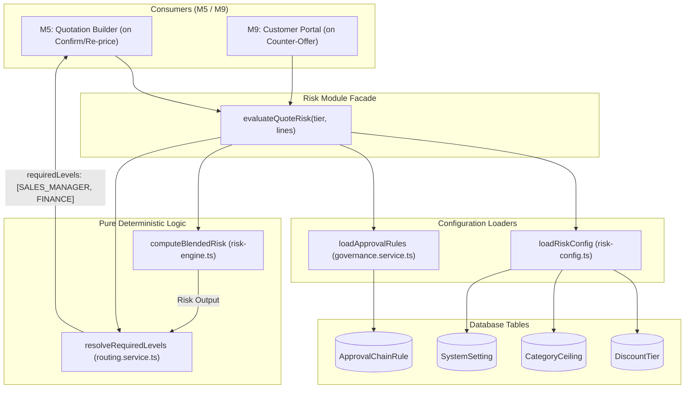
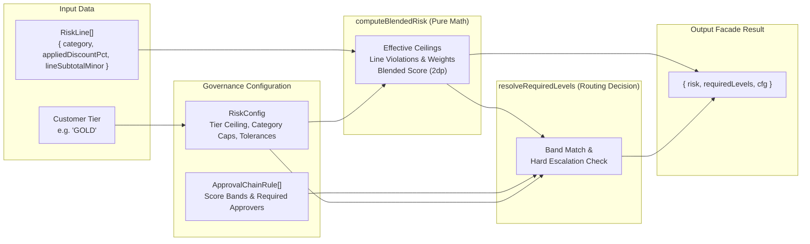

# M4 — Blended Risk Engine

## 1. Feature Overview

- **Feature Name**: M4 — Blended Risk Engine
- **Purpose**: Computes mathematical discount risk scores and determines governance approval chains for quotations. It implements a pure, value-weighted algorithm that evaluates line-item discounts against the stricter of customer tier ceilings and product category ceilings. It outputs the worst-line violation, value-weighted blended score, and total discounted currency amount, and maps these risk metrics against configured `ApprovalChainRule` bands and hard escalation thresholds to route quotations to required approval levels (`SALES_MANAGER`, `FINANCE`).
- **Triggering User Action**:
  - Automatically evaluated whenever a sales representative creates, edits, re-prices, or submits/confirms a quotation in M5 (`evaluateQuoteRisk`).
  - Evaluated in customer portal counter-offer negotiations in M9 (`portalConfirm`).
  - Unit-tested via `pnpm --filter @template/api test` (`risk-engine.test.ts`).
- **Expected Outcome**: Instantaneous, deterministic evaluation of quotation risk (`blendedScore`, `worstLineViolationPct`, `discountedValueMinor`, line-by-line breakdown) and determination of required approval levels (`[]` for auto-approve, `["SALES_MANAGER"]`, or `["SALES_MANAGER", "FINANCE"]`).

---

## 2. User Flow

1. **Quotation Line Evaluation**:
   - When a quotation's lines or discounts change, M5 constructs an array of `RiskLine` items (`category`, `appliedDiscountPct`, `lineSubtotalMinor`).
2. **Config Loading**:
   - `loadRiskConfig(customerTier)` retrieves the customer's tier discount ceiling (`DiscountTier`), product category ceilings (`CategoryCeiling`), and governance risk settings (`SystemSetting`: `perLineTolerancePct`, `blendedThreshold`, `financeValueThresholdMinor`).
   - `loadApprovalRules()` retrieves the ordered approval chain rules from M3 (`ApprovalChainRule`).
3. **Pure Risk Calculation**:
   - `computeBlendedRisk(lines, cfg)` computes the effective ceiling (`min(tierCeiling, categoryCeiling)`), line-level violation, value weight (`lineSubtotal / orderSubtotal`), weighted violation, worst-line violation, total discounted money in minor units, and final 2-decimal rounded blended score.
4. **Approval Routing Decision**:
   - `resolveRequiredLevels(risk, cfg, chain)` checks if any violation occurred.
   - If no violations (`worstLine === 0` and `blended === 0`) ➔ Returns `[]` (Auto-Approve).
   - If violations exist ➔ Matches highest matching rule band on `blendedScore`.
   - Checks hard escalation triggers:
     - Worst line violation > `perLineTolerancePct` (e.g. > 5%)
     - Blended score > `blendedThreshold` (e.g. > 3)
     - Discounted value > `financeValueThresholdMinor` (e.g. > $5,000)
     - If any hard trigger fires ➔ Adds `FINANCE` to the approval set.
   - Returns ordered list `["SALES_MANAGER", "FINANCE"]`.
5. **Downstream Consumption**:
   - M5 updates `Quotation.blendedRiskScore` and creates necessary `ApprovalStep` records if approval is required.

---

## 3. Related File Structure

### Pure Engine & Algorithms

- `apps/api/src/modules/discount/risk-engine.ts` — Pure calculation function `computeBlendedRisk` and types `RiskLine`, `RiskConfig`.
- `apps/api/src/modules/discount/routing.service.ts` — Pure approval chain routing resolver `resolveRequiredLevels`.

### Configuration Loader & Facade

- `apps/api/src/modules/discount/risk-config.ts` — Database loader `loadRiskConfig` aggregating M3 tables and M0 `SystemSetting` thresholds.
- `apps/api/src/modules/discount/risk.service.ts` — Unified facade function `evaluateQuoteRisk` called by M5 Quotation Builder.

### Automated Tests

- `apps/api/src/modules/discount/risk-engine.test.ts` — Exhaustive unit tests covering 6 key risk calculation and routing scenarios.

---

## 4. File Responsibilities

| File                                                | Responsibility                 | Why It's Involved                                                                     | Key Functions / Exports                        | Dependencies                                                                      |
| --------------------------------------------------- | ------------------------------ | ------------------------------------------------------------------------------------- | ---------------------------------------------- | --------------------------------------------------------------------------------- |
| `apps/api/src/modules/discount/risk-engine.ts`      | Mathematical risk calculation  | Core pure calculation engine determining weighted discount risk without side effects  | `computeBlendedRisk`, `RiskLine`, `RiskConfig` | None (pure TS)                                                                    |
| `apps/api/src/modules/discount/routing.service.ts`  | Approval level resolution      | Maps calculated risk metrics against approval rules and hard escalation thresholds    | `resolveRequiredLevels`                        | `risk-engine.ts`                                                                  |
| `apps/api/src/modules/discount/risk-config.ts`      | Risk configuration aggregation | Combines customer tier limits, category ceilings, and system setting parameters       | `loadRiskConfig`                               | `db`, `risk-engine.ts`                                                            |
| `apps/api/src/modules/discount/risk.service.ts`     | External risk facade           | Single entry point for M5 and M9 to evaluate quotation discount risk                  | `evaluateQuoteRisk`                            | `risk-engine.ts`, `routing.service.ts`, `risk-config.ts`, `governance.service.ts` |
| `apps/api/src/modules/discount/risk-engine.test.ts` | Verification test suite        | Validates mathematical precision, distributed risk detection, and escalation triggers | Vitest test cases 1 through 6                  | `vitest`, `risk-engine.ts`, `routing.service.ts`                                  |

---

## 5. File Relationships

```
apps/api/src/modules/discount/risk-engine.ts (Pure)
   │
   ├── imported by ──> apps/api/src/modules/discount/routing.service.ts (Pure)
   ├── imported by ──> apps/api/src/modules/discount/risk-config.ts
   ├── imported by ──> apps/api/src/modules/discount/risk.service.ts
   └── imported by ──> apps/api/src/modules/discount/risk-engine.test.ts

apps/api/src/modules/discount/risk-config.ts
   ├── queries ──────> PostgreSQL (db.discountTier, db.categoryCeiling, db.systemSetting)
   └── imported by ──> apps/api/src/modules/discount/risk.service.ts

apps/api/src/modules/governance/governance.service.ts
   └── exports loadApprovalRules ──> imported by apps/api/src/modules/discount/risk.service.ts

apps/api/src/modules/discount/risk.service.ts
   └── exported to ──> Module 5 Quotation Builder (evaluateQuoteRisk)
```

---

## 6. End-to-End Execution Flow

### Quotation Risk Evaluation Flow (`evaluateQuoteRisk(customerTier, lines)`)

1. **Call**: M5 Quotation Engine invokes `evaluateQuoteRisk("GOLD", lines)`.
2. **Parallel Config Fetch**:
   - `loadRiskConfig("GOLD")` queries `db.discountTier`, `db.categoryCeiling`, and `db.systemSetting` (`risk.perLineTolerancePct`, `risk.blendedThreshold`, `risk.financeValueThresholdMinor`).
   - `loadApprovalRules()` queries `db.approvalChainRule` sorted by `minScore ASC`.
3. **Pure Metric Calculation**:
   - `computeBlendedRisk` evaluates each line:
     - Calculates `effectiveCeilingPct = min(tierCeiling, categoryCeiling)`.
     - Calculates `violationPct = max(0, appliedDiscountPct - effectiveCeilingPct)`.
     - Computes value weight: `weight = lineSubtotalMinor / orderSubtotal`.
     - Multiplies `weightedViolation = violationPct * weight`.
   - Aggregates metrics:
     - `worstLineViolationPct`: maximum `violationPct` across all lines.
     - `blendedScore`: sum of `weightedViolation` rounded to 2 decimal places.
     - `discountedValueMinor`: sum of exact discounted minor units.
4. **Approval Level Decision**:
   - `resolveRequiredLevels` evaluates triggers:
     - No violations ➔ `[]`.
     - Score band match on `ApprovalChainRule`.
     - Hard escalation check on worst-line (> 5%), blended score (> 3), or discounted value (> $5,000) ➔ Escalates to `FINANCE`.
5. **Return**: Returns `{ risk, requiredLevels, cfg }` to M5 for state transition and step generation.

---

## 7. Mermaid Architecture Diagram



---

## 8. Mermaid Data Flow Diagram



---

## 9. Important Functions and Classes

| Function / Type         | File                                               | Purpose                                                                    | Called By                       | Calls                                                                                      | Input                                                   | Output                                                                     | Side Effects         |
| ----------------------- | -------------------------------------------------- | -------------------------------------------------------------------------- | ------------------------------- | ------------------------------------------------------------------------------------------ | ------------------------------------------------------- | -------------------------------------------------------------------------- | -------------------- |
| `computeBlendedRisk`    | `apps/api/src/modules/discount/risk-engine.ts`     | Calculates weighted discount risk metrics across order lines               | `risk.service.ts`, unit tests   | `round2`, `Math.min`, `Math.max`                                                           | `lines: RiskLine[]`, `cfg: RiskConfig`                  | `{ blendedScore, worstLineViolationPct, discountedValueMinor, breakdown }` | None (pure function) |
| `resolveRequiredLevels` | `apps/api/src/modules/discount/routing.service.ts` | Resolves required approver levels based on risk and escalation rules       | `risk.service.ts`, unit tests   | None                                                                                       | `risk`, `cfg: RiskConfig`, `chain: ApprovalChainRule[]` | `("SALES_MANAGER" \| "FINANCE")[]`                                         | None (pure function) |
| `loadRiskConfig`        | `apps/api/src/modules/discount/risk-config.ts`     | Loads discount limits and risk settings from DB                            | `evaluateQuoteRisk`             | `db.discountTier.findUnique`, `db.categoryCeiling.findMany`, `db.systemSetting.findUnique` | `customerTier: string`                                  | `Promise<RiskConfig>`                                                      | None                 |
| `evaluateQuoteRisk`     | `apps/api/src/modules/discount/risk.service.ts`    | Central facade orchestrating risk config loading, calculation, and routing | M5 Quotation Builder, M9 Portal | `loadRiskConfig`, `loadApprovalRules`, `computeBlendedRisk`, `resolveRequiredLevels`       | `customerTier: string`, `lines: RiskLine[]`             | `Promise<{ risk, requiredLevels, cfg }>`                                   | None                 |

---

## 10. API Flow

- **Direct HTTP Endpoints**: None (M4 is an **in-process domain calculation module**).
- **Internal API Contract**:
  - Consumed directly in-process via `evaluateQuoteRisk(customerTier, lines)`.
  - Used by M5 endpoint `POST /api/v1/quotations/:id/confirm` to determine if a quote transitions to `APPROVED` (auto-approved) or `PENDING_APPROVAL` with approval steps.

---

## 11. Error Flow

```
1. Divide-by-Zero Protection:
   If orderSubtotal === 0 (empty order)
   -> orderSubtotal fallback = 1
   -> line weights evaluate to 0 without throwing NaN.

2. Missing Category Ceiling:
   If line category is not present in categoryCeilingPct
   -> falls back to tierCeilingPct (fail-safe measurement against customer tier).

3. Missing Customer Tier in DB:
   If customer tier record is absent
   -> tierCeilingPct falls back to 0
   -> ANY discount is treated as an overage (safe default: flags for approval rather than auto-approving).

4. Missing System Settings:
   If SystemSetting rows are missing in DB
   -> falls back to hardcoded default constants (perLine: 5, blended: 3, financeValue: 500000).
```

---

## 12. Architectural Decisions

1. **Pure Function Separation**: `computeBlendedRisk` and `resolveRequiredLevels` have zero I/O and zero database calls. This allows 100% deterministic unit testing without database mocking or test databases.
2. **Effective Ceiling Rule (`min(tier, category)`)**: The discount limit applied to any line item is always the stricter of the customer tier ceiling and the product category ceiling.
3. **Value-Weighted Blended Risk**: Rather than taking a simple unweighted average of discount percentages, line overages are weighted by their revenue contribution (`lineSubtotal / orderSubtotal`). This catches distributed risk across high-value lines.
4. **Triple Hard Escalation to Finance**: Regardless of the blended score band, Finance approval is strictly required if any single line exceeds `perLineTolerancePct` (5%), if the blended score exceeds `blendedThreshold` (3), or if total discounted value exceeds `financeValueThresholdMinor` ($5,000).
5. **Fail-Safe Defaults**: Missing database configurations default to zero tolerance / safe thresholds, preventing accidental auto-approvals when settings are not seeded.

---

## 13. Dependencies and Impact

- **Dependencies**:
  - `M0 — Foundation & Auth` (`db`, `SystemSetting` records)
  - `M3 — Discount Governance Config` (`DiscountTier`, `CategoryCeiling`, `ApprovalChainRule` tables and `loadApprovalRules`)
- **Downstream Modules Depending on M4**:
  - **M5 (Quotation Builder & Lifecycle)**: Directly invokes `evaluateQuoteRisk` on quote confirmation and edit to generate `ApprovalStep` records.
  - **M9 (Customer Portal Negotiation)**: Invokes `evaluateQuoteRisk` when the customer submits counter-offers to determine whether rep/finance re-approval is required.
- **Blast Radius**:
  - Changes to the formula in `computeBlendedRisk` alter risk scores and approval routing for all future quotations system-wide.

---

## 14. Interview-Level Explanation

- **Where execution starts**: In-process via `apps/api/src/modules/discount/risk.service.ts:evaluateQuoteRisk()`.
- **Main execution path**: M5 calls `evaluateQuoteRisk` ➔ `loadRiskConfig` fetches limits from DB ➔ `computeBlendedRisk` computes weighted overages ➔ `resolveRequiredLevels` checks score bands and hard escalation thresholds ➔ returns `{ risk, requiredLevels, cfg }`.
- **Most important files**:
  1. `apps/api/src/modules/discount/risk-engine.ts` — The pure mathematical formula.
  2. `apps/api/src/modules/discount/routing.service.ts` — The approval routing logic.
  3. `apps/api/src/modules/discount/risk.service.ts` — The integration facade.
  4. `apps/api/src/modules/discount/risk-engine.test.ts` — Automated test proof.
- **Where business logic lives**: `apps/api/src/modules/discount/risk-engine.ts` and `routing.service.ts`.
- **Where data persists**: M4 does not persist data directly; it returns calculation results to M5 which writes `Quotation.blendedRiskScore` and `ApprovalStep` rows.
- **Files to know cold**:
  - `apps/api/src/modules/discount/risk-engine.ts`
  - `apps/api/src/modules/discount/routing.service.ts`
