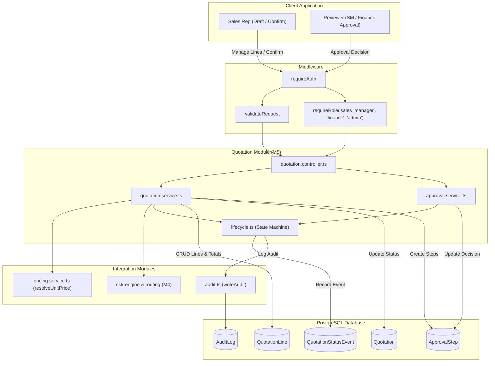
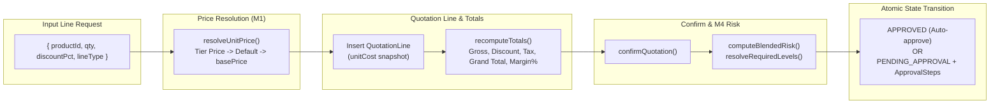

# M5 — Quotation Builder & Lifecycle ★

## 1. Feature Overview

- **Feature Name**: M5 — Quotation Builder & Lifecycle (The Spine)
- **Purpose**: Implements the central business engine of DealFlow360. Manages quotation creation, line-item pricing resolution (with tier/currency/basePrice hierarchy), quantity and discount mutations, server-authoritative money/margin recalculations, a strict 10-state lifecycle state machine (`DRAFT`, `PENDING_APPROVAL`, `APPROVED`, `SENT`, `UNDER_NEGOTIATION`, `CONFIRMED`, `FULFILLMENT`, `BILLING`, `PAID`, `REJECTED`), quotation confirmation with automatic risk evaluation via M4, atomic sequential approval chain creation, and multi-tier approval decisions (`APPROVED`, `REJECTED`, `RETURNED`) with immutable audit logging.
- **Triggering User Action**:
  - Rep creates quotation draft: `POST /api/v1/quotations`
  - Rep adds/updates/removes line item: `POST|PATCH|DELETE /api/v1/quotations/:id/lines`
  - Rep confirms quotation: `POST /api/v1/quotations/:id/confirm`
  - Sales Manager / Finance / Admin submits approval decision: `POST /api/v1/quotations/:id/approvals/decision`
- **Expected Outcome**: Real-time quotation and line-item persistence in PostgreSQL, dynamic discount risk evaluation against M3 governance, auto-approval or sequential creation of `ApprovalStep` records, guarded state transitions, and continuous audit logging.

---

## 2. User Flow

1. **Quotation Draft Creation**:
   - Sales rep sends `POST /api/v1/quotations` with `{ customerId }`.
   - Controller verifies authentication via `requireAuth` and binds `salesRepId: req.user.sub`.
   - Quotation created in `DRAFT` status; audit log recorded.
2. **Adding Line Items & Price Resolution**:
   - Rep sends `POST /api/v1/quotations/:id/lines` with `{ productId, qty, discountPct, lineType, subscriptionPlanId? }`.
   - Service verifies quotation ownership and editable status (`DRAFT` or `UNDER_NEGOTIATION`).
   - `resolveUnitPrice` determines unit price: customer-tier price list ➔ default currency price list ➔ catalog `basePrice` + variant extra.
   - Line is created snapshotting catalog `unitCostMinor` for margin accuracy.
   - `recomputeTotals` updates `subtotalMinor`, `discountTotalMinor`, `taxTotalMinor`, `grandTotalMinor`, and `marginPct`.
3. **Quotation Confirmation & Risk Evaluation (The Spine)**:
   - Rep sends `POST /api/v1/quotations/:id/confirm`.
   - Service verifies ownership and checks that at least one line item exists.
   - Invokes M4's `computeBlendedRisk` and `resolveRequiredLevels` with loaded customer tier limits and approval chain rules.
   - **Branch A (Auto-Approved)**: If `levels.length === 0`, transitions to `APPROVED` with reason `"Within discount limits — auto-approved"`.
   - **Branch B (Requires Approval)**: If `levels.length > 0`, atomically updates quotation to `PENDING_APPROVAL` and creates sequential `ApprovalStep` rows (e.g. sequence 1: `SALES_MANAGER`, sequence 2: `FINANCE`).
4. **Approval Review & Decision**:
   - Sales Manager or Finance reviewer sends `POST /api/v1/quotations/:id/approvals/decision` with `{ decision, reason }`.
   - Service verifies quotation is `PENDING_APPROVAL`, finds current pending step, and checks reviewer role match (`SALES_MANAGER` ➔ `sales_manager`, `FINANCE` ➔ `finance`).
   - If `REJECTED`: transitions to `REJECTED` (terminal state).
   - If `RETURNED`: transitions back to `DRAFT` so rep can revise and re-submit.
   - If `APPROVED`: checks if later approval steps exist. If yes, remains `PENDING_APPROVAL` with next level; if no, transitions to `APPROVED`.

---

## 3. Related File Structure

### Shared Contracts

- `packages/shared/src/schemas/quotation.ts` — Zod schemas (`createQuotationSchema`, `addLineSchema`, `updateLineSchema`, `decisionSchema`), enums (`QuotationStatus`, `LineType`, `ApproverLevel`, `ApprovalDecision`), and types.
- `packages/shared/src/config/api-routes.ts` — Registered endpoints under `apiRoutes.quotations`.

### Product Pricing Resolution (Commerce Bridge)

- `apps/api/src/modules/product/pricing.service.ts` — Unit price resolution hierarchy (`selectUnitPrice`, `resolveUnitPrice`).

### Quotation Domain Module

- `apps/api/src/modules/quotation/lifecycle.ts` — Lifecycle state machine `ALLOWED`, transition guards (`assertTransition`), and event logging (`transition`, `recordEvent`).
- `apps/api/src/modules/quotation/quotation.schema.ts` — Local proxy re-exporting schemas from `@template/shared`.
- `apps/api/src/modules/quotation/quotation.service.ts` — Quotation CRUD, line mutations, server-authoritative totals/margin recalculation, and `confirmQuotation`.
- `apps/api/src/modules/quotation/approval.service.ts` — Approval step resolution and stage advancement (`decideApproval`).
- `apps/api/src/modules/quotation/quotation.controller.ts` — HTTP controllers for quotations and approval decisions.
- `apps/api/src/modules/quotation/quotation.routes.ts` — Express router mounting endpoints with authentication and RBAC.

### Routing & Tests

- `apps/api/src/routes/index.ts` — Mounts `/quotations` router under `/api/v1`.
- `apps/api/src/modules/quotation/lifecycle.test.ts` — Unit tests for state machine transitions.

---

## 4. File Responsibilities

| File                                                     | Responsibility           | Why It's Involved                                                         | Key Functions / Exports                                                                                                                                                                           | Dependencies                                                                                       |
| -------------------------------------------------------- | ------------------------ | ------------------------------------------------------------------------- | ------------------------------------------------------------------------------------------------------------------------------------------------------------------------------------------------- | -------------------------------------------------------------------------------------------------- |
| `packages/shared/src/schemas/quotation.ts`               | Shared data contracts    | Validates quotation inputs and types across frontend and backend          | `createQuotationSchema`, `addLineSchema`, `updateLineSchema`, `decisionSchema`, enums                                                                                                             | `zod`                                                                                              |
| `packages/shared/src/config/api-routes.ts`               | API catalog              | Declares quotation endpoints and HTTP methods                             | `apiRoutes.quotations`                                                                                                                                                                            | None                                                                                               |
| `apps/api/src/modules/product/pricing.service.ts`        | Unit price resolution    | Resolves item prices using tier, currency, and variant fallbacks          | `selectUnitPrice`, `resolveUnitPrice`                                                                                                                                                             | `db`                                                                                               |
| `apps/api/src/modules/quotation/lifecycle.ts`            | Lifecycle state machine  | Enforces valid status transitions and stamps activity dates               | `ALLOWED`, `assertTransition`, `transition`, `recordEvent`                                                                                                                                        | `db`, `writeAudit`                                                                                 |
| `apps/api/src/modules/quotation/quotation.service.ts`    | Quotation business logic | Manages quote CRUD, line items, totals math, and confirmation risk checks | `loadQuotationWithLines`, `listQuotations`, `getQuotation`, `createQuotation`, `addLine`, `updateLine`, `deleteLine`, `recomputeTotals`, `confirmQuotation`                                       | `db`, `orderMarginPct`, `pricing.service.ts`, `risk-engine.ts`, `routing.service.ts`, `writeAudit` |
| `apps/api/src/modules/quotation/approval.service.ts`     | Approval workflow logic  | Validates reviewer roles and advances or rejects approval steps           | `decideApproval`                                                                                                                                                                                  | `db`, `lifecycle.ts`, `writeAudit`                                                                 |
| `apps/api/src/modules/quotation/quotation.controller.ts` | HTTP request handlers    | Formats HTTP responses and catches domain exceptions                      | `listQuotationsController`, `getQuotationController`, `createQuotationController`, `addLineController`, `updateLineController`, `deleteLineController`, `confirmController`, `decisionController` | `response.ts`, `quotation.service.ts`, `approval.service.ts`                                       |
| `apps/api/src/modules/quotation/quotation.routes.ts`     | Route routing and guard  | Protects endpoints with `requireAuth` and role gates                      | `quotationRouter`                                                                                                                                                                                 | `createRouter`, `requireAuth`, `requireRole`, `validateRequest`                                    |
| `apps/api/src/modules/quotation/lifecycle.test.ts`       | State machine tests      | Verifies allowed edges, terminal states, and 409 rejection                | Vitest tests                                                                                                                                                                                      | `vitest`, `lifecycle.ts`                                                                           |

---

## 5. File Relationships

```
packages/shared/src/schemas/quotation.ts
   └── imported by ──> apps/api/src/modules/quotation/quotation.schema.ts
                          ├── imported by ──> apps/api/src/modules/quotation/quotation.service.ts
                          └── imported by ──> apps/api/src/modules/quotation/quotation.routes.ts

apps/api/src/modules/product/pricing.service.ts
   └── imported by ──> apps/api/src/modules/quotation/quotation.service.ts

apps/api/src/modules/discount/ (M4)
   ├── risk-config.ts ──> imported by quotation.service.ts
   ├── risk-engine.ts ──> imported by quotation.service.ts
   └── routing.service.ts ──> imported by quotation.service.ts

apps/api/src/modules/quotation/lifecycle.ts
   ├── imported by ──> apps/api/src/modules/quotation/quotation.service.ts
   ├── imported by ──> apps/api/src/modules/quotation/approval.service.ts
   └── imported by ──> apps/api/src/modules/quotation/lifecycle.test.ts

apps/api/src/modules/quotation/quotation.service.ts & approval.service.ts
   └── imported by ──> apps/api/src/modules/quotation/quotation.controller.ts
                          └── imported by ──> apps/api/src/modules/quotation/quotation.routes.ts
                                                 └── imported by ──> apps/api/src/routes/index.ts
```

---

## 6. End-to-End Execution Flow

### Line Addition & Totals Recalculation Flow (`POST /api/v1/quotations/:id/lines`)

1. **Request**: Rep sends line item payload `{ productId, qty, discountPct, lineType }`.
2. **Guards**: `requireAuth` checks session; `quotation.service.ts` verifies rep owns the draft and status is editable (`DRAFT` or `UNDER_NEGOTIATION`).
3. **Price Resolution**: `resolveUnitPrice` checks tier price lists in `db.priceListItem`, defaulting to `product.basePrice`.
4. **Insert & Snapshot**: Line inserted into `db.quotationLine`, capturing `unitCostMinor: product.unitCost`.
5. **Recompute**: `recomputeTotals` iterates all lines, calculating integer minor units for gross, discount, tax, grand total, and weighted `orderMarginPct`.
6. **Audit**: `writeAudit` logs `quotation.line_added`.
7. **Response**: Returns HTTP 201 with line details.

### Quotation Confirmation Flow (`POST /api/v1/quotations/:id/confirm`)

1. **Request**: Rep clicks "Confirm / Submit Quote".
2. **Ownership & Validity Check**: Verifies rep ownership and non-empty line items.
3. **M4 Risk Engine Integration**:
   - `loadRiskConfig(customerTier)` reads discount limits and system settings.
   - `computeBlendedRisk` evaluates line discounts against effective ceilings (`min(tier, category)`).
   - `resolveRequiredLevels` matches score bands and checks hard escalation triggers (> 5% single line, > 3 blended score, > $5,000 discount).
4. **Branching**:
   - **Auto-Approve**: If `requiredLevels === []`, transitions to `APPROVED` and records audit.
   - **Requires Approval**: If `requiredLevels.length > 0`, runs `$transaction` updating quotation to `PENDING_APPROVAL`, setting `blendedRiskScore`, and creating sequential `ApprovalStep` records (1: `SALES_MANAGER`, 2: `FINANCE`).
5. **Response**: Returns `{ status, risk, requiredLevels? }`.

---

## 7. Mermaid Architecture Diagram



---

## 8. Mermaid Data Flow Diagram



---

## 9. Important Functions and Classes

| Function           | File                                                  | Purpose                                                              | Called By                                                 | Calls                                                                                            | Input                                                 | Output                                       | Side Effects                                                            |
| ------------------ | ----------------------------------------------------- | -------------------------------------------------------------------- | --------------------------------------------------------- | ------------------------------------------------------------------------------------------------ | ----------------------------------------------------- | -------------------------------------------- | ----------------------------------------------------------------------- |
| `resolveUnitPrice` | `apps/api/src/modules/product/pricing.service.ts`     | Resolves item price by tier and currency                             | `addLine`                                                 | `db.priceListItem.findFirst`, `db.product.findUnique`                                            | `productId`, `variantId?`, `customerTier`, `currency` | `Promise<number>`                            | None                                                                    |
| `assertTransition` | `apps/api/src/modules/quotation/lifecycle.ts`         | Validates lifecycle status transition                                | `transition`, `confirmQuotation`                          | None                                                                                             | `from: QuotationStatus`, `to: QuotationStatus`        | None (throws 409 if illegal)                 | None                                                                    |
| `transition`       | `apps/api/src/modules/quotation/lifecycle.ts`         | Executes status change, stamps activity, logs event and audit        | `quotation.service.ts`, `approval.service.ts`             | `assertTransition`, `db.quotation.update`, `recordEvent`                                         | `q`, `to`, `actorId`, `reason?`, `blendedRiskScore?`  | `Promise<void>`                              | Updates `Quotation`, inserts `QuotationStatusEvent`, inserts `AuditLog` |
| `recomputeTotals`  | `apps/api/src/modules/quotation/quotation.service.ts` | Recalculates subtotal, discounts, tax, grand total, and order margin | `addLine`, `updateLine`, `deleteLine`, `confirmQuotation` | `orderMarginPct`, `db.quotation.update`                                                          | `quotationId: string`                                 | `Promise<void>`                              | Updates monetary fields in `Quotation`                                  |
| `confirmQuotation` | `apps/api/src/modules/quotation/quotation.service.ts` | Evaluates quote risk and routes to approval steps or auto-approves   | `confirmController`                                       | `loadRiskConfig`, `computeBlendedRisk`, `resolveRequiredLevels`, `transition`, `db.$transaction` | `quotationId: string`, `actorId: string`              | `Promise<{ status, risk, requiredLevels? }>` | Updates `Quotation`, creates `ApprovalStep`s, inserts `AuditLog`        |
| `decideApproval`   | `apps/api/src/modules/quotation/approval.service.ts`  | Records approval step decision and advances quotation state          | `decisionController`                                      | `db.approvalStep.update`, `writeAudit`, `transition`                                             | `quotationId`, `actor`, `{ decision, reason }`        | `Promise<{ status, nextLevel? }>`            | Updates `ApprovalStep`, transitions `Quotation`, inserts `AuditLog`     |

---

## 10. API Flow

### Quotation Endpoints

- `GET /api/v1/quotations`: Lists quotations with customer summary and line count. Filterable by `status`, `customerId`. Sales reps only see their own.
- `GET /api/v1/quotations/:id`: Returns full quotation with customer, lines, products, variants, approvals, and status events.
- `POST /api/v1/quotations`: Creates a new `DRAFT` quotation for a given `customerId`.
- `POST /api/v1/quotations/:id/lines`: Adds a line item, resolves price, snapshots cost, and recalculates totals.
- `PATCH /api/v1/quotations/:id/lines/:lineId`: Modifies line quantity or discount percentage and updates totals.
- `DELETE /api/v1/quotations/:id/lines/:lineId`: Deletes a line item and updates totals.
- `POST /api/v1/quotations/:id/confirm`: Triggers M4 risk evaluation; transitions quotation to `APPROVED` or `PENDING_APPROVAL` with sequential approval steps.
- `POST /api/v1/quotations/:id/approvals/decision`: Approver submits `APPROVED`, `REJECTED`, or `RETURNED` with mandatory reason.

---

## 11. Error Flow

```
1. Non-Owner Attempting Line Edit:
   sales_rep tries to modify another rep's quote
   -> assertOwnership throws { message: "NOT_OWNER", http: 403 }
   -> Returns HTTP 403 Forbidden.

2. Editing Locked Quotation:
   Quote is in PENDING_APPROVAL or APPROVED
   -> assertEditable throws { message: "Quotation is locked...", http: 409 }
   -> Returns HTTP 409 Conflict.

3. Confirming Empty Quotation:
   Quote has 0 lines
   -> confirmQuotation throws { message: "CANNOT_CONFIRM_EMPTY_QUOTATION", http: 400 }
   -> Returns HTTP 400 Bad Request.

4. Illegal State Transition:
   Attempting transition from DRAFT to PAID
   -> assertTransition throws { message: "ILLEGAL_TRANSITION", http: 409 }
   -> Returns HTTP 409 Conflict.

5. Unauthorized Approval Decision:
   sales_manager attempts to decide a step assigned to FINANCE
   -> decideApproval throws { message: "WRONG_APPROVER", http: 403 }
   -> Returns HTTP 403 Forbidden.
```

---

## 12. Architectural Decisions

1. **Unit Cost Snapshotting**: `unitCostMinor` is stored directly on `QuotationLine` upon line creation. This ensures historic gross margin percentages remain stable even if product catalog costs change later.
2. **Server-Authoritative Integer Money**: All line subtotals, taxes, and totals are computed strictly on the backend in integer minor units (cents/paise) using integer rounding, eliminating frontend floating-point discrepancies.
3. **Decoupled Pricing & Risk**: Quotation line pricing is decoupled from risk calculations. Prices are resolved first; confirmation evaluates the applied discounts against customer and category ceilings.
4. **Atomic Approval Step Generation**: Sequential approval steps are generated within a Prisma `$transaction` alongside the status update to `PENDING_APPROVAL`, preventing partial approval state corruption.
5. **Two-Tier State Timeline**: Quotations maintain a complete history via `QuotationStatusEvent` (for UI timeline rendering) and global `AuditLog` (for administrative compliance).

---

## 13. Dependencies and Impact

- **Dependencies**:
  - `M0 — Foundation & Auth` (`db`, `requireAuth`, `requireRole`, `orderMarginPct`, `writeAudit`)
  - `M3 — Discount Governance Config` (`db.approvalChainRule`)
  - `M4 — Blended Risk Engine` (`computeBlendedRisk`, `resolveRequiredLevels`, `loadRiskConfig`)
- **Downstream Modules Depending on M5 (The Spine Unlock)**:
  - **M6 (Upsell & Cross-sell Engine)**: Reads quotation lines to generate complementary recommendations.
  - **M7 (Warehouse Fulfillment)**: Reads confirmed quotations to allocate inventory and schedule shipments (`CONFIRMED ➔ FULFILLMENT`).
  - **M8 (Hybrid Billing & Subscriptions)**: Converts confirmed lines into one-time invoices and recurring subscription schedules (`FULFILLMENT ➔ BILLING ➔ PAID`).
  - **M9 (Customer Portal Negotiation)**: Exposes approved quotations to customers and handles counter-offer re-confirmation.
  - **M10 (Deal Health Dashboard)**: Uses `Quotation.lastActivityAt` and status events to flag stalled deals (>7 days).
- **Blast Radius**:
  - As the central spine, any modifications to `Quotation` or `QuotationLine` schemas affect fulfillment, billing, reporting, and customer portal workflows.

---

## 14. Interview-Level Explanation

- **Where execution starts**: `apps/api/src/modules/quotation/quotation.routes.ts` mounted under `/api/v1/quotations`.
- **Main execution path**: Rep creates quote ➔ adds line items (prices resolved via `pricing.service.ts`, totals computed by `recomputeTotals`) ➔ confirms quote (evaluated by M4 risk engine) ➔ transitions to `APPROVED` or `PENDING_APPROVAL` with `ApprovalStep`s ➔ approvers submit decisions via `approval.service.ts`.
- **Most important files**:
  1. `apps/api/src/modules/quotation/quotation.service.ts` — Core quote lifecycle, line mutations, totals, and confirm orchestration.
  2. `apps/api/src/modules/quotation/lifecycle.ts` — Server-side state machine guard and event recorder.
  3. `apps/api/src/modules/quotation/approval.service.ts` — Multi-tier approval gate and step advancement.
  4. `packages/shared/src/schemas/quotation.ts` — Shared validation schemas and contracts.
- **Where business logic lives**:
  - Pricing resolution: `apps/api/src/modules/product/pricing.service.ts`.
  - Financial totals: `quotation.service.ts:recomputeTotals()`.
  - Transition legality: `lifecycle.ts:assertTransition()`.
  - Approval logic: `approval.service.ts:decideApproval()`.
- **Where data persists**: `Quotation`, `QuotationLine`, `QuotationStatusEvent`, `ApprovalStep`, and `AuditLog` tables in PostgreSQL.
- **Files to know cold**:
  - `apps/api/src/modules/quotation/quotation.service.ts`
  - `apps/api/src/modules/quotation/lifecycle.ts`
  - `apps/api/src/modules/quotation/approval.service.ts`
