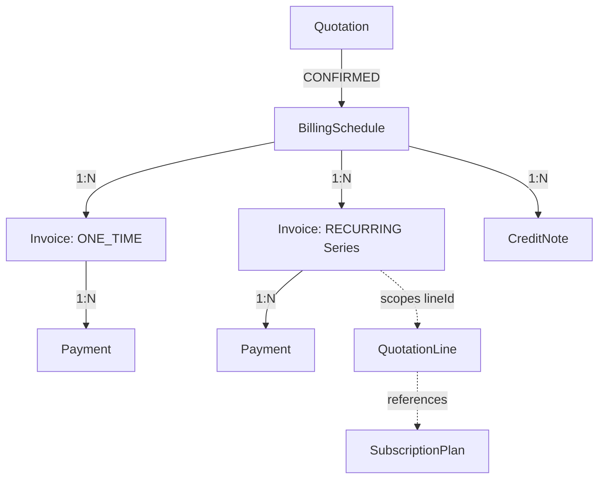
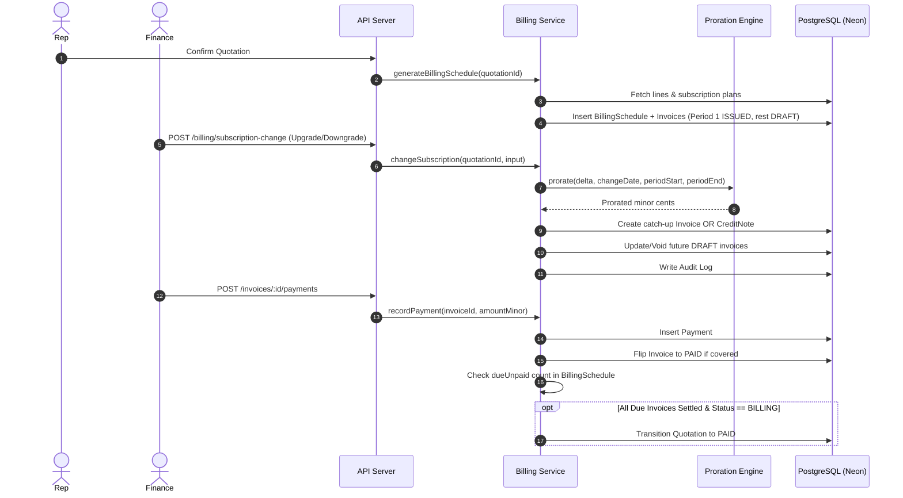

# M8 — Hybrid Billing Engine ★

## 1. Feature Overview

- **Feature Name**: M8 — Hybrid Billing & Invoicing Engine
- **Purpose**: Solves the complex dual-nature challenge of enterprise commerce by managing unified invoicing for one-time capital purchases and recurring subscription contracts. Provides deterministic, pure-math proration for mid-cycle subscription modifications (upgrades, downgrades, cancellations), maintains calendar horizons of recurring invoices, records invoice settlements in integer minor units (cents), logs immutable audit entries, and orchestrates the transition of quotations from `BILLING` into the terminal `PAID` lifecycle state when all due invoices are fully satisfied.
- **Triggering User Actions / System Events**:
  - Quotation reaches `CONFIRMED`: Triggers `generateBillingSchedule` (via `onConfirmed` lifecycle hook).
  - Finance Manager / Admin reviews billing schedule: `GET /api/v1/quotations/:id/billing`.
  - Customer / Rep initiates mid-cycle subscription change: `POST /api/v1/quotations/:id/billing/subscription-change`.
  - Finance records payment: `POST /api/v1/invoices/:invoiceId/payments`.
  - Operations transitions quote after fulfillment: `moveToBilling(quotationId, actorId)`.
- **Expected Outcome**: Real-time generation of aggregate one-time invoices and horizon recurring invoices, mathematical precision on day-based proration without float rounding discrepancies, issuance of immediate catch-up invoices or prorated `CreditNote` records, and automated quotation finalization to `PAID`.

---

## 2. User Flow & State Machine Transitions

1. **Quotation Confirmation & Schedule Generation**:
   - When a quotation transitions to `CONFIRMED` (via internal approval or customer portal confirmation), `onConfirmed(quotationId)` is invoked.
   - The engine generates a `BillingSchedule` 1:1 with the quotation.
   - **One-Time Lines**: Aggregated into a single `ONE_TIME` invoice with status `ISSUED`.
   - **Recurring Lines**: Grouped by line and subscription plan; generates a full horizon of period invoices (12 for `MONTHLY`, 4 for `QUARTERLY`, 1 for `YEARLY`). Period 1 is set to `ISSUED`; future periods (2..N) are set to `DRAFT`.
2. **Post-Fulfillment Hand-off**:
   - Once warehouse fulfillment accepts/ships the splits (Module 7), `moveToBilling(quotationId, actorId)` is invoked.
   - Quotation transitions from `FULFILLMENT` to `BILLING`.
3. **Mid-Cycle Subscription Modification**:
   - A finance manager or admin submits `POST /api/v1/quotations/:id/billing/subscription-change` with `{ lineId, newPeriodAmountMinor, reason, changeDate? }`.
   - The engine resolves the current active `ISSUED` invoice for the subscription line.
   - Computes `delta = newPeriodAmountMinor - current.amountMinor`.
   - **Upgrade (`delta > 0`)**: Calculates prorated catch-up amount for remaining days in the period (`changeDate ➔ periodEnd`). Creates an immediate `ISSUED` recurring invoice. Re-prices all future `DRAFT` invoices to `newPeriodAmountMinor`.
   - **Downgrade (`delta < 0`)**: If plan has `cancellationRule === "prorated_credit"`, writes a `CreditNote` for the unused slice of the current period. Re-prices future `DRAFT` invoices.
   - **Cancellation (`newPeriodAmountMinor === 0`)**: Issues a prorated `CreditNote` (if enabled) and marks all future `DRAFT` periods as `VOID`.
   - Emits an immutable audit log entry.
4. **Invoice Payment & Quotation Finalization**:
   - Finance submits `POST /api/v1/invoices/:invoiceId/payments` with `{ amountMinor }`.
   - System validates invoice is not `VOID`, inserts a `Payment` row, and sums recorded payments.
   - If paid amount meets or exceeds invoice `amountMinor`, flips invoice status from `ISSUED` to `PAID`.
   - Runs `maybeFinalizeQuotation`: checks if any `ISSUED` invoice in the schedule remains unpaid.
   - If `dueUnpaid === 0` and quotation status is `BILLING`, automatically transitions quotation to `PAID`. Future `DRAFT` periods do not block this transition.

---

## 3. Related File Structure

### Shared Contracts
- `packages/shared/src/schemas/billing.ts` — Zod schemas (`subscriptionChangeSchema`, `recordPaymentSchema`, `createSubscriptionPlanSchema`), enums (`BillingInterval`, `InvoiceKind`, `InvoiceStatus`), and TypeScript types.
- `packages/shared/src/config/api-routes.ts` — API route registry entries for billing schedules and invoice payments.

### Domain Module (`apps/api/src/modules/billing/`)
- `proration.ts` — Pure mathematical engine (`daysBetween`, `prorate`) with boundary clamping and zero-length period guards.
- `proration.test.ts` — Pure unit tests for date calculation and proration math.
- `billing.service.ts` — Core orchestration: schedule generation, mid-cycle subscription transitions, payments, audit emission, and quotation finalization.
- `billing.controller.ts` — Express controller handlers for schedule retrieval, subscription change mutations, and payments.
- `billing.routes.ts` — Express routers mounted onto `/quotations` and `/invoices`, guarded by `requireAuth` and `requireRole("finance", "admin")`.
- `billing.service.test.ts` — Integration tests validating end-to-end billing schedules, upgrades, downgrades, cancellations, and quote finalization.

---

## 4. Contract & Data Model Definitions

### Prisma Schema (`schema.prisma`)

```prisma
enum BillingInterval { MONTHLY QUARTERLY YEARLY }
enum InvoiceKind     { ONE_TIME RECURRING }
enum InvoiceStatus   { DRAFT ISSUED PAID VOID }

model SubscriptionPlan {
  id               String          @id @default(cuid())
  name             String
  interval         BillingInterval
  prorationEnabled Boolean         @default(true)
  cancellationRule String          @default("prorated_credit") // "prorated_credit" | "none"
  lines            QuotationLine[]
  createdAt        DateTime        @default(now())
  updatedAt        DateTime        @updatedAt
}

model BillingSchedule {
  id          String       @id @default(cuid())
  quotationId String       @unique
  quotation   Quotation    @relation(fields: [quotationId], references: [id], onDelete: Cascade)
  invoices    Invoice[]
  creditNotes CreditNote[]
  createdAt   DateTime     @default(now())
  updatedAt   DateTime     @updatedAt
}

model Invoice {
  id          String          @id @default(cuid())
  scheduleId  String
  schedule    BillingSchedule @relation(fields: [scheduleId], references: [id], onDelete: Cascade)
  kind        InvoiceKind
  lineId      String?         // null for aggregate one-time invoice; QuotationLine id for recurring
  periodStart DateTime?
  periodEnd   DateTime?
  amountMinor Int             // integer minor units (cents)
  status      InvoiceStatus   @default(DRAFT)
  payments    Payment[]
  createdAt   DateTime        @default(now())
  updatedAt   DateTime        @updatedAt

  @@index([scheduleId])
  @@index([scheduleId, lineId, status])
}

model CreditNote {
  id              String          @id @default(cuid())
  scheduleId      String
  schedule        BillingSchedule @relation(fields: [scheduleId], references: [id], onDelete: Cascade)
  reason          String
  amountMinor     Int             // integer minor units (cents)
  sourceInvoiceId String?         // source invoice/period being credited
  createdAt       DateTime        @default(now())
  updatedAt       DateTime        @updatedAt

  @@index([scheduleId])
}

model Payment {
  id          String   @id @default(cuid())
  invoiceId   String
  invoice     Invoice  @relation(fields: [invoiceId], references: [id], onDelete: Cascade)
  amountMinor Int      // integer minor units (cents)
  status      String   @default("recorded") // recorded | failed | refunded
  createdAt   DateTime @default(now())
  updatedAt   DateTime @updatedAt

  @@index([invoiceId])
}
```

---

## 5. Component Relationship Diagram



---

## 6. Flow Diagram



---

## 7. Detailed Implementation Details

### Mathematical Rigor of Proration
Proration uses integer minor units throughout:
```ts
export function daysBetween(from: Date, to: Date): number {
  return Math.round((to.getTime() - from.getTime()) / 86_400_000);
}

export function prorate(
  planAmountMinor: number,
  changeDate: Date,
  periodStart: Date,
  periodEnd: Date,
): number {
  const total = daysBetween(periodStart, periodEnd);
  if (total <= 0) return 0;
  const remaining = Math.min(Math.max(daysBetween(changeDate, periodEnd), 0), total);
  return Math.round(planAmountMinor * (remaining / total));
}
```
- Zero-length periods evaluate safely to `0` without divide-by-zero exceptions.
- `changeDate` clamped between `0` and `total` days prevents overflow (>100%) or underflow (<0%).

### Horizon Generation Strategy
- `MONTHLY`: 12 periods, stepping 1 month per invoice.
- `QUARTERLY`: 4 periods, stepping 3 months per invoice.
- `YEARLY`: 1 period, stepping 12 months.

---

## 8. Security, Permissions & Governance

- **Read Operations**: Any authenticated internal user (`sales_rep`, `sales_manager`, `finance`, `admin`) can view a quotation's billing schedule.
- **Write Operations**: `POST /quotations/:id/billing/subscription-change` and `POST /invoices/:invoiceId/payments` are strictly gated to users holding `finance` or `admin` roles via `requireRole("finance", "admin")`.
- **Audit Logging**: All mutating billing operations record structured audit entries with actor details, action tag (`billing.subscription.changed`, `billing.subscription.cancelled`, `billing.payment.recorded`), entity ID, and diff payload.

---

## 9. Edge Cases & Resilience

| Edge Case | Behavior |
|---|---|
| Re-running `generateBillingSchedule` | Idempotent: returns existing schedule and invoices without duplicates. |
| Zero-length billing period | `total <= 0` guard prevents division by zero; returns 0 cents. |
| Change date after period end | Clamped to 0 remaining days; no charge or credit generated. |
| Change date before period start | Clamped to 100% of plan amount. |
| Paying a `VOID` invoice | Throws `INVOICE_VOID` (409 Conflict). |
| Unknown invoice or schedule | Throws `INVOICE_NOT_FOUND` / `SCHEDULE_NOT_FOUND` (404 Not Found). |
| Partial invoice payment | Invoice remains `ISSUED` until sum of recorded payments matches or exceeds invoice amount. |
| Future draft recurring invoices | Do not block quotation finalization; quote advances to `PAID` as soon as all currently due (`ISSUED`) invoices are settled. |

---

## 10. Testing Strategy & Test Cases

1. **Layer 1 Pure Tests (`proration.test.ts`)**:
   - `daysBetween` counts whole calendar days.
   - Partial period proration calculation.
   - Full period billing when change is on start date.
   - Zero billing when change is on/after end date.
   - Clamping when change is before period start.
   - Guarding zero-length periods.
2. **Layer 2 Integration Tests (`billing.service.test.ts`)**:
   - Correct split between one-time and recurring invoices.
   - Accurate period horizons (12, 4, 1).
   - Idempotent schedule creation.
   - Prorated catch-up charges and draft re-pricing on upgrade.
   - Prorated `CreditNote` generation on downgrade and cancellation.
   - Disabling credit notes when `cancellationRule === "none"`.
   - Rejecting changes with no active period.
   - Multi-installment payment recording and invoice status flipping.
   - Rejection of payments against void invoices.
   - Automatic quote progression to `PAID` in `BILLING` state.

---

## 11. Troubleshooting Guide & Error Map

| Error Code | HTTP Status | Root Cause & Remediation |
|---|---|---|
| `SCHEDULE_NOT_FOUND` | 404 | Quotation does not have an active billing schedule. Ensure quotation has reached `CONFIRMED`. |
| `NO_ACTIVE_PERIOD` | 409 | Subscription change requested for a line with no active `ISSUED` recurring invoice. |
| `INVOICE_NOT_FOUND` | 404 | Payment attempted against a non-existent invoice ID. |
| `INVOICE_VOID` | 409 | Payment attempted against an invoice with status `VOID`. |
| `ILLEGAL_TRANSITION` | 409 | Attempting to transition quotation to `BILLING` or `PAID` out of sequence with lifecycle state machine. |

---

## 12. Migration & Deployment Notes

- Schema includes models `SubscriptionPlan`, `BillingSchedule`, `Invoice`, `CreditNote`, and `Payment`.
- Seed script (`apps/api/prisma/seed.ts`) populates standard subscription plans, customers, catalog products, price lists, and upsell rules.
- Prisma client generation and migrations are verified across local and remote Neon PostgreSQL databases.

---

## 13. Future Evolutions & Extension Points

- **Automated Billing Cron / Worker**: A scheduled background job to promote future `DRAFT` invoices to `ISSUED` as their `periodStart` arrives.
- **Payment Gateway Webhooks**: Integration with Stripe / Adyen webhooks to automatically record asynchronous card/ACH settlements directly into `recordPayment`.
- **Dunning Management**: Grace-period workflows and automatic quote suspension when `ISSUED` invoices remain overdue beyond SLA.

---

## 14. Verification Checklist

- [x] Pure mathematical proration engine implemented and covered by unit tests.
- [x] Billing schedule generation splits one-time vs recurring lines.
- [x] Mid-cycle upgrade creates immediate prorated catch-up invoice.
- [x] Mid-cycle downgrade/cancel creates prorated `CreditNote` (respecting `cancellationRule`).
- [x] Future draft invoices are re-priced on plan modification and voided on cancellation.
- [x] Payments accumulate correctly and flip invoice status to `PAID`.
- [x] Quotation automatically finalizes to `PAID` when all due invoices are settled.
- [x] Immutable audit logs emitted for subscription changes, cancellations, and payments.
- [x] All 34 vitest tests pass across the entire API suite.
- [x] TypeScript typechecking passes with zero errors.
- [x] ESLint linting passes with zero warnings.
- [x] Database seed runs idempotently.
