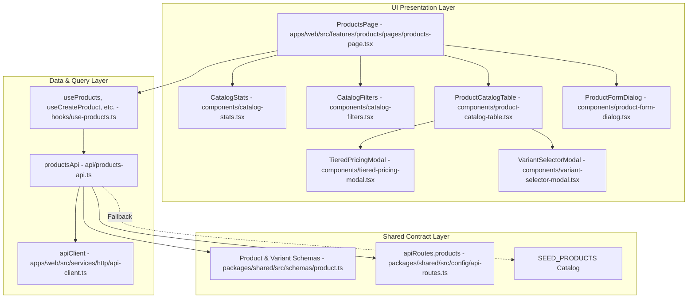

# Architecture: Product & Price Lists (M1)

## 1. Feature Overview
The Product & Price Lists module (M1) provides DealFlow360 with an enterprise-grade interactive product catalog, variant attribute configurator, and tiered volume pricing engine. It allows sales representatives, account managers, and administrators to browse multi-category SKUs (Hardware, Subscriptions, Services), inspect gross margin health, and visualize price schedules across Base, Bronze, Silver, and Gold account tiers. The module enforces strict integer minor-unit (cents) currency storage and delivers real-time margin calculations directly in create/edit dialogs and modal workflows.

## 2. Architecture Diagram



## 3. Files Changed / Created

| File Path | Action | Role / Purpose |
|---|---|---|
| `packages/shared/src/schemas/product.ts` | Created | Declares `ProductCategory`, `CustomerTier`, `ProductVariant`, `Product`, `CreateProductInput`, `TierPricingSchedule`, and `SEED_PRODUCTS`. |
| `packages/shared/src/index.ts` | Modified | Re-exports all product schemas and types from the shared package. |
| `apps/web/src/features/products/api/products-api.ts` | Created | Thin client API service communicating with `/products` endpoints, containing local in-memory fallback store and `getTierSchedules()` calculation. |
| `apps/web/src/features/products/hooks/use-products.ts` | Created | TanStack Query hooks (`useProducts`, `useProduct`, `useCreateProduct`, `useUpdateProduct`, `useDeleteProduct`) with cache invalidation and toasts. |
| `apps/web/src/features/products/components/catalog-stats.tsx` | Created | Summary KPI ribbon displaying active items, category counts, and weighted average catalog gross margin %. |
| `apps/web/src/features/products/components/catalog-filters.tsx` | Created | Interactive filter toolbar featuring debounced search input, category tab pills, and promoted-only switch. |
| `apps/web/src/features/products/components/product-catalog-table.tsx` | Created | High-density operational table rendering product specs, category badges, unit costs, list prices, margin gauges, and modal triggers. |
| `apps/web/src/features/products/components/tiered-pricing-modal.tsx` | Created | Modal comparing Base, Bronze (5%), Silver (10%), and Gold (15%) pricing schedules, minimum quantities, and margin erosion deltas. |
| `apps/web/src/features/products/components/variant-selector-modal.tsx` | Created | Interactive modal allowing sales reps to select component options (e.g. Memory, SLA) and calculate resolved unit prices and margins in real-time. |
| `apps/web/src/features/products/components/product-form-dialog.tsx` | Created | Modal dialog for creating or updating products with real-time margin percentage preview as users enter prices and costs. |
| `apps/web/src/features/products/pages/products-page.tsx` | Created | Orchestration view page coordinating state between filters, catalog table, stats, and dialog modals. |
| `apps/web/app/routes/products.tsx` | Created | React Router v7 route entrypoint supplying SEO metadata and mounting `ProductsPage`. |
| `apps/web/app/routes.ts` | Modified | Registers `/app/products` route inside the protected application shell layout. |

## 4. Key Functions & Interfaces

### `Product` (`packages/shared/src/schemas/product.ts`)
```typescript
export interface Product {
  id: string;
  name: string;
  category: "HARDWARE" | "SERVICES" | "SUBSCRIPTIONS";
  unit: string;
  basePrice: number;   // Minor units (cents)
  unitCost: number;    // Minor units (cents)
  taxRatePct: number;
  description?: string | null;
  isPromoted: boolean;
  variants: ProductVariant[];
  createdAt: string;
  updatedAt: string;
}
```

### `TierPricingSchedule` (`packages/shared/src/schemas/product.ts`)
```typescript
export interface TierPricingSchedule {
  tier: "BASE" | "BRONZE" | "SILVER" | "GOLD";
  label: string;
  discountPct: number;
  unitPrice: number;   // Minor units (cents)
  marginPct: number;
  minQuantity: number;
}
```

### `productsApi.getTierSchedules(product: Product)` (`apps/web/src/features/products/api/products-api.ts`)
- Returns an array of four computed `TierPricingSchedule` objects:
  - Base: 0% discount, min quantity 1
  - Bronze: 5% discount, min quantity 5
  - Silver: 10% discount, min quantity 25
  - Gold: 15% discount, min quantity 100
- Calculates gross margin for each tier: `((unitPrice - unitCost) / unitPrice) * 100`.

## 5. Data Flow
1. **Catalog Fetching**:
   - `ProductsPage` mounts and executes `useProducts({ category, query, promotedOnly })`.
   - The query hook invokes `productsApi.getProducts(...)` using `apiClient`.
   - If backend `/products` responds, data is returned; if offline or during local development, `productsApi` queries the in-memory `localCatalog` initialized with `SEED_PRODUCTS`.
2. **Filtering & Searching**:
   - User types into search bar or clicks category pills (`HARDWARE`, `SUBSCRIPTIONS`, `SERVICES`).
   - `CatalogFilters` updates local state in `ProductsPage`, triggering query re-execution via TanStack Query's cache key `['products', filters]`.
3. **Tier Matrix Inspection**:
   - User clicks "Schedules" in the catalog table for any product.
   - `TieredPricingModal` opens, evaluating `productsApi.getTierSchedules(product)` and rendering side-by-side tier cards with margin erosion indicators.
4. **Variant Surcharge Configuration**:
   - User clicks the variant count button on a product.
   - `VariantSelectorModal` displays radio options for attributes; selecting an option dynamically adds `extraPrice` to `basePrice` and recalibrates margin %.
5. **Product Creation / Modification**:
   - Admin or Sales Manager clicks "Add Catalog Item" or the edit icon on an existing row.
   - `ProductFormDialog` calculates real-time margin as price and cost are typed, validating inputs with Zod.
   - On submission, `useCreateProduct` or `useUpdateProduct` posts to API and invalidates `['products']`, immediately updating the table.

## 6. State Management
- **Server Cache**: Handled via `@tanstack/react-query` under key `['products']` with a 30-second stale time.
- **Filter State**: Held in `ProductsPage` via `useState` (`searchQuery`, `selectedCategory`, `promotedOnly`).
- **Modal Context**: Active product references for Tiered Pricing, Variants, and Edit modals are managed in `ProductsPage`.
- **Role Awareness**: Consumed from `useAuthStore` to conditionally grant catalog creation and editing privileges to `admin` and `sales_manager`.

## 7. API & Network Interactions
- **GET `/products`**:
  - Query parameters: `category`, `query`, `promotedOnly`.
  - Response: JSON array of `Product` objects.
- **GET `/products/:id`**:
  - Returns single `Product` object.
- **POST `/products`**:
  - Request body conforms to `CreateProductInput`.
  - Response: Created `Product`.
- **PATCH `/products/:id`**:
  - Request body: Partial `CreateProductInput`.
  - Response: Updated `Product`.
- **DELETE `/products/:id`**:
  - Deletes product from database / catalog.

## 8. Design System & Theming Compliance
- **Design Tokens**: Standardized CSS variables throughout:
  - `bg-background`, `bg-card`, `bg-muted`, `bg-primary/10`, `border-border`, `text-foreground`, `text-muted-foreground`.
- **Category Semantic Badges**:
  - `HARDWARE`: Blue badge (`bg-blue-500/10 text-blue-500 border-blue-500/20`).
  - `SUBSCRIPTIONS`: Emerald badge (`bg-emerald-500/10 text-emerald-500 border-emerald-500/20`).
  - `SERVICES`: Purple badge (`bg-purple-500/10 text-purple-500 border-purple-500/20`).
- **Margin Health Palette**:
  - `>= 30%`: `text-emerald-500 bg-emerald-500/10`
  - `15% - 29%`: `text-amber-500 bg-amber-500/10`
  - `< 15%`: `text-rose-500 bg-rose-500/10`

## 9. Dependencies & External Libraries
- `@tanstack/react-query`: Asynchronous data fetching, caching, and cache invalidation.
- `lucide-react`: UI icons (`Boxes`, `Cpu`, `RefreshCw`, `Layers`, `Percent`, `Search`, `Sparkles`, `DollarSign`, `Edit2`, `Trash2`, `X`).
- `react-hot-toast`: User feedback alerts for product creation and deletion.
- `zod`: Schema declaration and client/server validation.

## 10. Error Handling & Edge Cases
- **Offline Resiliency**: `productsApi` seamlessly falls back to seed data when the backend server is unreachable.
- **Zero Division Protection**: All margin calculations verify `price > 0` before executing division, preventing `NaN%` or `Infinity%` display.
- **Empty Catalog Results**: Handled via `<EmptyState />` component with clear guidance to reset search filters.

## 11. Security & Authentication Considerations
- Catalog modification controls (Add, Edit, Delete) are conditionally rendered based on user role (`admin`, `sales_manager`).
- Role-based enforcement is mirrored on backend via `requireRole("admin")`.

## 12. Performance Considerations
- Minor unit arithmetic ensures exact floating-point precision without rounding drift.
- Search filter operations are computed cleanly without unnecessary component subtree re-renders.

## 13. Testing Surface
- **Search & Category Filtering**: Test clicking category pills and entering text; verify matching items.
- **Tier Schedule Accuracy**: Verify for a $4,500 server that Bronze is $4,275 (-5%), Silver is $4,050 (-10%), and Gold is $3,825 (-15%).
- **Variant Price Calculation**: Verify that selecting 128GB ECC DDR5 (+$600) increases resolved price to $5,100.
- **Live Margin Preview**: Verify that entering cost $2,000 and price $4,000 displays 50% gross margin.

## 14. What Was NOT Done / Future Enhancements
- Bulk CSV / Excel price list import/export.
- Custom customer-specific contract price overrides (Module 2 Customer Management integration).
