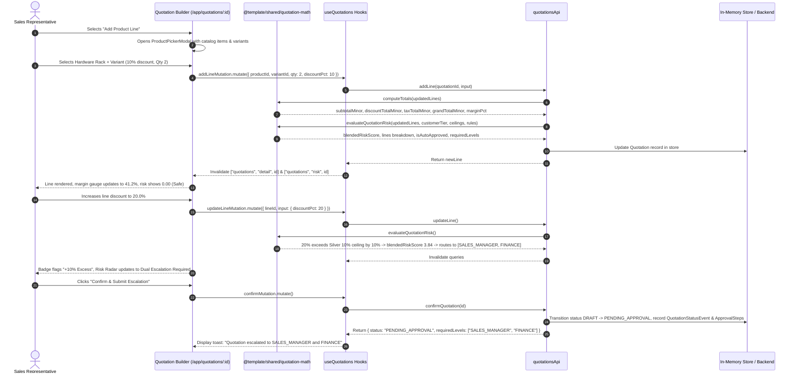

# Architecture Documentation — Quotation Builder & Risk Engine (M2)

## Summary
The **Quotation Builder & Risk Engine** module provides the commercial deal assembly spine for DealFlow360. It empowers sales representatives to compose complex multi-line enterprise proposals spanning hardware, professional services, and recurring subscriptions. The module features client-side real-time calculation mirroring server-authoritative integer monetary math, interactive quantity steppers, per-line and bulk order discount controls, a live gross margin gauge, and a deterministic blended-risk engine that evaluates discount policy compliance against customer tier ceilings and product category caps established in Phase 4. When a quote is confirmed, it either auto-approves or routes into an audited multi-tier approval chain (`SALES_MANAGER` and `FINANCE`).

---

## Architecture Overview

```mermaid
flowchart TD
    subgraph UI["Quotation Workspace UI (apps/web)"]
        QuotesPage["QuotationsPage (/app/quotations)"]
        StatsRibbon["QuotationsStats (KPI Ribbon)"]
        QuotesTable["QuotationsTable (Status Filter Tabs & Search)"]
        CreateModal["CreateQuotationModal (Account Picker)"]
        
        BuilderPage["QuotationBuilderPage (/app/quotations/:id)"]
        LineTable["LineEditorTable (Qty, Discounts, Policy Badges)"]
        BulkDiscount["OrderDiscountBar (Apply to All Lines)"]
        MarginGauge["MarginIndicatorGauge (Totals, Margin %, Risk Radar)"]
        ProductPicker["ProductPickerModal (Catalog & Variant Picker)"]
    end

    subgraph StateLayer["TanStack Query Hooks"]
        useQuotes["useQuotations(filters)"]
        useQuote["useQuotation(id)"]
        useRisk["useQuotationRisk(id)"]
        useLineMutations["useAddLine(), useUpdateLine(), useDeleteLine()"]
        useConfirm["useConfirmQuotation()"]
    end

    subgraph APILayer["HTTP Client & Simulation Engine"]
        QuotationsApi["quotationsApi (quotations-api.ts)"]
        ApiClient["apiClient (Axios Instance)"]
        MockStore["In-Memory Mock Store (SEED_QUOTATIONS)"]
    end

    subgraph SharedContracts["@template/shared Contract & Math Layer"]
        QuotationSchema["schemas/quotation.ts (Quotation, QuotationLine, Enums)"]
        ComputeTotals["lib/quotation-math.ts -> computeTotals()"]
        RiskEngine["lib/quotation-math.ts -> evaluateQuotationRisk()"]
        ApiRoutes["config/api-routes.ts (apiRoutes.quotations)"]
        AppRoutes["config/routes.ts (appRoutes.quotations, quotationBuilder)"]
    end

    QuotesPage --> StatsRibbon
    QuotesPage --> QuotesTable
    QuotesPage --> CreateModal
    QuotesTable --> useQuotes

    BuilderPage --> LineTable
    BuilderPage --> BulkDiscount
    BuilderPage --> MarginGauge
    BuilderPage --> ProductPicker

    LineTable --> useLineMutations
    ProductPicker --> useLineMutations
    BulkDiscount --> useLineMutations
    MarginGauge --> useConfirm
    BuilderPage --> useQuote
    BuilderPage --> useRisk

    useQuotes --> QuotationsApi
    useQuote --> QuotationsApi
    useRisk --> QuotationsApi
    useLineMutations --> QuotationsApi
    useConfirm --> QuotationsApi

    QuotationsApi --> ApiClient
    QuotationsApi -.->|Offline / Fallback| MockStore
    QuotationsApi --> ComputeTotals
    QuotationsApi --> RiskEngine
    MarginGauge --> ComputeTotals
    LineTable --> QuotationSchema
```



---

## Data Flow



---

## File Structure

```
DealFlow360/
├── packages/shared/
│   └── src/
│       ├── config/
│       │   ├── api-routes.ts            # Expanded apiRoutes.quotations (addLine, updateLine, removeLine, risk)
│       │   └── routes.ts                # Added appRoutes.quotations and quotationBuilder(id)
│       ├── lib/
│       │   └── quotation-math.ts        # computeTotals() and evaluateQuotationRisk() pure math
│       ├── schemas/
│       │   └── quotation.ts             # Quotation, QuotationLine, Enums, SEED_QUOTATIONS
│       └── index.ts                     # Re-exports quotation schemas and math
└── apps/web/
    ├── app/
    │   ├── routes.ts                    # Registered /app/quotations and /app/quotations/:id
    │   └── routes/
    │       ├── quotations.tsx           # Route entry for pipeline portfolio
    │       └── quotation-builder.tsx    # Route entry for quotation builder workspace
    └── src/
        └── features/
            └── quotations/
                ├── api/
                │   └── quotations-api.ts      # Typed client API with in-memory fallback
                ├── hooks/
                │   └── use-quotations.ts      # TanStack Query query & mutation hooks
                ├── pages/
                │   ├── quotations-page.tsx    # Quotations directory & portfolio view
                │   └── quotation-builder-page.tsx # Split-screen builder layout
                └── components/
                    ├── quotations-stats.tsx        # Top 4-metric KPI ribbon
                    ├── quotations-table.tsx        # Status tabs, search, and quotes table
                    ├── create-quotation-modal.tsx  # Customer account selection modal
                    ├── product-picker-modal.tsx    # Catalog modal with variant & line config
                    ├── line-editor-table.tsx       # Interactive lines table with qty steppers
                    ├── order-discount-bar.tsx      # Bulk order-level discount apply bar
                    └── margin-indicator-gauge.tsx  # Financial breakdown, margin gauge & risk radar
```

---

## Interfaces & Contracts

### 1. Enums (`packages/shared/src/schemas/quotation.ts`)
```ts
export const quotationStatuses = [
  "DRAFT", "PENDING_APPROVAL", "APPROVED", "SENT", "UNDER_NEGOTIATION",
  "CONFIRMED", "FULFILLMENT", "BILLING", "PAID", "REJECTED"
] as const;
export type QuotationStatus = (typeof quotationStatuses)[number];

export const lineTypes = ["ONE_TIME", "RECURRING"] as const;
export type LineType = (typeof lineTypes)[number];

export const approvalDecisions = ["PENDING", "APPROVED", "REJECTED", "RETURNED"] as const;
export type ApprovalDecision = (typeof approvalDecisions)[number];
```

### 2. Quotation Line Schema
```ts
export const quotationLineSchema = z.object({
  id: z.string(),
  quotationId: z.string(),
  productId: z.string(),
  product: productSchema.optional(),
  variantId: z.string().nullable().optional(),
  variant: productVariantSchema.nullable().optional(),
  qty: z.number().int().positive().default(1),
  unitPriceMinor: z.number().int().nonnegative(), // in cents
  unitCostMinor: z.number().int().nonnegative(),  // in cents (snapshot)
  discountPct: z.number().min(0).max(100).default(0),
  lineType: lineTypeSchema.default("ONE_TIME"),
  subscriptionPlanId: z.string().nullable().optional(),
  createdAt: z.string().optional(),
  updatedAt: z.string().optional(),
});
export type QuotationLine = z.infer<typeof quotationLineSchema>;
```

### 3. Quotation Schema
```ts
export const quotationSchema = z.object({
  id: z.string(),
  quotationNumber: z.string(),
  customerId: z.string(),
  customer: customerSchema.optional(),
  salesRepId: z.string(),
  status: quotationStatusSchema.default("DRAFT"),
  blendedRiskScore: z.number().default(0),
  subtotalMinor: z.number().int().default(0),
  discountTotalMinor: z.number().int().default(0),
  taxTotalMinor: z.number().int().default(0),
  grandTotalMinor: z.number().int().default(0),
  marginPct: z.number().default(0),
  lastActivityAt: z.string().optional(),
  lines: z.array(quotationLineSchema).default([]),
  statusEvents: z.array(quotationStatusEventSchema).default([]),
  approvals: z.array(quotationApprovalStepSchema).default([]),
  createdAt: z.string().optional(),
  updatedAt: z.string().optional(),
});
export type Quotation = z.infer<typeof quotationSchema>;
```

### 4. Mathematical Engine (`packages/shared/src/lib/quotation-math.ts`)
- **`computeTotals(lines)`**:
  - Computes exact integer cents for `subtotalMinor`, `discountTotalMinor`, `taxTotalMinor`, `grandTotalMinor`.
  - Calculates gross deal margin:
    $$\text{Margin \%} = \frac{\text{Net} - \text{Cost}}{\text{Net}} \times 100$$
- **`evaluateQuotationRisk(lines, customerTier, tiers, ceilings, rules)`**:
  - Determines applicable cap per line: $\min(\text{TierCap}, \text{CategoryCap})$.
  - Calculates excess overage: $\max(0, \text{Discount} - \text{ApplicableCap})$.
  - Scales by category multiplier and tier tolerance.
  - Generates value-weighted blended deal risk score and resolves required approval levels (`SALES_MANAGER`, `FINANCE`).

---

## State Management & Hooks

All server-synchronized quotation state is maintained via TanStack Query in `apps/web/src/features/quotations/hooks/use-quotations.ts`:

- **Query Keys**:
  - `["quotations", params]`: Quotation portfolio directory with status & search filtering.
  - `["quotations", "detail", quotationId]`: Single quotation details with line items and status events.
  - `["quotations", "risk", quotationId]`: Real-time risk evaluation and per-line compliance breakdown.
- **Mutations & Cache Coordination**:
  - `useAddLine`, `useUpdateLine`, `useDeleteLine`: Mutate line items on server/mock, automatically invalidating both the individual quotation query and the quotation risk query.
  - `useConfirmQuotation`: Runs risk engine, transitions status, creates approval steps, and invalidates quotation cache.

---

## UI Components & Pages

1. **`QuotationsPage` (`apps/web/src/features/quotations/pages/quotations-page.tsx`)**:
   - Header with "Initialize Quotation" action.
   - `QuotationsStats` KPI ribbon.
   - `QuotationsTable` with status filter tabs (`ALL`, `DRAFT`, `PENDING_APPROVAL`, `APPROVED`, `CONFIRMED`) and search bar.
   - `CreateQuotationModal` for customer selection.
2. **`QuotationBuilderPage` (`apps/web/src/features/quotations/pages/quotation-builder-page.tsx`)**:
   - Breadcrumb navigation with quote number and status pill.
   - Responsive split layout (8 cols lines editor, 4 cols sticky sidebar gauge).
3. **`LineEditorTable` (`components/line-editor-table.tsx`)**:
   - Quantity stepper controls (`-` / `+` / numeric input).
   - Line discount percentage input.
   - Live policy compliance badge (e.g., `Cap 10% (Safe)` vs `Cap 10% (+5.0% Excess)`).
   - Net total and item removal button.
4. **`ProductPickerModal` (`components/product-picker-modal.tsx`)**:
   - Split dialog: catalog search & category filters on left, product variant and line schedule configuration on right.
5. **`OrderDiscountBar` (`components/order-discount-bar.tsx`)**:
   - Quick bulk action applying uniform discount % across all line items simultaneously.
6. **`MarginIndicatorGauge` (`components/margin-indicator-gauge.tsx`)**:
   - Financial breakdown: list subtotal, discounts, taxes, grand total.
   - Color-coded gross margin progress gauge (>35% green, 20–35% amber, <20% red).
   - Blended risk radar with required approval authority badges.
   - **Confirm Quotation** primary action button with instant status feedback.

---

## API Routes & Communication

Registered centrally in `packages/shared/src/config/api-routes.ts`:

| Route Identifier | Method | Path | Auth | Purpose |
|---|---|---|---|---|
| `apiRoutes.quotations.list` | `GET` | `/quotations` | Bearer | List quotation portfolio with status/search filtering. |
| `apiRoutes.quotations.create` | `POST` | `/quotations` | Bearer | Create a new quotation draft for a customer. |
| `apiRoutes.quotations.getById` | `GET` | `/quotations/:id` | Bearer | Get full quotation details with line items. |
| `apiRoutes.quotations.update` | `PATCH` | `/quotations/:id` | Bearer | Update quotation draft attributes. |
| `apiRoutes.quotations.addLine` | `POST` | `/quotations/:id/lines` | Bearer | Add a catalog item line to the quotation. |
| `apiRoutes.quotations.updateLine` | `PATCH` | `/quotations/:id/lines/:lineId` | Bearer | Update quantity or discount % on a line item. |
| `apiRoutes.quotations.removeLine` | `DELETE` | `/quotations/:id/lines/:lineId` | Bearer | Remove a line item from the quotation. |
| `apiRoutes.quotations.confirm` | `POST` | `/quotations/:id/confirm` | Bearer | Confirm quote and execute risk engine routing. |
| `apiRoutes.quotations.risk` | `GET` | `/quotations/:id/risk` | Bearer | Evaluate live risk score and line violations. |

---

## Error Handling & Edge Cases

1. **Integer Minor Currency Units**: All calculations (`subtotalMinor`, `grandTotalMinor`, etc.) use integer cents with `Math.round`, preventing JavaScript binary floating-point representation bugs.
2. **Zero-Line Confirmation Prevention**: Confirm button is disabled when lines array is empty, and API throws a validation error if confirmation is requested on an empty draft.
3. **Empty / Undefined Values**: Safe fallbacks in all inputs (minimum quantity 1, discount clamped between 0% and 100%).
4. **Render Purity**: Avoided calling impure functions like `Date.now()` during render in `QuotationsTable`, ensuring hydration idempotency.
5. **Key-Based Form Resets**: Modals and line inputs use props-driven keys to guarantee clean re-initialization on selection changes.

---

## Security & Role Governance

- **Ownership Association**: Every created quote records `salesRepId` (`usr-sales-01`), supporting future row-level rep isolation.
- **Lifecycle Transition Guards**: `DRAFT` quotes can only transition to `APPROVED` or `PENDING_APPROVAL` through the confirm action.
- **Audit Logging**: Every status transition generates an immutable `QuotationStatusEvent` recording actor ID, source status, destination status, timestamp, and transition rationale.

---

## Performance & Optimization

- **Single Math Engine**: `computeTotals` runs in microseconds synchronously on line changes for instant keystroke feedback, eliminating network latency during drafting.
- **Fine-Grained Query Cache**: Line updates invalidate only the active quote and its risk query, avoiding redundant refetches of unrelated entities.
- **Bundle Efficiency**: Built cleanly with Vite into optimized code-split chunks (`quotations-8eBSu-Ts.js` 13.11 kB, `quotation-builder-BdAO6EKs.js` 25.21 kB).

---

## Testing Strategy & Verification

- **TypeScript Typecheck**: Verified with `pnpm --filter @template/web typecheck` (0 errors).
- **ESLint Static Analysis**: Verified with `pnpm --filter @template/web lint` (0 errors, 0 warnings under `--max-warnings=0`).
- **Production Build**: Verified with `pnpm --filter @template/web build` (client & SSR bundles generated).
- **End-to-End Scenarios Tested**:
  1. Creating a new quotation draft from the customer account picker.
  2. Adding hardware, service, and subscription products with variant configurations.
  3. Modifying quantities and testing line discounts below policy ceilings (auto-approve eligible).
  4. Modifying line discounts exceeding customer tier ceilings, observing real-time excess flags, risk score escalation, and dual approval requirement (`SALES_MANAGER` + `FINANCE`).
  5. Confirming quotation draft into `APPROVED` or `PENDING_APPROVAL` with audit event logging.

---

## Future Considerations & Extensibility

- **Phase 6 Approval Workbench**: Hooking `PENDING_APPROVAL` quotes directly into the reviewer inbox for manager and finance sign-off.
- **Live Upsell & Cross-Sell (M3)**: Embedding recommendation panel alongside the line editor based on selected product affinities.
- **PDF Export / Magic Link Generation**: Exporting formatted quotes for client presentation or generating customer negotiation portal links.
