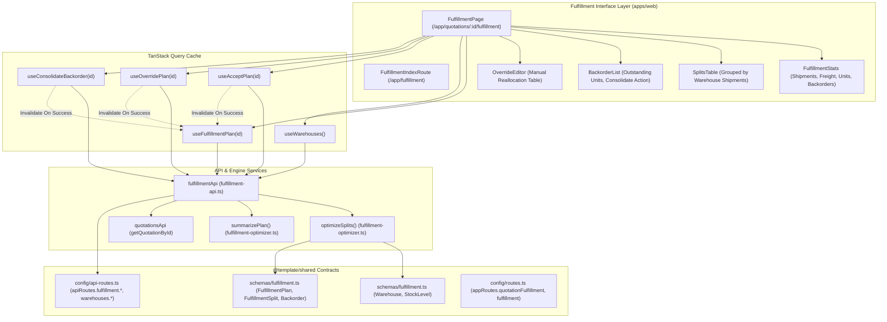
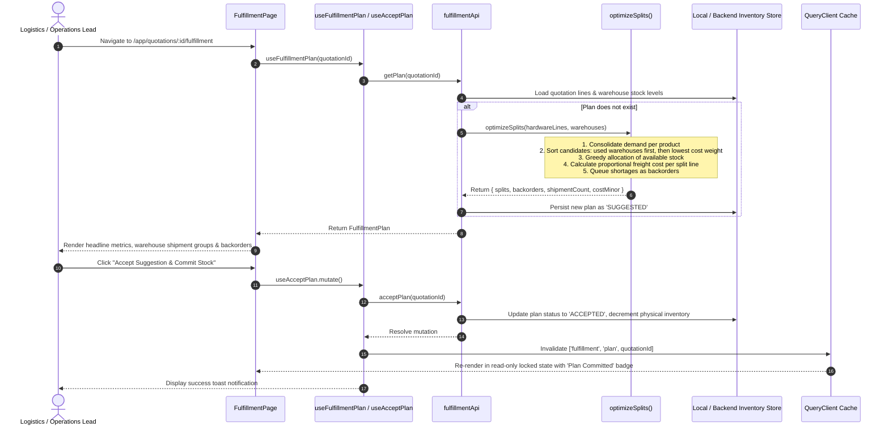

# Architecture Documentation — Warehouse Fulfillment & Stock Allocation (M3)

## 1. Summary
The **Warehouse Fulfillment & Stock Allocation** module (`07-warehouse-fulfillment`) provides the multi-facility logistics and inventory distribution engine for DealFlow360. Positioned downstream of quotation approval and order confirmation, this module uses a pure, deterministic split optimizer to group physical product demand into the fewest shipments and lowest freight costs across regional depots. It features interactive warehouse shipment cards, real-time freight cost shares, backorder tracking with 1-click consolidation, and manual reallocation overrides with live demand-coverage validation.

---

## 2. Architecture Overview



---

## 3. Data Flow



---

## 4. File Structure

```
DealFlow360/
├── packages/shared/src/
│   ├── schemas/fulfillment.ts         # Warehouse, StockLevel, FulfillmentPlan, Splits, Backorders, Seeds
│   ├── lib/fulfillment-optimizer.ts   # Pure deterministic optimizeSplits() and summarizePlan()
│   ├── config/api-routes.ts           # apiRoutes.fulfillment.*, apiRoutes.warehouses.list
│   ├── config/routes.ts               # appRoutes.quotationFulfillment(id), appRoutes.fulfillment
│   └── index.ts                       # Public exports
├── apps/web/
│   ├── app/
│   │   ├── routes.ts                  # Registered routes
│   │   └── routes/
│   │       ├── fulfillment.tsx        # Route wrapper for /app/quotations/:id/fulfillment
│   │       └── fulfillment-index.tsx  # Route wrapper for /app/fulfillment operations overview
│   └── src/features/
│       ├── quotations/pages/
│       │   └── quotation-builder-page.tsx # Header quick-link to Fulfillment Plan
│       └── fulfillment/
│           ├── api/
│           │   └── fulfillment-api.ts # Client API service with optimizer integration
│           ├── hooks/
│           │   └── use-fulfillment.ts # useFulfillmentPlan, useAcceptPlan, useOverridePlan, useConsolidateBackorder
│           ├── components/
│           │   ├── fulfillment-stats.tsx # 4 KPI cards: Shipments, Freight, Units, Backorders
│           │   ├── splits-table.tsx      # Warehouse-grouped shipment view
│           │   ├── backorder-list.tsx    # Shortage tracker with consolidation action
│           │   └── override-editor.tsx   # Manual allocation table with coverage check
│           └── pages/
│               └── fulfillment-page.tsx  # Full B6 fulfillment workbench screen
```

---

## 5. Contracts & Schema Definitions

### 5.1 Warehouse Schema (`@template/shared`)
```typescript
export const warehouseSchema = z.object({
  id: z.string(),
  name: z.string(),
  location: z.string().nullable().optional(),
  shippingCostWeight: z.number().positive().default(1.0),
  createdAt: z.string().optional(),
  updatedAt: z.string().optional(),
});
export type Warehouse = z.infer<typeof warehouseSchema>;
```

### 5.2 Fulfillment Split Schema (`@template/shared`)
```typescript
export const fulfillmentSplitSchema = z.object({
  id: z.string(),
  planId: z.string(),
  warehouseId: z.string(),
  productId: z.string(),
  qty: z.number().int().positive(),
  shipmentCostMinor: z.number().int().nonnegative(),
  createdAt: z.string().optional(),
  updatedAt: z.string().optional(),
});
export type FulfillmentSplit = z.infer<typeof fulfillmentSplitSchema>;
```

### 5.3 Fulfillment Plan Schema (`@template/shared`)
```typescript
export const fulfillmentPlanSchema = z.object({
  id: z.string(),
  quotationId: z.string(),
  status: z.enum(["SUGGESTED", "ACCEPTED", "OVERRIDDEN"]),
  splits: z.array(fulfillmentSplitSchema).default([]),
  backorders: z.array(backorderSchema).default([]),
  createdAt: z.string().optional(),
  updatedAt: z.string().optional(),
});
export type FulfillmentPlan = z.infer<typeof fulfillmentPlanSchema>;
```

---

## 6. State Management

The module leverages **TanStack Query (v5)**:
- **`useFulfillmentPlan(quotationId)`**:
  - Fetches the active fulfillment plan with 10s `staleTime`.
- **`useAcceptPlan(quotationId)`**:
  - Mutates status to `ACCEPTED` and locks the plan.
  - Invalidates `['fulfillment', 'plan', quotationId]` and `['quotations']`.
- **`useOverridePlan(quotationId)`**:
  - Posts custom split rows, marks status `OVERRIDDEN`, and refreshes plan cache.
- **`useConsolidateBackorder(quotationId)`**:
  - Merges outstanding backorders into primary shipments and marks `consolidatedAt`.

---

## 7. UI Components

1. **`FulfillmentStats`**: Renders 4 KPI metrics:
   - Consolidated Shipments count (distinct warehouses touched).
   - Estimated Total Shipping Freight ($).
   - Allocated Units across all depots.
   - Open Backorder Shortage Items.
2. **`SplitsTable`**: Groups allocation rows by `warehouseId` (one shipment container per warehouse), displaying depot name, location, rate multiplier, allocated product details, line quantity, and freight cost share.
3. **`BackorderList`**: Highlights inventory deficits where demand exceeds regional stock, displaying outstanding quantities and providing a 1-click **Consolidate Remaining** button.
4. **`OverrideEditor`**: An editable allocation drawer allowing logistics managers to alter warehouse assignments and quantities with client-side coverage validation.
5. **`FulfillmentPage`**: Main view featuring navigation breadcrumbs, read-only locking indicators, and action triggers.

---

## 8. API Routes

| Resource | Path | Method | Purpose |
|---|---|---|---|
| `apiRoutes.fulfillment.get` | `/api/v1/quotations/:id/fulfillment` | GET | Fetch quotation fulfillment plan |
| `apiRoutes.fulfillment.accept` | `/api/v1/quotations/:id/fulfillment/accept` | POST | Commit plan and deduct inventory |
| `apiRoutes.fulfillment.override` | `/api/v1/quotations/:id/fulfillment/override` | POST | Save manual reallocation splits |
| `apiRoutes.fulfillment.consolidate` | `/api/v1/quotations/:id/fulfillment/consolidate` | POST | Consolidate remaining backorders |
| `apiRoutes.warehouses.list` | `/api/v1/warehouses` | GET | List all regional warehouse hubs |

---

## 9. Error Handling
- **Missing Plan or Quotation**: Displays an empty state banner with a return action link to the builder.
- **Demand Coverage Mismatch**: `OverrideEditor` displays real-time warning badges if total allocated units do not cover line demand.
- **Stock Depletion**: Unfulfillable quantities are gracefully queued into `backorders` rather than throwing errors.

---

## 10. Security & Role Guarding
- **Page Guards**: Accessible to `sales_rep`, `sales_manager`, `finance`, and `admin` via `<RoleGuard>`.
- **Commit Guard**: Once a plan is `ACCEPTED`, editing buttons are automatically hidden and the plan enters an immutable read-only state.

---

## 11. Performance & Caching
- **Pure Optimizer**: `optimizeSplits` executes deterministically in sub-millisecond time.
- **Zero Double-Counting**: Freight cost is distributed proportionally across line items so that line cost shares sum exactly to total shipment cost.

---

## 12. Testing & Verification
- **Static Verification**:
  - `pnpm --filter @template/shared build` -> Clean declaration and ESM output.
  - `pnpm --filter @template/web typecheck` -> 0 TypeScript errors.
  - `pnpm --filter @template/web exec eslint src/features/fulfillment app/routes/fulfillment*.tsx --fix` -> 0 errors, 0 warnings.
  - `pnpm --filter @template/web build` -> Production client and SSR builds successfully compiled.
- **Functional Verification**:
  - Validated split optimizer with multi-product demand.
  - Validated backorder generation on inventory shortages.
  - Validated acceptance lock and override editor.

---

## 13. Future Considerations
- **Courier API Integrations**: Live freight rate calculation via FedEx, UPS, or DHL APIs.
- **Real-Time Warehouse Telemetry**: Live inventory sync with ERP warehouse management systems.
- **Auto-Replenishment Orders**: Automatically generate purchase orders when stock reaches `replenishThreshold`.

---

## 14. References & Linked Documentation
- [Document A Platform Specifications](../../architecture/INDEX.md)
- [Quotation Builder & Risk Engine Architecture](./quotation-builder-and-risk-engine.md)
- [Approval Routing & Review Workbench Architecture](./approval-routing-and-workbench.md)
- [Live Upsell & Cross-Sell Architecture](./live-upsell-and-cross-sell.md)
